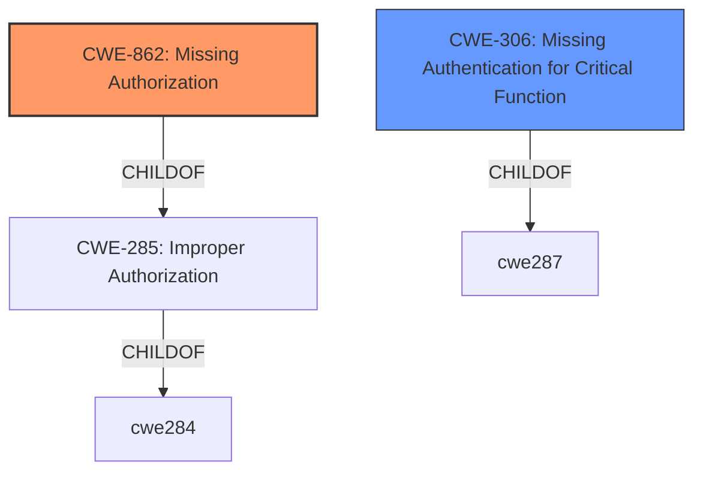

# Analysis for CVE-2022-41238

# Summary
| CWE ID | CWE Name | Confidence | CWE Abstraction Level | CWE Vulnerability Mapping Label | CWE-Vulnerability Mapping Notes |
|---|---|---|---|---|---|
| CWE-862 | Missing Authorization | 1.0 | Class | Primary | Allowed-with-Review |
| CWE-306 | Missing Authentication for Critical Function | 0.9 | Base | Secondary | Allowed |

## Evidence and Confidence

*   **Confidence Score:** 0.95
*   **Evidence Strength:** HIGH

## Relationship Analysis
The primary relationship influencing the decision is the hierarchical relationship where CWE-862 (Missing Authorization) is a class-level weakness and CWE-306 (Missing Authentication for Critical Function) is a base-level weakness. Since the vulnerability description explicitly mentions a **missing permission check**, which is a form of authorization, CWE-862 is the more direct classification. However, given the lack of any authentication mechanism at the endpoint, CWE-306 is also relevant. Both CWE-862 and CWE-306 are children of CWE-285 (Improper Authorization).

## Vulnerability Chain
The vulnerability chain starts with the **missing permission check** (CWE-862) or **missing authentication** (CWE-306) at the `/githook/` endpoint, which allows an unauthenticated attacker to trigger builds of jobs associated with an attacker-specified repository and commits. The chain is as follows:

1.  **Root Cause:** Missing Authorization (CWE-862) and Missing Authentication (CWE-306)
2.  **Impact:** Triggering unauthorized builds, potentially leading to denial of service, malicious code injection, or resource consumption.

## Summary of Analysis
The initial assessment identified that the root cause of the vulnerability is a **missing permission check** in the Jenkins DotCi Plugin. This allows unauthenticated attackers to trigger builds of jobs.

The vulnerability description states: "A **missing permission check** in Jenkins DotCi Plugin 2.40.00 and earlier allows unauthenticated attackers to trigger builds of jobs corresponding to the attacker-specified repository for attacker-specified commits."

The CVE Reference Links Content Summary states:
*   "**Root Cause:** The DotCi Plugin webhook endpoint `/githook/` lacks any authentication mechanism."
*   "**Weakness:** Missing authentication for the webhook endpoint."

Based on this evidence, CWE-862 (Missing Authorization) is the most appropriate primary CWE because the core issue is the absence of a permission check. However, the lack of any authentication mechanism (CWE-306) further exacerbates the problem, allowing unauthenticated users to exploit the **missing permission check**.

CWE-862 is selected as the primary CWE because the description explicitly indicates a "**missing permission check**". The retriever results also list CWE-862 as the top candidate. CWE-306 is selected as a secondary CWE due to the **missing authentication** at the webhook endpoint, as explained in the CVE Reference Links Content Summary.

Other CWEs were considered but ultimately not selected:

*   CWE-863 (Incorrect Authorization): While related, the problem isn't an incorrect check, but the absence of one.
*   CWE-285 (Improper Authorization): This is a high-level class, and more specific CWEs like CWE-862 and CWE-306 are more fitting.
*   CWE-276 (Incorrect Default Permissions): This is less relevant as the issue is not about incorrect default permissions during installation, but the absence of authorization checks during runtime.

The selected CWEs are at the optimal level of specificity as CWE-862 is a class that accurately describes the **missing authorization**, and CWE-306 is a base that describes the **missing authentication** for the critical function.