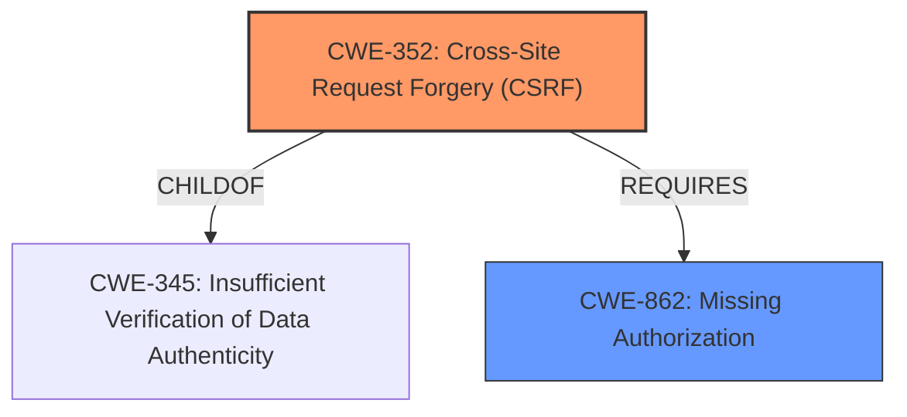

# Raw Analyzer Response for CVE-2022-4124

# Summary
| CWE ID | CWE Name | Confidence | CWE Abstraction Level | CWE Vulnerability Mapping Label | CWE-Vulnerability Mapping Notes |
|---|---|---|---|---|---|
| CWE-352 | Cross-Site Request Forgery (CSRF) | 0.9 | Compound | Allowed | Primary CWE |
| CWE-862 | Missing Authorization | 0.9 | Class | Allowed-with-Review | Secondary Candidate |

## Evidence and Confidence

*   **Confidence Score:** 0.9
*   **Evidence Strength:** HIGH

## Relationship Analysis
The primary relationship that influenced the decision was the co-occurrence of **missing authorization checks** and the lack of CSRF protection, leading to a compound weakness.

## Vulnerability Chain
The vulnerability chain starts with **missing authorization checks** and the absence of CSRF protection, leading to arbitrary popup deletion by unauthenticated users. The root causes are the **missing authorization** and CSRF checks.

## Summary of Analysis
The initial assessment identified the **missing authorization** (CWE-862) and CSRF (CWE-352) vulnerabilities in the Popup Manager WordPress plugin. The provided evidence clearly states the "**rootcause:** **missing authorisation and CSRF checks**" and confirms that unauthenticated users can delete popups.

The "CVE Reference Links Content Summary" explicitly mentions:

*   "**Missing Authorization:** The plugin does not verify if the user attempting to delete a popup has the necessary permissions to do so."
*   "**CSRF Vulnerability:** The lack of CSRF protection makes it possible to trigger the delete action through a cross-site request forgery attack."

The Retriever Results also support this assessment, with CWE-352 and CWE-862 being among the top matches.

The relationship analysis reveals that CWE-352 (Cross-Site Request Forgery) is a compound weakness that **requires** multiple weaknesses to occur simultaneously, including insufficient verification of data authenticity (CWE-345), missing CSRF protection (CWE-346), and often relies on **missing authorization** (CWE-862).

CWE-862 is a Class-level CWE, and the guidance suggests examining its children for a better fit. However, in this case, the root cause is explicitly the **missing authorization check**, making CWE-862 a suitable, although not perfectly specific, classification. The CSRF vulnerability completes the picture, making CWE-352 the primary CWE.

The selected CWEs are at the optimal level of specificity, given the available information and the nature of the vulnerability. CWE-352 accurately represents the CSRF aspect, while CWE-862 captures the **missing authorization** component.

Relevant CWE Information:

# Enhanced Context (25 CWEs)
The following CWEs were identified as potentially relevant to this vulnerability:

## CWE-807: Reliance on Untrusted Inputs in a Security Decision
**Abstraction Level**: Base
**Similarity Score**: 0.78
**Source**: dense

**Description**:
The product uses a protection mechanism that relies on the existence or values of an input, but the input can be modified by an untrusted actor in a way that bypasses the protection mechanism.

**Mapping Guidance**:
- Usage: Allowed
- Rationale: This CWE entry is at the Base level of abstraction, which is a preferred level of abstraction for mapping to the root causes of vulnerabilities.

*Rationale for not selecting this CWE*: While the vulnerability relies on untrusted inputs (specifically the `popup_id` parameter), the core issue is the lack of authorization and CSRF protection, not the reliance on the input itself.

## CWE-472: External Control of Assumed-Immutable Web Parameter
**Abstraction Level**: Base
**Similarity Score**: 0.77
**Source**: dense

**Description**:
The web application does not sufficiently verify inputs that are assumed to be immutable but are actually externally controllable, such as hidden form fields.

**Mapping Guidance**:
- Usage: Allowed
- Rationale: This CWE entry is at the Base level of abstraction, which is a preferred level of abstraction for mapping to the root causes of vulnerabilities.

*Rationale for not selecting this CWE*: This CWE is not applicable because the vulnerability does not involve an assumed-immutable web parameter that is externally controlled. The core issues are the **missing authorization** and CSRF protection.

## CWE-639: Authorization Bypass Through User-Controlled Key
**Abstraction Level**: Base
**Similarity Score**: 0.76
**Source**: dense

**Description**:
The system's authorization functionality does not prevent one user from gaining access to another user's data or record by modifying the key value identifying the data.

**Mapping Guidance**:
- Usage: Allowed
- Rationale: This CWE entry is at the Base level of abstraction, which is a preferred level of abstraction for mapping to the root causes of vulnerabilities.

*Rationale for not selecting this CWE*: This CWE is too specific. While the `popup_id` parameter is user-controlled, the primary issue is the **missing authorization** check, not the modification of a key value.

## CWE-425: Direct Request ('Forced Browsing')
**Abstraction Level**: Base
**Similarity Score**: 0.76
**Source**: dense

**Description**:
The web application does not adequately enforce appropriate authorization on all restricted URLs, scripts, or files.

**Mapping Guidance**:
- Usage: Allowed
- Rationale: This CWE entry is at the Base level of abstraction, which is a preferred level of abstraction for mapping to the root causes of vulnerabilities.

*Rationale for not selecting this CWE*: While related to **missing authorization**, CWE-425 is more about accessing URLs directly. The CSRF aspect is not covered.

## CWE-41: Improper Resolution of Path Equivalence
**Abstraction Level**: Base
**Similarity Score**: 0.76
**Source**: dense

**Description**:
The product is vulnerable to file system contents disclosure through path equivalence. Path equivalence involves the use of special characters in file and directory names. The associated manipulations are intended to generate multiple names for the same object.

**Mapping Guidance**:
- Usage: Allowed
- Rationale: This CWE entry is at the Base level of abstraction, which is a preferred level of abstraction for mapping to the root causes of vulnerabilities.

*Rationale for not selecting this CWE*: This CWE is not applicable as the vulnerability does not involve file system path manipulation.

## CWE-1390: Weak Authentication
**Abstraction Level**: Class
**Similarity Score**: 0.75
**Source**: dense

**Description**:
The product uses an authentication mechanism to restrict access to specific users or identities, but the mechanism does not sufficiently prove that the claimed identity is correct.

**Mapping Guidance**:
- Usage: Allowed-with-Review
- Rationale: This CWE entry is a Class and might have Base-level children that would be more appropriate

*Rationale for not selecting this CWE*: The problem is not weak authentication, it is a **missing authorization** check after (or in place of) authentication.

## CWE-552: Files or Directories Accessible to External Parties
**Abstraction Level**: Base
**Similarity Score**: 0.75
**Source**: dense

**Description**:
The product makes files or directories accessible to unauthorized actors, even though they should not be.

**Mapping Guidance**:
- Usage: Allowed
- Rationale: This CWE entry is at the Base level of abstraction, which is a preferred level of abstraction for mapping to the root causes of vulnerabilities.

*Rationale for not selecting this CWE*: This is not about file access.

## CWE-799: Improper Control of Interaction Frequency
**Abstraction Level**: Class
**Similarity Score**: 0.75
**Source**: dense

**Description**:
The product does not properly limit the number or frequency of interactions that it has with an actor, such as the number of incoming requests.

**Mapping Guidance**:
- Usage: Allowed-with-Review
- Rationale: This CWE entry is a Class and might have Base-level children that would be more appropriate

*Rationale for not selecting this CWE*: Interaction frequency is not the problem.

## CWE-1289: Improper Validation of Unsafe Equivalence in Input
**Abstraction Level**: Base
**Similarity Score**: 0.75
**Source**: dense

**Description**:
The product receives an input value that is used as a resource identifier or other type of reference, but it does not validate or incorrectly validates that the input is equivalent to a potentially-unsafe value.

**Mapping Guidance**:
- Usage: Allowed
- Rationale: This CWE entry is at the Base level of abstraction, which is a preferred level of abstraction for mapping to the root causes of vulnerabilities.