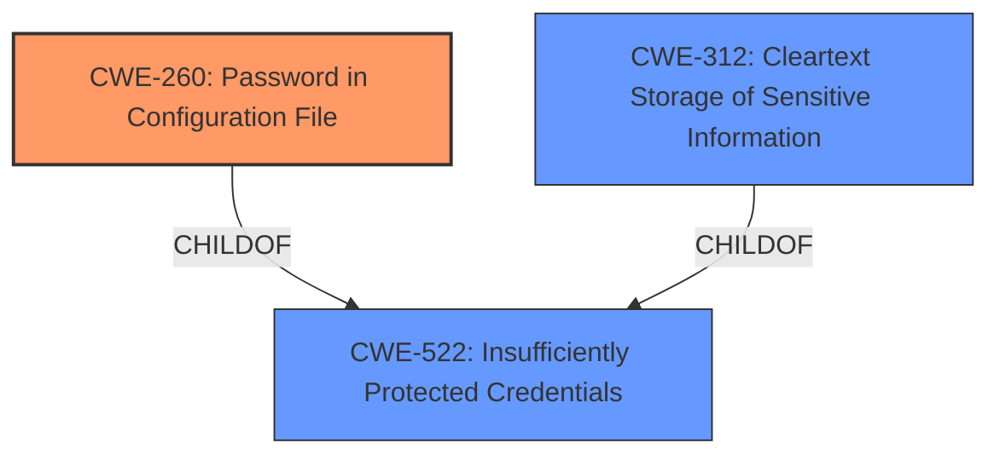

# Raw Analyzer Response for CVE-2022-41247

# Summary
| CWE ID | CWE Name | Confidence | CWE Abstraction Level | CWE Vulnerability Mapping Label | CWE-Vulnerability Mapping Notes |
|---|---|---|---|---|---|
| CWE-260 | Password in Configuration File | 1.0 | Base | Allowed | Primary CWE |
| CWE-312 | Cleartext Storage of Sensitive Information | 0.75 | Base | Allowed | Secondary Candidate |
| CWE-522 | Insufficiently Protected Credentials | 0.6 | Class | Allowed-with-Review | Secondary Candidate |

## Evidence and Confidence

*   **Confidence Score:** 0.9
*   **Evidence Strength:** HIGH

## Relationship Analysis
The primary CWE, CWE-260 (Password in Configuration File), is a child of CWE-522 (Insufficiently Protected Credentials), indicating a more specific case of credential protection failure. CWE-312 (Cleartext Storage of Sensitive Information) is related as a broader category of storing sensitive data without encryption. The abstraction levels guided the selection, favoring the base level CWE-260 for its direct relevance to the vulnerability.

## Vulnerability Chain
The vulnerability chain starts with the **weakness** of the BigPanda Notifier Plugin **storing the BigPanda API key unencrypted in its global configuration file**. This leads to the **impact** where users with access to the Jenkins controller file system can view the API key. The root cause is the **improper storage** of the API key, directly leading to the exposure of sensitive information.

## Summary of Analysis
The analysis strongly supports the selection of CWE-260 (Password in Configuration File) as the primary CWE. The vulnerability description clearly states that the BigPanda API key is stored unencrypted in the global configuration file, which directly aligns with the definition of CWE-260. The "CVE Reference Links Content Summary" reinforces this by stating that the "API key is stored in plain text." This direct evidence justifies the high confidence level. CWE-312 (Cleartext Storage of Sensitive Information) and CWE-522 (Insufficiently Protected Credentials) were considered as secondary CWEs due to their broader scope, but CWE-260 was chosen for its precise match to the vulnerability's specifics.

The selection of CWE-260 is also supported by the MITRE mapping guidance, which recommends using Base level CWEs when possible. The retriever results also indicate CWE-260 as the top candidate.

CWE-538 (Insertion of Sensitive Information into Externally-Accessible File or Directory) and CWE-532 (Insertion of Sensitive Information into Log File) were considered but not selected because they are less specific than CWE-260. The issue isn't just about putting sensitive info into an accessible file, but specifically about a password/API key within a configuration file.

Relevant CWE Information:

# Enhanced Context (25 CWEs)
The following CWEs were identified as potentially relevant to this vulnerability:

## CWE-312: Cleartext Storage of Sensitive Information
**Abstraction Level**: Base
**Similarity Score**: 0.80
**Source**: dense

**Description**:
The product stores sensitive information in cleartext within a resource that might be accessible to another control sphere.

**Mapping Guidance**:
- Usage: Allowed
- Rationale: This CWE entry is at the Base level of abstraction, which is a preferred level of abstraction for mapping to the root causes of vulnerabilities.

**Explanation**: This CWE applies because the API key, which is sensitive information, is stored in cleartext in the configuration file.

## CWE-538: Insertion of Sensitive Information into Externally-Accessible File or Directory
**Abstraction Level**: Base
**Similarity Score**: 0.78
**Source**: dense

**Description**:
The product places sensitive information into files or directories that are accessible to actors who are allowed to have access to the files, but not to the sensitive information.

**Mapping Guidance**:
- Usage: Allowed
- Rationale: This CWE entry is at the Base level of abstraction, which is a preferred level of abstraction for mapping to the root causes of vulnerabilities.

**Explanation**: While this CWE is relevant, it's less specific than CWE-260 because it doesn't focus on configuration files or passwords.

## CWE-522: Insufficiently Protected Credentials
**Abstraction Level**: Class
**Similarity Score**: 0.77
**Source**: dense

**Description**:
The product transmits or stores authentication credentials, but it uses an insecure method that is susceptible to unauthorized interception and/or retrieval.

**Mapping Guidance**:
- Usage: Allowed-with-Review
- Rationale: This CWE entry is a Class and might have Base-level children that would be more appropriate

**Explanation**: This is a broader category that encompasses the vulnerability, but CWE-260 is a more specific child.

## CWE-319: Cleartext Transmission of Sensitive Information
**Abstraction Level**: Base
**Similarity Score**: 0.77
**Source**: dense

**Description**:
The product transmits sensitive or security-critical data in cleartext in a communication channel that can be sniffed by unauthorized actors.

**Mapping Guidance**:
- Usage: Allowed
- Rationale: This CWE entry is at the Base level of abstraction, which is a preferred level of abstraction for mapping to the root causes of vulnerabilities.

**Explanation**: This CWE is not applicable because the vulnerability involves storage, not transmission.

## CWE-256: Plaintext Storage of a Password
**Abstraction Level**: Base
**Similarity Score**: 0.76
**Source**: dense

**Description**:
Storing a password in plaintext may result in a system compromise.

**Mapping Guidance**:
- Usage: Allowed
- Rationale: This CWE entry is at the Base level of abstraction, which is a preferred level of abstraction for mapping to the root causes of vulnerabilities.

**Explanation**: This CWE is very close, but CWE-260 is more specific to the configuration file context.

## CWE-212: Improper Removal of Sensitive Information Before Storage or Transfer
**Abstraction Level**: Base
**Similarity Score**: 0.76
**Source**: dense

**Description**:
The product stores, transfers, or shares a resource that contains sensitive information, but it does not properly remove that information before the product makes the resource available to unauthorized actors.

**Mapping Guidance**:
- Usage: Allowed
- Rationale: This CWE entry is at the Base level of abstraction, which is a preferred level of abstraction for mapping to the root causes of vulnerabilities.

**Explanation**: This CWE is not applicable because the problem is not about failing to remove the information, but about storing it in cleartext.

## CWE-311: Missing Encryption of Sensitive Data
**Abstraction Level**: Class
**Similarity Score**: 0.76
**Source**: dense

**Description**:
The product does not encrypt sensitive or critical information before storage or transmission.

**Mapping Guidance**:
- Usage: Discouraged
- Rationale: CWE-311 is high-level with more precise children available. It is a level-1 Class (i.e., a child of a Pillar).

**Explanation**: This is a more general class of the issue, and more specific CWEs are available.

## CWE-1391: Use of Weak Credentials
**Abstraction Level**: Class
**Similarity Score**: 0.76
**Source**: dense

**Description**:
The product uses weak credentials (such as a default key or hard-coded password) that can be calculated, derived, reused, or guessed by an attacker.

**Mapping Guidance**:
- Usage: Allowed-with-Review
- Rationale: This CWE entry is a Class and might have Base-level children that would be more appropriate

**Explanation**: This CWE is not applicable because the problem is about storing the API key in cleartext, not about the strength of the key itself.

## CWE-922: Insecure Storage of Sensitive Information
**Abstraction Level**: Class
**Similarity Score**: 0.75
**Source**: dense

**Description**:
The product stores sensitive information without properly limiting read or write access by unauthorized actors.

**Mapping Guidance**:
- Usage: Allowed-with-Review
- Rationale: This CWE entry is a Class and might have Base-level children that would be more appropriate

**Explanation**: This is a more general class of the issue, and more specific CWEs are available.

## CWE-798: Use of Hard-coded Credentials
**Abstraction Level**: Base
**Similarity Score**: 0.75
**Source**: dense

**Description**:
The product contains hard-