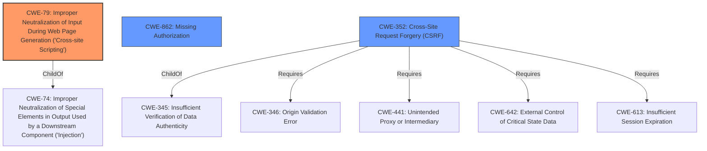

# Analysis Report for CVE-2022-4125

# Vulnerability Analysis Report: CVE-2022-4125

## Description


## Analysis (with Relationship Data)

# Summary
| CWE ID | CWE Name | Confidence | CWE Abstraction Level | CWE Vulnerability Mapping Label | CWE-Vulnerability Mapping Notes |
|---|---|---|---|---|---|
| CWE-79 | Improper Neutralization of Input During Web Page Generation ('Cross-site Scripting') | 1.0 | Base | Allowed | Primary CWE |
| CWE-862 | Missing Authorization | 1.0 | Class | Allowed-with-Review | Secondary Candidate |
| CWE-352 | Cross-Site Request Forgery (CSRF) | 1.0 | Compound | Allowed | Secondary Candidate |

## Evidence and Confidence

*   **Confidence Score:** 1.0
*   **Evidence Strength:** HIGH

## Relationship Analysis
The primary weakness is CWE-79, which represents the Stored XSS vulnerability due to the lack of sanitization and escaping. CWE-862 captures the missing authorization check, and CWE-352 captures the missing CSRF protection. These three weaknesses combined allow an unauthenticated attacker to inject malicious scripts into the WordPress plugin.



## Vulnerability Chain
The vulnerability chain starts with **lack of authorization and sanitization**.
1.  **Missing Authorization (CWE-862)**: The plugin does not check if the user has the right privileges to create or update popups.
2.  **Missing CSRF Protection (CWE-352)**: The plugin does not validate if the request was intentionally sent by the user, potentially tricking the user into making unintended requests.
3.  **Improper Neutralization of Input During Web Page Generation ('Cross-site Scripting') (CWE-79)**: The plugin does not neutralize user-controlled input, allowing for the injection of malicious scripts.
The end result is Stored XSS, where an attacker can inject arbitrary JavaScript code through popups.

## Summary of Analysis
The analysis is based on the provided evidence which points to the root causes being **lack of authorization and sanitization**, leading to Cross-Site Scripting.

The vulnerability description states, "The Popup Manager WordPress plugin through 1.6.6 does not have authorisation and CSRF check when creating/updating popups, and is missing sanitisation as well as escaping, which could allow unauthenticated attackers to create arbitrary popups and add Stored XSS payloads as well". The "CVE Reference Links Content Summary" section further supports this by stating, "The plugin lacks authorization and CSRF checks when creating or updating popups. Additionally, it doesn't sanitize or escape user-supplied input" and "Unauthenticated Stored Cross-Site Scripting (XSS) vulnerability"

CWE-79 is chosen as the primary CWE because the core issue is the ability to inject malicious scripts due to the **lack of sanitization and escaping**. CWE-862 is selected due to the **missing authorization check** and CWE-352 is selected due to the **missing CSRF protection**, both contributing to the vulnerability.

Other CWEs considered but not used:
*   CWE-284: Improper Access Control - This is a very high-level class, and more specific CWEs such as CWE-862 are more appropriate.
*   CWE-116: Improper Encoding or Escaping of Output - This is a Class-level CWE, and CWE-79 is a more specific Base-level CWE.
*   CWE-434: Unrestricted Upload of File with Dangerous Type - This CWE is not relevant because the vulnerability doesn't involve unrestricted file uploads.
*   CWE-471: Modification of Assumed-Immutable Data (MAID) - This CWE is not directly applicable as the vulnerability doesn't involve modification of assumed-immutable data.

The selected CWEs are at the optimal level of specificity because they directly represent the root causes and resulting vulnerability, with CWE-79 as the Stored XSS vulnerability, CWE-862 as the missing authorization check, and CWE-352 as the missing CSRF protection.


## CWE Relationship Analysis

Current CWEs represent these abstraction levels: .


### Vulnerability Chain Analysis

**Chain starting from CWE-862:**
- 862 (Missing Authorization) - ROOT


**Chain starting from CWE-434:**
- 434 (Unrestricted Upload of File with Dangerous Type) - ROOT


### CWE Relationship Diagram

```mermaid
graph TD
    classDef primary fill:#f96,stroke:#333,stroke-width:2px
    classDef secondary fill:#69f,stroke:#333
    classDef tertiary fill:#9e9,stroke:#333
```


*Report generated on 2025-03-30 18:41:37*
