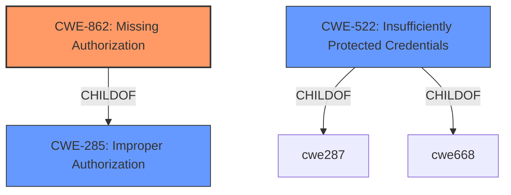

# Raw Analyzer Response for CVE-2022-41250

# Summary
| CWE ID | CWE Name | Confidence | CWE Abstraction Level | CWE Vulnerability Mapping Label | CWE-Vulnerability Mapping Notes |
|---|---|---|---|---|---|
| CWE-862 | Missing Authorization | 1.0 | Class | Allowed-with-Review | Primary CWE |
| CWE-522 | Insufficiently Protected Credentials | 0.7 | Class | Allowed-with-Review | Secondary Candidate |

## Evidence and Confidence

*   **Confidence Score:** 0.85
*   **Evidence Strength:** HIGH

## Relationship Analysis
The primary CWE is CWE-862, which is a Class-level weakness describing a **missing authorization** check. Its parent is CWE-285, Improper Authorization, which is a more general class. A related weakness is CWE-522, Insufficiently Protected Credentials, which can be a consequence of missing authorization.

## Vulnerability Chain
The chain of events for this vulnerability is as follows:
1.  **Missing Permission Check (CWE-862):** The application **fails to perform an authorization check**, allowing unauthorized access.
2.  **Connect to Attacker-Specified Server:** Attackers can connect to a server they control.
3.  **Capture Credentials:** Attackers can capture credentials stored in Jenkins, indicating **insufficient protection of credentials (CWE-522)**.

## Summary of Analysis
Initially, the **missing permission check** pointed towards an authorization issue. The description explicitly mentions a **missing permission check**, which aligns directly with **CWE-862 (Missing Authorization)**. The ability to capture credentials suggests a secondary issue related to how credentials are protected, leading to consideration of **CWE-522 (Insufficiently Protected Credentials)**.

The evidence explicitly states: "A **missing permission check** in Jenkins SCM HttpClient Plugin 1.5 and earlier allows attackers with Overall/Read permission to connect to an attacker-specified HTTP server using attacker-specified credentials IDs obtained through another method, capturing credentials stored in Jenkins."

The graph relationships and retriever results supported the selection of CWE-862 as the primary weakness. The retriever results also suggested CWE-522, as the attacker is able to capture the credentials stored in Jenkins.

CWE-862 is chosen because the root cause is a **missing authorization** check, not an incorrect one. While CWE-285 (Improper Authorization) could be considered, CWE-862 is more specific and therefore preferred. The fact that credentials can be captured suggests CWE-522, but this is a consequence of the **missing authorization** check and not the primary issue. Both CWE-862 and CWE-522 are class-level, however, the guidance suggests a more specific Base level, but none of those fit.

Relevant CWE Information:

# Enhanced Context (25 CWEs)
The following CWEs were identified as potentially relevant to this vulnerability:

## CWE-862: Missing Authorization
**Abstraction:** Class
**Status:** Incomplete

### Description
The product does not perform an authorization check when an actor attempts to access a resource or perform an action.

### Extended Description
Not provided

### Alternative Terms
AuthZ: "AuthZ" is typically used as an abbreviation of "authorization" within the web application security community. It is distinct from "AuthN" (or, sometimes, "AuthC") which is an abbreviation of "authentication." The use of "Auth" as an abbreviation is discouraged, since it could be used for either authentication or authorization.

### Relationships
ChildOf -> CWE-285
ChildOf -> CWE-284

### Mapping Guidance
**Usage:** Allowed-with-Review
**Rationale:** This CWE entry is a Class and might have Base-level children that would be more appropriate
**Comments:** Examine children of this entry to see if there is a better fit
**Reasons:**
- Abstraction

### Additional Notes
**[Terminology]** Assuming a user with a given identity, authorization is the process of determining whether that user can access a given resource, based on the user's privileges and any permissions or other access-control specifications that apply to the resource.

### Observed Examples
- **CVE-2022-24730:** Go-based continuous deployment product does not check that a user has certain privileges to update or create an app, allowing adversaries to read sensitive repository information
- **CVE-2009-3168:** Web application does not restrict access to admin scripts, allowing authenticated users to reset administrative passwords.
- **CVE-2009-3597:** Web application stores database file under the web root with insufficient access control (CWE-219), allowing direct request.

## CWE-522: Insufficiently Protected Credentials
**Abstraction:** Class
**Status:** Incomplete

### Description
The product transmits or stores authentication credentials, but it uses an insecure method that is susceptible to unauthorized interception and/or retrieval.

### Extended Description
Not provided

### Alternative Terms
None

### Relationships
ChildOf -> CWE-1390
ChildOf -> CWE-287
ChildOf -> CWE-668

### Mapping Guidance
**Usage:** Allowed-with-Review
**Rationale:** This CWE entry is a Class and might have Base-level children that would be more appropriate
**Comments:** Examine children of this entry to see if there is a better fit
**Reasons:**
- Abstraction

### Observed Examples
- **CVE-2022-30018:** A messaging platform serializes all elements of User/Group objects, making private information available to adversaries
- **CVE-2022-29959:** Initialization file contains credentials that can be decoded using a "simple string transformation"
- **CVE-2022-35411:** Python-based RPC framework enables pickle functionality by default, allowing clients to unpickle untrusted data.