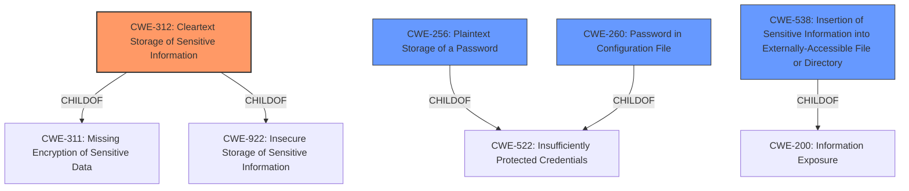

# Raw Analyzer Response for CVE-2022-41255

# Summary
| CWE ID | CWE Name | Confidence | CWE Abstraction Level | CWE Vulnerability Mapping Label | CWE-Vulnerability Mapping Notes |
|---|---|---|---|---|---|
| CWE-312 | Cleartext Storage of Sensitive Information | 1.0 | Base | Allowed | Primary CWE |
| CWE-256 | Plaintext Storage of a Password | 0.9 | Base | Allowed | Secondary Candidate |
| CWE-260 | Password in Configuration File | 0.8 | Base | Allowed | Secondary Candidate |
| CWE-538 | Insertion of Sensitive Information into Externally-Accessible File or Directory | 0.7 | Base | Allowed | Secondary Candidate |

## Evidence and Confidence

*   **Confidence Score:** 1.0
*   **Evidence Strength:** HIGH

## Relationship Analysis
The primary CWE is CWE-312 (**Cleartext Storage of Sensitive Information**), which is a base-level CWE. Several other CWEs were considered, reflecting different facets of the same underlying issue. CWE-256 (**Plaintext Storage of a Password**) is a specialized case of storing sensitive information, specifically passwords, in plaintext. CWE-260 (**Password in Configuration File**) specifies that the password is in a configuration file. CWE-538 (**Insertion of Sensitive Information into Externally-Accessible File or Directory**) broadens the context to externally accessible files, which aligns with the description of the `config.xml` file on the Jenkins controller. The relationship analysis indicates a progression from generic **unencrypted storage** to specific scenarios involving passwords and configuration files. The abstraction levels influenced the choice by favoring the most specific base-level CWE that accurately captures the vulnerability.

## Vulnerability Chain
The chain of weaknesses starts with the **unencrypted storage** of the Cons3rt API token in the `config.xml` file (CWE-312). This allows unauthorized users with access to the Jenkins controller's file system to view the token, potentially leading to unauthorized access to the Cons3rt platform. The root cause is the **lack of encryption**, and the impact is unauthorized access due to the exposed API token.

## Summary of Analysis
The initial analysis focused on identifying the core weakness described in the vulnerability description, which is the **unencrypted storage of sensitive information**. The selection of CWE-312 is strongly supported by the vulnerability description and the CVE reference summary, which explicitly mention the **storage of the API token in plain text**. The graph relationships and retriever results further reinforced this selection, highlighting the relevance of CWE-312 and its related CWEs. The final decision to prioritize CWE-312 is based on its direct alignment with the root cause and its appropriate level of specificity.

The primary evidence supporting CWE-312 is:
- Vulnerability Description Key Phrases: "**rootcause:** **unencrypted storage of sensitive information**"
- CVE Reference Links Content Summary: "The CONS3RT Plugin stores the Cons3rt API token **unencrypted** in job `config.xml` files on the Jenkins controller."

CWEs considered but not used:

*   CWE-522 (**Insufficiently Protected Credentials**): While related, this is a class-level CWE, and CWE-312 provides more specific information about the weakness.
*   CWE-256 (**Plaintext Storage of a Password**): This CWE is very similar to CWE-312, but the vulnerability involves an API token, not necessarily a password.
*   CWE-260 (**Password in Configuration File**): This is relevant, as the API token is stored in a configuration file. However, CWE-312 is broader and accurately captures the **unencrypted storage** aspect.
*   CWE-538 (**Insertion of Sensitive Information into Externally-Accessible File or Directory**): This is also relevant, but CWE-312 focuses more directly on the **unencrypted storage**, which is the core weakness.
*   CWE-862 (**Missing Authorization**) and CWE-863 (**Incorrect Authorization**): These CWEs address authorization issues, which are not the primary concern in this vulnerability. The core issue is the exposure of sensitive information, not the failure to enforce authorization.
*   CWE-555 (**J2EE Misconfiguration: Plaintext Password in Configuration File**): This is a variant related to J2EE applications, which is not directly applicable to the described vulnerability.
*   CWE-523 (**Unprotected Transport of Credentials**): This concerns the transport of credentials, which is not the case here. The issue is with storage.
*   CWE-178 (**Improper Handling of Case Sensitivity**), CWE-289 (**Authentication Bypass by Alternate Name**), CWE-433 (**Unparsed Raw Web Content Delivery**), CWE-498 (**Cloneable Class Containing Sensitive Information**), CWE-499 (**Serializable Class Containing Sensitive Data**), CWE-942 (**Permissive Cross-domain Policy with Untrusted Domains**), CWE-1289 (**Improper Validation of Unsafe Equivalence in Input**): These CWEs don't directly apply to the described vulnerability.
Relevant CWE Information: