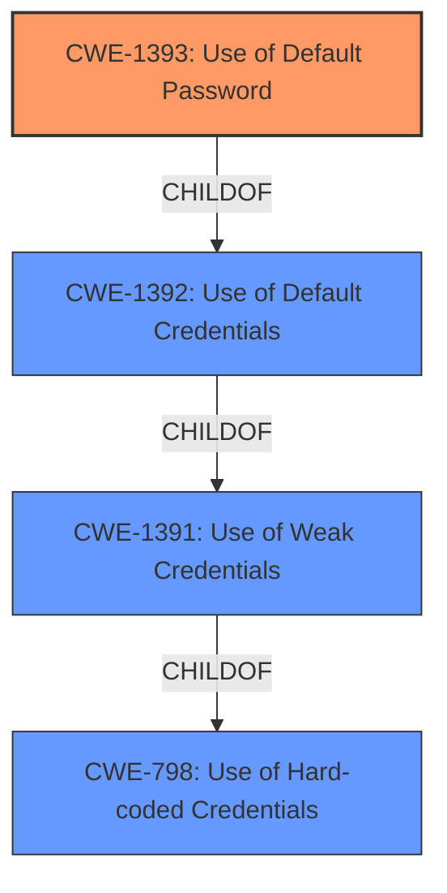

# Analysis Report for CVE-2022-4126

# Vulnerability Analysis Report: CVE-2022-4126

## Description


## Analysis (with Relationship Data)

# Summary
| CWE ID | CWE Name | Confidence | CWE Abstraction Level | CWE Vulnerability Mapping Label | CWE-Vulnerability Mapping Notes |
|---|---|---|---|---|---|
| CWE-1393 | Use of Default Password | 1.0 | Base | Primary | Allowed |

## Evidence and Confidence

*   **Confidence Score:** 1.0
*   **Evidence Strength:** HIGH

## Relationship Analysis
The primary relationship considered was the hierarchical structure, specifically the ChildOf relationship between CWE-1393 and its parent, CWE-1392. CWE-1393 is a more specific case of CWE-1392, focusing specifically on default passwords. Given the explicit mention of a default password in the vulnerability description, CWE-1393 was deemed the more appropriate choice.



## Vulnerability Chain
The vulnerability chain starts with the **use of a default password** (CWE-1393). An attacker exploits this by using the default password to gain unauthorized access. The impact is unauthorized access to the ABB RCCMD product.

## Summary of Analysis
The vulnerability description explicitly states "Use of Default Password vulnerability in ABB RCCMD". The phrase "**use of default password**" directly corresponds to CWE-1393.

The retriever results also ranked CWE-1393 as the top candidate with a high score. The CWE specifications for CWE-1393 describe the weakness precisely: "The product uses default passwords for potentially critical functionality."

The evidence is strong and directly supports the selection of CWE-1393 as the primary CWE. The abstraction level is Base, which is a preferred level. The relationship analysis confirmed that choosing the most specific CWE, CWE-1393, is appropriate in this context.

CWE-312 (Cleartext Storage of Sensitive Information), CWE-522 (Insufficiently Protected Credentials), CWE-1391 (Use of Weak Credentials), CWE-259 (Use of Hard-coded Password), CWE-1392 (Use of Default Credentials), CWE-321 (Use of Hard-coded Cryptographic Key), CWE-276 (Incorrect Default Permissions), CWE-204 (Observable Response Discrepancy), and CWE-798 (Use of Hard-coded Credentials) were considered but not selected. While some of these CWEs have related aspects, such as the credentials being weak (CWE-1391) or the credentials potentially being stored insecurely (CWE-312, CWE-522), the root cause is the **use of a default password**. Therefore, CWE-1393 is the most accurate and specific representation of the vulnerability.


## CWE Relationship Analysis

Current CWEs represent these abstraction levels: .


### Vulnerability Chain Analysis

**Chain starting from CWE-1392:**
- 1392 (Use of Default Credentials) - ROOT


**Chain starting from CWE-321:**
- 321 (Use of Hard-coded Cryptographic Key) - ROOT


### CWE Relationship Diagram

```mermaid
graph TD
    classDef primary fill:#f96,stroke:#333,stroke-width:2px
    classDef secondary fill:#69f,stroke:#333
    classDef tertiary fill:#9e9,stroke:#333
```


*Report generated on 2025-03-31 06:52:38*
