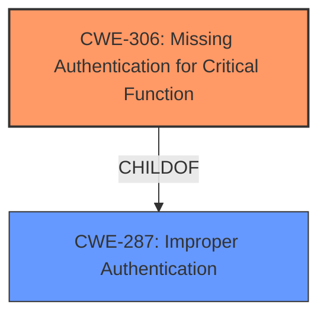

# Analysis Report for CVE-2022-41263

# Vulnerability Analysis Report: CVE-2022-41263

## Description


## Analysis (with Relationship Data)

# Summary
| CWE ID  | CWE Name                                  | Confidence | CWE Abstraction Level | CWE Vulnerability Mapping Label | CWE-Vulnerability Mapping Notes |
|---------|-------------------------------------------|------------|-----------------------|---------------------------------|-----------------------------------|
| CWE-306 | Missing Authentication for Critical Function | 1.0        | Base                  | Primary                           | Allowed                           |

## Evidence and Confidence

*   **Confidence Score:** 1.0
*   **Evidence Strength:** HIGH

## Relationship Analysis
The primary relationship that influenced the CWE selection was the direct match of "missing authentication check" in the vulnerability description to CWE-306. While other CWEs like CWE-862 (Missing Authorization) were considered, CWE-306 is a more specific Base-level CWE that directly addresses the root cause. CWE-306 is a child of CWE-287 (Improper Authentication), but selecting the child CWE-306 is more precise and informative.



## Vulnerability Chain
The vulnerability chain starts with the **missing authentication check** (CWE-306), which leads to an authenticated non-administrator attacker being able to modify data source information, impacting the integrity of the application.

## Summary of Analysis
The analysis is based primarily on the provided vulnerability description, which explicitly states a **"missing authentication check"**. This directly aligns with CWE-306 (Missing Authentication for Critical Function).

The vulnerability description key phrases include:
- **rootcause:** **missing authentication check**
- **impact:** modify data source information
- **attacker:** authenticated non-administrator attacker
- **product:** SAP Business Objects Business Intelligence Platform (Web Intelligence)
- **version:** 420, 430

The retriever results also list CWE-306 as the top candidate.

The chosen CWE is at the Base level, providing the most specific and accurate representation of the vulnerability's root cause. The "Usage: Allowed" mapping guidance for CWE-306 further supports this decision. Other potential CWEs such as CWE-862 and CWE-285, while related to authorization, are Class-level CWEs and less specific than CWE-306, which specifically addresses the lack of authentication.

Relevant CWE Information:

# Enhanced Context (25 CWEs)

## CWE-807: Reliance on Untrusted Inputs in a Security Decision
This CWE was considered but not selected because the vulnerability is not about relying on untrusted inputs for security decisions. The core issue is the **absence of an authentication check** altogether.

## CWE-1289: Improper Validation of Unsafe Equivalence in Input
This CWE was considered but not selected because the vulnerability is not about improper validation of inputs, but rather about the **lack of authentication**.

## CWE-183: Permissive List of Allowed Inputs
This CWE was considered but not selected because it concerns a protection mechanism that relies on a list of explicitly allowed inputs, which is not relevant to the **missing authentication check**.

## CWE-639: Authorization Bypass Through User-Controlled Key
This CWE was considered but not selected because the vulnerability is not about bypassing authorization through a user-controlled key, but rather the **absence of authentication**.

## CWE-184: Incomplete List of Disallowed Inputs
This CWE was considered but not selected because it concerns a protection mechanism that relies on a list of disallowed inputs, which is not relevant to the **missing authentication check**.

## CWE-274: Improper Handling of Insufficient Privileges
This CWE was considered but not selected because the vulnerability is not about improper handling of insufficient privileges, but rather the **absence of authentication**.

## CWE-668: Exposure of Resource to Wrong Sphere
This CWE was considered but not selected because the vulnerability is not primarily about exposing resources to the wrong sphere, but the **lack of authentication**.

## CWE-280: Improper Handling of Insufficient Permissions or Privileges
This CWE was considered but not selected because the vulnerability is not about improper handling of permissions, but the **absence of authentication**.

## CWE-1220: Insufficient Granularity of Access Control
This CWE was considered but not selected because the vulnerability is not about the granularity of access control, but the **absence of authentication**.

## CWE-303: Incorrect Implementation of Authentication Algorithm
This CWE was considered but not selected because the vulnerability is not about an incorrect implementation of an authentication algorithm, but rather the **absence of an authentication check**.

## CWE-863: Incorrect Authorization
This CWE was considered but not selected because while related to authorization, the primary issue is the **absence of authentication**, making CWE-306 a more accurate fit.

## CWE-200: Exposure of Sensitive Information to an Unauthorized Actor
This CWE was considered but not selected because it represents the impact (information exposure) rather than the root cause (**missing authentication**).

## CWE-285: Improper Authorization
This CWE was considered but not selected because the primary issue is the **absence of authentication**, not an improper authorization check.

## CWE-22: Improper Limitation of a Pathname to a Restricted Directory ('Path Traversal')
This CWE was considered but not selected because it is unrelated to the **missing authentication check**.

## CWE-73: External Control of File Name or Path
This CWE was considered but not selected because it is unrelated to the **missing authentication check**.

## CWE-770: Allocation of Resources Without Limits or Throttling
This CWE was considered but not selected because it is unrelated to the **missing authentication check**.

## CWE-190: Integer Overflow or Wraparound
This CWE was considered but not selected because it is unrelated to the **missing authentication check**.

## CWE-178: Improper Handling of Case Sensitivity
This CWE was considered but not selected because it is unrelated to the **missing authentication check**.

## CWE-202: Exposure of Sensitive Information Through Data Queries
This CWE was considered but not selected because it is unrelated to the **missing authentication check**.

## CWE-201: Insertion of Sensitive Information Into Sent Data
This CWE was considered but not selected because it is unrelated to the **missing authentication check**.

## CWE-1284: Improper Validation of Specified Quantity in Input
This CWE was considered but not selected because it is unrelated to the **missing authentication check**.

## CWE-252: Unchecked Return Value
This CWE was considered but not selected because it is unrelated to the **missing authentication check**.

## CWE-41: Improper Resolution of Path Equivalence
This CWE was considered but not selected because it is unrelated to the **missing authentication check**.


## CWE Relationship Analysis

Current CWEs represent these abstraction levels: .


### Vulnerability Chain Analysis

**Chain starting from CWE-41:**
- 41 (Improper Resolution of Path Equivalence) - ROOT


**Chain starting from CWE-807:**
- 807 (Reliance on Untrusted Inputs in a Security Decision) - ROOT


### CWE Relationship Diagram

```mermaid
graph TD
    classDef primary fill:#f96,stroke:#333,stroke-width:2px
    classDef secondary fill:#69f,stroke:#333
    classDef tertiary fill:#9e9,stroke:#333
```


*Report generated on 2025-03-31 12:44:52*
