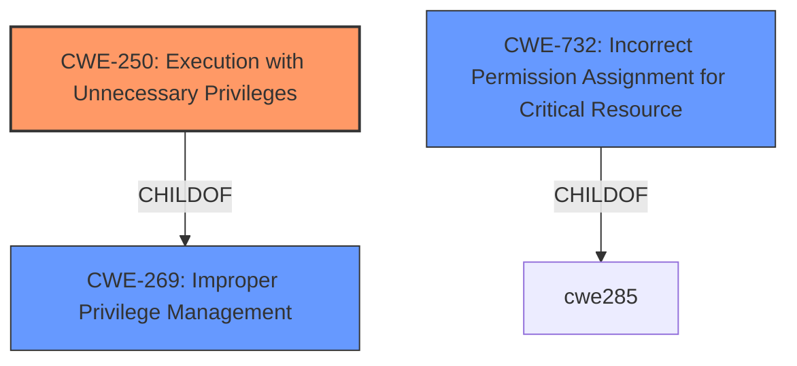

# Enhanced Analysis for CVE-2022-41290

# Summary
| CWE ID    | CWE Name                                                                                                          | Confidence | CWE Abstraction Level | CWE Vulnerability Mapping Label | CWE-Vulnerability Mapping Notes |
| --------- | ----------------------------------------------------------------------------------------------------------------- | ---------- | ----------------------- | ------------------------------- | --------------------------------- |
| CWE-250   | Execution with Unnecessary Privileges                                                                             | 0.85       | Base                    | Primary CWE                     | Allowed                           |
| CWE-269   | Improper Privilege Management                                                                                     | 0.65       | Class                   | Secondary Candidate             | Discouraged                       |
| CWE-732   | Incorrect Permission Assignment for Critical Resource                                                             | 0.60       | Class                   | Secondary Candidate             | Allowed-with-Review             |

## Evidence and Confidence

*   **Confidence Score:** 0.80
*   **Evidence Strength:** MEDIUM

## Relationship Analysis
The primary relationship influencing my decision is that CWE-250 is a child of CWE-269. Although CWE-269 appears higher in the retriever results, its discouraged usage and Class level abstraction make CWE-250 a better fit. Also considered was CWE-732 as it relates to critical resources but it was deemed less descriptive of the root cause than CWE-250.



## Vulnerability Chain
The chain of events starts with the **rm_rlcache_file command** being executed by a non-privileged user, leading to **Execution with Unnecessary Privileges (CWE-250)**, and ultimately resulting in the ability to **obtain root privileges.**

## Summary of Analysis
The initial assessment focused on identifying the root cause of the vulnerability, which lies in the `rm_rlcache_file` command's behavior when executed by a non-privileged user. The key phrase "obtain root privileges" and the description of a "non-privileged local user" exploiting the command to gain elevated privileges strongly suggest a privilege management issue.

The Retriever results pointed to CWE-250 (Execution with Unnecessary Privileges) and CWE-269 (Improper Privilege Management). While CWE-269 is a broader category, CWE-250 provides a more precise description of the **weakness**: the command is running with privileges it doesn't need, and this allows a non-privileged user to escalate their privileges.

The evidence from the vulnerability description and CVE Reference Links Content Summary directly supports this: "IBM AIX 7.1, 7.2, 7.3, and VIOS 3.1 could allow a non-privileged local user to exploit a vulnerability in the rm_rlcache_file command to obtain root privileges." This statement highlights that the command, when run by a non-privileged user, leads to unintended privilege escalation. The fact that a non-privileged user can trigger this suggests the command is running with unnecessary privileges.

CWE-250 is at the Base level of abstraction, which is preferred. The mapping guidance for CWE-250 also states: "Carefully read both the name and description to ensure that this mapping is an appropriate fit. Do not try to 'force' a mapping to a lower-level Base/Variant simply to comply with this preferred level of abstraction." In this case, the description of CWE-250 aligns well with the vulnerability.

Therefore, I am assigning CWE-250 as the primary CWE. CWE-269 is considered a secondary candidate because it's a broader class that encompasses the issue, but it's less specific and its usage is discouraged. CWE-732 was also considered, but the root cause is more about a command running with too much privilege than an explicit incorrect assignment of permissions.

Relevant CWE Information:

# Enhanced Context (25 CWEs)

## CWE-1289: Improper Validation of Unsafe Equivalence in Input
**Abstraction Level**: Base
**Similarity Score**: 0.78
**Source**: dense

**Description**:
The product receives an input value that is used as a resource identifier or other type of reference, but it does not validate or incorrectly validates that the input is equivalent to a potentially-unsafe value.

**Mapping Guidance**:
- Usage: Allowed
- Rationale: This CWE entry is at the Base level of abstraction, which is a preferred level of abstraction for mapping to the root causes of vulnerabilities.

## CWE-73: External Control of File Name or Path
**Abstraction Level**: Base
**Similarity Score**: 0.78
**Source**: dense

**Description**:
The product allows user input to control or influence paths or file names that are used in filesystem operations.

**Mapping Guidance**:
- Usage: Allowed
- Rationale: This CWE entry is at the Base level of abstraction, which is a preferred level of abstraction for mapping to the root causes of vulnerabilities.

## CWE-41: Improper Resolution of Path Equivalence
**Abstraction Level**: Base
**Similarity Score**: 0.77
**Source**: dense

**Description**:
The product is vulnerable to file system contents disclosure through path equivalence. Path equivalence involves the use of special characters in file and directory names. The associated manipulations are intended to generate multiple names for the same object.

**Mapping Guidance**:
- Usage: Allowed
- Rationale: This CWE entry is at the Base level of abstraction, which is a preferred level of abstraction for mapping to the root causes of vulnerabilities.

## CWE-23: Relative Path Traversal
**Abstraction Level**: Base
**Similarity Score**: 0.77
**Source**: dense

**Description**:
The product uses external input to construct a pathname that should be within a restricted directory, but it does not properly neutralize sequences such as ".." that can resolve to a location that is outside of that directory.

**Mapping Guidance**:
- Usage: Allowed
- Rationale: This CWE entry is at the Base level of abstraction, which is a preferred level of abstraction for mapping to the root causes of vulnerabilities.

## CWE-807: Reliance on Untrusted Inputs in a Security Decision
**Abstraction Level**: Base
**Similarity Score**: 0.77
**Source**: dense

**Description**:
The product uses a protection mechanism that relies on the existence or values of an input, but the input can be modified by an untrusted actor in a way that bypasses the protection mechanism.

**Mapping Guidance**:
- Usage: Allowed
- Rationale: This CWE entry is at the Base level of abstraction, which is a preferred level of abstraction for mapping to the root causes of vulnerabilities.

## CWE-184: Incomplete List of Disallowed Inputs
**Abstraction Level**: Base
**Similarity Score**: 0.76
**Source**: dense

**Description**:
The product implements a protection mechanism that relies on a list of inputs (or properties of inputs) that are not allowed by policy or otherwise require other action to neutralize before additional processing takes place, but the list is incomplete.

**Mapping Guidance**:
- Usage: Allowed
- Rationale: This CWE entry is at the Base level of abstraction, which is a preferred level of abstraction for mapping to the root causes of vulnerabilities.

## CWE-668: Exposure of Resource to Wrong Sphere
**Abstraction Level**: Class
**Similarity Score**: 0.76
**Source**: dense

**Description**:
The product exposes a resource to the wrong control sphere, providing unintended actors with inappropriate access to the resource.

**Mapping Guidance**:
- Usage: Discouraged
- Rationale: CWE-668 is high-level and is often misused as a catch-all when lower-level CWE IDs might be applicable. It is sometimes used for low-information vulnerability reports [REF-1287]. It is a level-1 Class (i.e., a child of a Pillar). It is not useful for trend analysis.

## CWE-59: Improper Link Resolution Before File Access ('Link Following')
**Abstraction Level**: Base
**Similarity Score**: 0.76
**Source**: dense

**Description**:
The product attempts to access a file based on the filename, but it does not properly prevent that filename from identifying a link or shortcut that resolves to an unintended resource.

**Mapping Guidance**:
- Usage: Allowed
- Rationale: This CWE entry is at the Base level of abstraction, which is a preferred level of abstraction for mapping to the root causes of vulnerabilities.

## CWE-138: Improper Neutralization of Special Elements
**Abstraction Level**: Class
**Similarity Score**: 0.76
**Source**: dense

**Description**:
The product receives input from an upstream component, but it does not neutralize or incorrectly neutralizes special elements that could be interpreted as control elements or syntactic markers when they are sent to a downstream component.


## CWE Relationship Analysis

Current CWEs represent these abstraction levels: .


### Vulnerability Chain Analysis

**Chain starting from CWE-41:**
- 41 (Improper Resolution of Path Equivalence) - ROOT


**Chain starting from CWE-184:**
- 184 (Incomplete List of Disallowed Inputs) - ROOT


### CWE Relationship Diagram

```mermaid
graph TD
    classDef primary fill:#f96,stroke:#333,stroke-width:2px
    classDef secondary fill:#69f,stroke:#333
    classDef tertiary fill:#9e9,stroke:#333
```