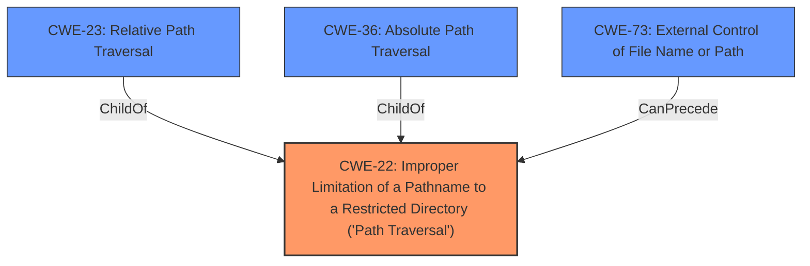

# Raw Analyzer Response for CVE-2022-41328

# Summary
| CWE ID | CWE Name | Confidence | CWE Abstraction Level | CWE Vulnerability Mapping Label | CWE-Vulnerability Mapping Notes |
|---|---|---|---|---|---|
| CWE-22 | Improper Limitation of a Pathname to a Restricted Directory ('Path Traversal') | 1.0 | Base | Allowed | Primary CWE |

## Evidence and Confidence

*   **Confidence Score:** 1.0
*   **Evidence Strength:** HIGH

## Relationship Analysis
The primary relationship is that CWE-22 is a base-level weakness related to improper path handling. CWE-23 (Relative Path Traversal) and CWE-36 (Absolute Path Traversal) are children of CWE-22, providing more specific classifications, but the description does not specify whether relative or absolute path traversal is used, so CWE-22 is the best fit. CWE-73 (External Control of File Name or Path) can precede CWE-22 in a vulnerability chain, where external control of the filename enables path traversal.

## Vulnerability Chain
The chain of events is as follows:
1.  **Root Cause:** **Improper pathname limitation** (CWE-22) within CLI commands.
2.  **Exploitation:** A privileged attacker crafts CLI commands to perform **path traversal**.
3.  **Impact:** The attacker can read and write arbitrary files on the underlying Linux system, potentially leading to unauthorized code or command execution.

## Summary of Analysis
The primary weakness is the **improper pathname limitation** leading to **path traversal**. The vulnerability description explicitly mentions a **path traversal** [CWE-22] vulnerability. The "CVE Reference Links Content Summary" reinforces this by stating: "Root cause of vulnerability: Improper limitation of a pathname to a restricted directory, also known as path traversal" and "Weaknesses/vulnerabilities present: Path traversal [CWE-22]."

The Retriever Results also strongly suggest CWE-22 as the best match, giving it a score of 1.0. CWE-23, CWE-73, and CWE-36 were considered but were not as directly supported by the evidence.

The choice of CWE-22 is at the optimal level of specificity because the description doesn't specify whether the **path traversal** is relative or absolute, making the more general CWE-22 the most appropriate.