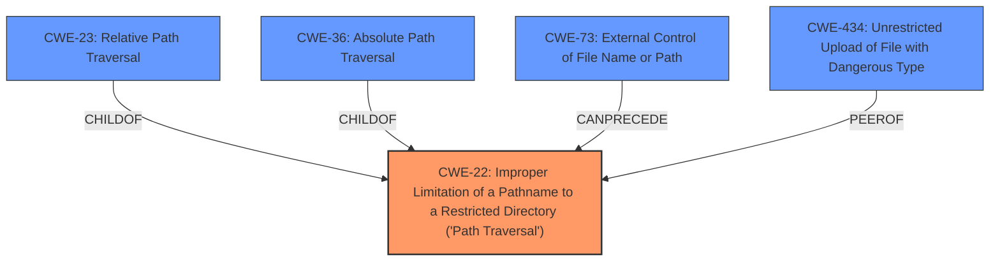

# Analysis for CVE-2022-41352

# Summary
| CWE ID | CWE Name | Confidence | CWE Abstraction Level | CWE Vulnerability Mapping Label | CWE-Vulnerability Mapping Notes |
|---|---|---|---|---|---|
| CWE-22 | Improper Limitation of a Pathname to a Restricted Directory ('Path Traversal') | 0.9 | Base | Primary | Allowed |
| CWE-434 | Unrestricted Upload of File with Dangerous Type | 0.7 | Base | Secondary | Allowed |

## Evidence and Confidence

*   **Confidence Score:** 0.8
*   **Evidence Strength:** HIGH

## Relationship Analysis
The primary CWE is CWE-22, which deals with path traversal issues due to improper limitation of pathnames. CWE-23 (Relative Path Traversal) and CWE-36 (Absolute Path Traversal) are children of CWE-22, representing specific types of path traversal. CWE-434 (Unrestricted Upload of File with Dangerous Type) is a peer of CWE-430 (Unprotected Storage of Credentials) and CWE-436 (Interpretation Conflict) indicating it is related to file handling and upload issues. CWE-73 (External Control of File Name or Path) can precede CWE-22, showing that external control of file paths can lead to path traversal vulnerabilities.

## Vulnerability Chain
The vulnerability chain starts with the **cpio loophole**, which leads to arbitrary file upload due to the **improper handling of pathnames** within the archive. This allows an attacker to overwrite files in arbitrary locations, leading to remote code execution.

Root Cause: **Improper Limitation of a Pathname to a Restricted Directory ('Path Traversal') (CWE-22)**
Weakness: Unrestricted Upload of File with Dangerous Type (CWE-434)
Impact: Remote Code Execution

## Summary of Analysis
The initial assessment identified the "**cpio loophole**" as a significant factor. The primary finding is CWE-22 (Improper Limitation of a Pathname to a Restricted Directory ('Path Traversal')), supported by the vulnerability description and CVE details. The content indicates that the `cpio` utility, when used without proper safeguards, allows attackers to write files to arbitrary locations, a classic path traversal scenario. The description specifically mentions "extraction to /opt/zimbra/jetty/webapps/zimbra/public" which provides evidence of how an attacker can write to unintended locations.

The analysis considered CWE-23 (Relative Path Traversal) as a more specific variant of CWE-22 but the provided information doesn't explicitly limit the traversal to relative paths only. Therefore, CWE-22 is a more appropriate fit.

The graph relationships helped to illustrate how external control of file names (CWE-73) can precede and enable path traversal (CWE-22), and how unrestricted file uploads (CWE-434) are related to the path traversal vulnerability.

The final selection of CWE-22 is based on its direct relevance to the vulnerability description, its alignment with the CVE details, and its base-level abstraction, which is preferred for root cause analysis. CWE-434 is included as a secondary CWE due to the unrestricted upload aspect of the vulnerability.

Relevant CWE Information:

# Enhanced Context (25 CWEs)
The following CWEs were identified as potentially relevant to this vulnerability:

## CWE-23: Relative Path Traversal
**Abstraction Level**: Base
**Similarity Score**: 0.80
**Source**: dense

**Description**:
The product uses external input to construct a pathname that should be within a restricted directory, but it does not properly neutralize sequences such as ".." that can resolve to a location that is outside of that directory.

**Mapping Guidance**:
- Usage: Allowed
- Rationale: This CWE entry is at the Base level of abstraction, which is a preferred level of abstraction for mapping to the root causes of vulnerabilities.

## CWE-434: Unrestricted Upload of File with Dangerous Type
**Abstraction Level**: base
**Similarity Score**: 4.33
**Source**: graph

**Description**:
CWE-434: Unrestricted Upload of File with Dangerous Type

**Mapping Guidance**:
- Usage: Allowed
- Rationale: This CWE entry is at the Base level of abstraction, which is a preferred level of abstraction for mapping to the root causes of vulnerabilities.

**Relationships**:
- CANFOLLOW -> CWE-73
- CANFOLLOW -> CWE-184
- CANFOLLOW -> CWE-183
- PEEROF -> CWE-430
- PEEROF -> CWE-436

## CWE-22: Improper Limitation of a Pathname to a Restricted Directory ('Path Traversal')
**Abstraction Level**: Base
**Similarity Score**: 8178.32
**Source**: sparse

**Description**:
The product uses external input to construct a pathname that is intended to identify a file or directory that is located underneath a restricted parent directory, but the product does not properly neutralize special elements within the pathname that can cause the pathname to resolve to a location that is outside of the restricted directory.

**Mapping Guidance**:
- Usage: Allowed
- Rationale: This CWE entry is at the Base level of abstraction, which is a preferred level of abstraction for mapping to the root causes of vulnerabilities.

## Technical Explanation for CWE-22
*   **How the vulnerability's details match the CWE's characteristics:** The vulnerability involves the **improper handling of pathnames** during archive extraction, allowing attackers to write to arbitrary locations outside the intended directory.
*   **The security implications and potential impact:** This leads to arbitrary file upload and potentially remote code execution, as attackers can overwrite critical system files.
*   **Any parent-child relationships or chain patterns that influenced your mapping:** CWE-23 (Relative Path Traversal) is a child of CWE-22, but the broader nature of the vulnerability, allowing writes to any accessible path, makes CWE-22 more appropriate.
*   **Whether the weakness is primary or secondary in the vulnerability:** Primary.
*   **How the official MITRE mapping guidance influenced your decision:** The MITRE mapping guidance suggests using the Base level of abstraction, which CWE-22 fulfills.

## Technical Explanation for CWE-434
*   **How the vulnerability's details match the CWE's characteristics:** The vulnerability allows the upload of arbitrary files without proper restrictions on the file type.
*   **The security implications and potential impact:** This can lead to the execution of malicious code if a dangerous file type is uploaded and executed by the server.
*   **Any parent-child relationships or chain patterns that influenced your mapping:** There are no direct parent-child relationships. However, CWE-434 can follow CWE-73 (External Control of File Name or Path).
*   **Whether the weakness is primary or secondary in the vulnerability:** Secondary, as it is a consequence of the path traversal issue.
*   **How the official MITRE mapping guidance influenced your decision:** The MITRE mapping guidance suggests using the Base level of abstraction, which CWE-434 fulfills.

## CWEs Considered But Not Used
*   **CWE-23 (Relative Path Traversal):** While related, the vulnerability description does not limit the traversal to relative paths only. Therefore, the broader CWE-22 is more suitable.
*   **CWE-93 (Improper Neutralization of CRLF Sequences ('CRLF Injection')):** This CWE is not relevant as the vulnerability is related to file path manipulation rather than CRLF injection.
*   **CWE-306 (Missing Authentication for Critical Function):** This CWE is not directly applicable as the vulnerability is related to path traversal during file extraction, not a missing authentication issue.
*   **CWE-863 (Incorrect Authorization):** This CWE is not directly relevant as the issue is not related to incorrect authorization checks but rather to improper handling of file paths.
*   **CWE-770 (Allocation of Resources Without Limits or Throttling):** This CWE is not applicable as the vulnerability is not related to resource allocation issues but rather to path traversal during file extraction.
*   **CWE-73 (External Control of File Name or Path):** While there is external control of the file path, the core issue is the improper limitation of the pathname, making