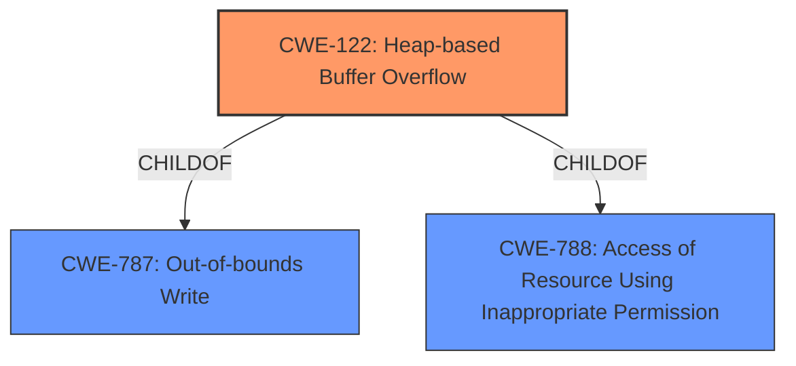

# Enhanced Analysis for CVE-2022-4141

# Summary
| CWE ID | CWE Name | Confidence | CWE Abstraction Level | CWE Vulnerability Mapping Label | CWE-Vulnerability Mapping Notes |
|---|---|---|---|---|---|
| CWE-122 | Heap-based Buffer Overflow | 1.0 | Variant | Primary | Allowed |

## Evidence and Confidence

*   **Confidence Score:** 1.0
*   **Evidence Strength:** HIGH

## Relationship Analysis
The primary relationship impacting the decision is the ChildOf relationship between CWE-122 and CWE-787 (Out-of-bounds Write) and CWE-788 (Access of Resource Using Inappropriate Permission). CWE-122 is a variant of CWE-787, specifying the location of the buffer overflow as the heap.



## Vulnerability Chain
The vulnerability chain starts with a crafted substitute command, leading to the **heap-based buffer overflow** due to **invalid memory access** when `CTRL-W gf` is used in the expression.

## Summary of Analysis
The initial analysis focused on the provided **Vulnerability Description** and **CVE Reference Links Content Summary**. The key phrase "**Heap based buffer overflow**" immediately suggested CWE-122. The **CVE Reference Links Content Summary** section confirmed this by detailing an **invalid memory access** scenario caused by using `CTRL-W gf` in the substitute command, which jumps to a different file without proper lock checking. The fix involved adding a check for text locks, which further supports the buffer overflow classification.

The Retriever Results listed CWE-122 as a candidate and the Complete CWE Specifications confirmed that CWE-122 accurately describes the vulnerability. The mapping guidance for CWE-122 is "Allowed" and it is at the Variant level of abstraction, making it a preferred level of abstraction.

Other CWEs considered included:

*   CWE-119 (Improper Restriction of Operations within the Bounds of a Memory Buffer): This is a more general class, and CWE-122 provides a more specific description (heap-based). The mapping guidance for CWE-119 is "Discouraged."
*   CWE-190 (Integer Overflow or Wraparound): While integer overflows can lead to buffer overflows, there is no evidence of an integer overflow in the description.
*   CWE-126 (Buffer Over-read): The vulnerability is a write, not a read.
*   CWE-124 (Buffer Underwrite ('Buffer Underflow')): The vulnerability is an overflow, not an underflow.
*   CWE-786 (Access of Memory Location Before Start of Buffer): This is a related CWE, but CWE-122 more accurately describes the vulnerability.
*   CWE-120 (Buffer Copy without Checking Size of Input ('Classic Buffer Overflow')): This CWE requires a buffer copy operation, and that isn't explicitly mentioned in the description. Also, its usage is "Allowed-with-Review".
*   CWE-193 (Off-by-one Error): There is no indication of an off-by-one error in the description.
*   CWE-1284 (Improper Validation of Specified Quantity in Input): The vulnerability is not explicitly related to improper validation of input quantity.
*   CWE-131 (Incorrect Calculation of Buffer Size): There is no mention of incorrect calculation of buffer size.

Therefore, CWE-122 is the most appropriate and specific CWE for this vulnerability, based on the evidence provided.


## CWE Relationship Analysis

Current CWEs represent these abstraction levels: .


### Vulnerability Chain Analysis

**Chain starting from CWE-190:**
- 190 (Integer Overflow or Wraparound) - ROOT


**Chain starting from CWE-131:**
- 131 (Incorrect Calculation of Buffer Size) - ROOT


### CWE Relationship Diagram

```mermaid
graph TD
    classDef primary fill:#f96,stroke:#333,stroke-width:2px
    classDef secondary fill:#69f,stroke:#333
    classDef tertiary fill:#9e9,stroke:#333
```