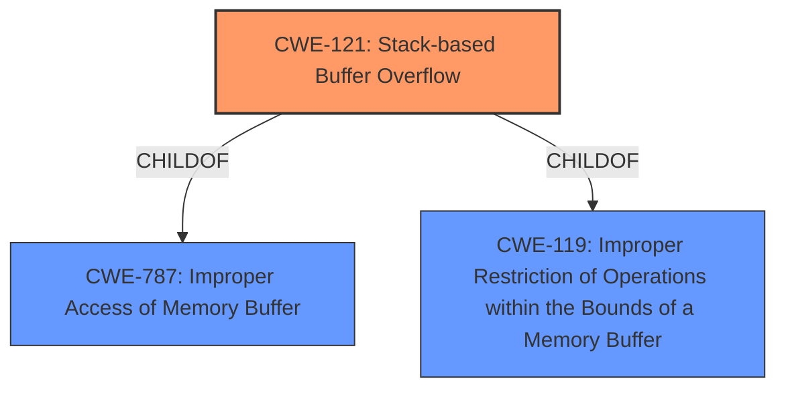

# Enhanced Analysis for CVE-2022-41415

# Summary
| CWE ID | CWE Name | Confidence | CWE Abstraction Level | CWE Vulnerability Mapping Label | CWE-Vulnerability Mapping Notes |
|---|---|---|---|---|---|
| CWE-121 | Stack-based Buffer Overflow | 1.0 | Variant | Primary | Allowed |

## Evidence and Confidence

*   **Confidence Score:** 1.0
*   **Evidence Strength:** HIGH

## Relationship Analysis
The primary relationship influencing the decision is the hierarchical one, with CWE-121 being a Variant of CWE-787 (Improper Access of Memory Buffer) and CWE-119 (Improper Restriction of Operations within the Bounds of a Memory Buffer). Given the clear indication of a **stack overflow**, selecting the more specific CWE-121 is appropriate. There are no chain relationships in this case, as the described vulnerability is a direct **stack overflow**.



## Vulnerability Chain
The vulnerability chain starts with an **improperly sized buffer** on the stack, leading to a **stack overflow** when data larger than the buffer's capacity is written into it.
  - **Root Cause:** **Improperly sized buffer** on the stack.
  - **Weakness:** **Stack overflow** (CWE-121).
  - **Impact:** Denial of Service (DoS) due to overwritten stack.

## Summary of Analysis
The analysis strongly supports CWE-121 as the primary CWE. The vulnerability description explicitly mentions a "**stack overflow**" in the `RevserveMem` component, and the CVE Reference Links Content Summary further confirms this, stating that the root cause is due to the incorrect use of `gRT->GetVariable` with a hardcoded `DataSize` parameter larger than the allocated stack buffer. This leads to the **stack-based buffer overflow**. The direct evidence of the **stack overflow** combined with the retriever results listing CWE-121 as the top match confirms this assessment.

The selection of CWE-121 is at the optimal level of specificity because it accurately represents the **stack-based nature** of the buffer overflow, which is a critical aspect of the vulnerability.

Relevant CWE Information:

# Enhanced Context (25 CWEs)
The following CWEs were identified as potentially relevant to this vulnerability:

## CWE-131: Incorrect Calculation of Buffer Size
**Abstraction Level**: Base
**Similarity Score**: 0.78
**Source**: dense

**Description**:
The product does not correctly calculate the size to be used when allocating a buffer, which could lead to a buffer overflow.

**Mapping Guidance**:
- Usage: Allowed
- Rationale: This CWE entry is at the Base level of abstraction, which is a preferred level of abstraction for mapping to the root causes of vulnerabilities.

## CWE-190: Integer Overflow or Wraparound
**Abstraction Level**: Base
**Similarity Score**: 0.76
**Source**: dense

**Description**:
The product performs a calculation that can produce an integer overflow or wraparound when the logic assumes that the resulting value will always be larger than the original value.

**Mapping Guidance**:
- Usage: Allowed
- Rationale: This CWE entry is at the Base level of abstraction, which is a preferred level of abstraction for mapping to the root causes of vulnerabilities.

## CWE-121: Stack-based Buffer Overflow
**Abstraction:** Variant
**Status:** Draft

### Description
A stack-based buffer overflow condition is a condition where the buffer being overwritten is allocated on the stack (i.e., is a local variable or, rarely, a parameter to a function).

### Extended Description
Not provided

### Alternative Terms
Stack Overflow: "Stack Overflow" is often used to mean the same thing as stack-based buffer overflow, however it is also used on occasion to mean stack exhaustion, usually a result from an excessively recursive function call. Due to the ambiguity of the term, use of stack overflow to describe either circumstance is discouraged.

### Relationships
ChildOf -> CWE-788
ChildOf -> CWE-787

### Mapping Guidance
**Usage:** Allowed
**Rationale:** This CWE entry is at the Variant level of abstraction, which is a preferred level of abstraction for mapping to the root causes of vulnerabilities.
**Comments:** Carefully read both the name and description to ensure that this mapping is an appropriate fit. Do not try to 'force' a mapping to a lower-level Base/Variant simply to comply with this preferred level of abstraction.
**Reasons:**
- Acceptable-Use

### Observed Examples
- **CVE-2021-35395:** Stack-based buffer overflows in SFK for wifi chipset used for IoT/embedded devices, as exploited in the wild per CISA KEV.

I considered the other CWEs listed in the Retriever Results and Complete CWE Specifications but did not select them as the primary CWE because they do not specifically address the **stack-based nature** of the buffer overflow described in the vulnerability. For instance, CWE-190 (Integer Overflow or Wraparound) and CWE-770 (Allocation of Resources Without Limits or Throttling) are related to different types of weaknesses. While an integer overflow could potentially lead to a buffer overflow, the provided information directly points to a **stack overflow** due to an **improperly sized buffer**.


## CWE Relationship Analysis

Current CWEs represent these abstraction levels: .


### Vulnerability Chain Analysis

**Chain starting from CWE-131:**
- 131 (Incorrect Calculation of Buffer Size) - ROOT


**Chain starting from CWE-190:**
- 190 (Integer Overflow or Wraparound) - ROOT


### CWE Relationship Diagram

```mermaid
graph TD
    classDef primary fill:#f96,stroke:#333,stroke-width:2px
    classDef secondary fill:#69f,stroke:#333
    classDef tertiary fill:#9e9,stroke:#333
```