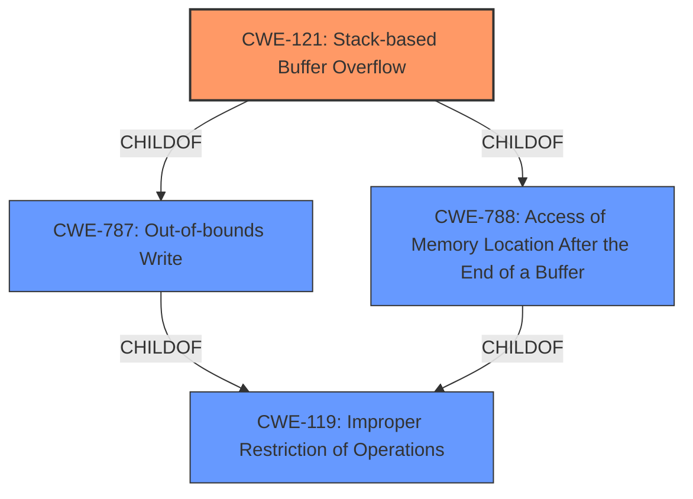

# Analysis Report for CVE-2022-41420

# Vulnerability Analysis Report: CVE-2022-41420

## Description


## Analysis (with Relationship Data)

# Summary
| CWE ID  | CWE Name  | Confidence | CWE Abstraction Level | CWE Vulnerability Mapping Label | CWE-Vulnerability Mapping Notes |
|---|---|---|---|---|---|
| CWE-121 | Stack-based Buffer Overflow | 1.0 | Variant | Allowed | Primary CWE |

## Evidence and Confidence

*   **Confidence Score:** 1.0
*   **Evidence Strength:** HIGH

## Relationship Analysis
The primary relationship influencing the decision is the ChildOf relationship between CWE-121 and its parents. CWE-121 is a Variant of CWE-788 and CWE-787, which are in turn related to buffer overflows. This hierarchical structure confirms that CWE-121 is a specific type of buffer overflow occurring on the stack.



## Vulnerability Chain
The vulnerability chain involves a crafted input file leading to a **stack overflow** in the `do_ea` function, which results in memory corruption and a potential crash.
  - Crafted Input File -> **Stack Overflow** (CWE-121) -> Memory Corruption -> Crash

## Summary of Analysis
The initial assessment strongly points to CWE-121, Stack-based Buffer Overflow, as the primary weakness. This is based on the vulnerability description explicitly mentioning a **stack overflow** in the Ndisasm component of nasm v2.16. The CVE Reference Links Content Summary further supports this, stating that "A stack buffer overflow occurs in the `do_ea` function within the disassembler component when processing a crafted input file."

The graph relationships confirm that CWE-121 is a specific type of buffer overflow. The retriever results also list CWE-121 as the top match with a score of 1.0.

The selection of CWE-121 is at the optimal level of specificity because the evidence explicitly identifies the overflow as occurring on the stack. Therefore, a more general CWE like CWE-119 would not be as accurate.

Relevant CWE Information:

# Enhanced Context (25 CWEs)
The following CWEs were identified as potentially relevant to this vulnerability:

## CWE-191: Integer Underflow (Wrap or Wraparound)
**Abstraction Level**: Base
**Similarity Score**: 0.77
**Source**: dense
## CWE-131: Incorrect Calculation of Buffer Size
**Abstraction Level**: Base
**Similarity Score**: 0.76
**Source**: dense
## CWE-805: Buffer Access with Incorrect Length Value
**Abstraction Level**: Base
**Similarity Score**: 0.75
**Source**: dense
## CWE-124: Buffer Underwrite ('Buffer Underflow')
**Abstraction Level**: Base
**Similarity Score**: 0.75
**Source**: dense
## CWE-789: Memory Allocation with Excessive Size Value
**Abstraction Level**: Variant
**Similarity Score**: 0.75
**Source**: dense
## CWE-1325: Improperly Controlled Sequential Memory Allocation
**Abstraction Level**: Base
**Similarity Score**: 0.74
**Source**: dense
## CWE-126: Buffer Over-read
**Abstraction Level**: Variant
**Similarity Score**: 0.74
**Source**: dense
## CWE-125: Out-of-bounds Read
**Abstraction Level**: Base
**Similarity Score**: 0.74
**Source**: dense
## CWE-190: Integer Overflow or Wraparound
**Abstraction Level**: Base
**Similarity Score**: 0.74
**Source**: dense
## CWE-404: Improper Resource Shutdown or Release
**Abstraction Level**: Class
**Similarity Score**: 0.74
**Source**: dense
## CWE-190: Integer Overflow or Wraparound
**Abstraction Level**: Base
**Similarity Score**: 6207.16
**Source**: sparse
## CWE-125: Out-of-bounds Read
**Abstraction Level**: Base
**Similarity Score**: 5758.63
**Source**: sparse
## CWE-1284: Improper Validation of Specified Quantity in Input
**Abstraction Level**: Base
**Similarity Score**: 5675.91
**Source**: sparse
## CWE-193: Off-by-one Error
**Abstraction Level**: Base
**Similarity Score**: 5460.79
**Source**: sparse
## CWE-191: Integer Underflow (Wrap or Wraparound)
**Abstraction Level**: Base
**Similarity Score**: 5444.54
**Source**: sparse
## CWE-128: Wrap-around Error
**Abstraction Level**: base
**Similarity Score**: 5.03
**Source**: graph
## CWE-170: Improper Null Termination
**Abstraction Level**: base
**Similarity Score**: 5.03
**Source**: graph
## CWE-120: Buffer Copy without Checking Size of Input ('Classic Buffer Overflow')
**Abstraction Level**: base
**Similarity Score**: 4.82
**Source**: graph
## CWE-123: Write-what-where Condition
**Abstraction Level**: base
**Similarity Score**: 4.33
**Source**: graph
## CWE-770: Allocation of Resources Without Limits or Throttling
**Abstraction Level**: base
**Similarity Score**: 4.33
**Source**: graph
## CWE-1284: Improper Validation of Specified Quantity in Input
**Abstraction Level**: base
**Similarity Score**: 4.33
**Source**: graph
## CWE-195: Signed to Unsigned Conversion Error
**Abstraction Level**: variant
**Similarity Score**: 3.88
**Source**: graph
## CWE-463: Deletion of Data Structure Sentinel
**Abstraction Level**: base
**Similarity Score**: 3.64
**Source**: graph
## CWE-1339: Insufficient Precision or Accuracy of a Real Number
**Abstraction Level**: base
**Similarity Score**: 3.57
**Source**: graph
## CWE-190: Integer Overflow or Wraparound
**Abstraction Level**: Base
**Similarity Score**: 3.31
**Source**: graph

The vulnerability description clearly indicates a **stack overflow**. Therefore, the most appropriate CWE is **CWE-121 (Stack-based Buffer Overflow)**. This is a Variant-level CWE, providing a specific classification of the buffer overflow.

Other CWEs were considered but deemed less appropriate:

*   **CWE-190 (Integer Overflow or Wraparound)**: While integer overflows can sometimes lead to buffer overflows, the primary issue here is the **stack overflow** itself, not an integer overflow.
*   **CWE-674 (Uncontrolled Recursion)**: Although uncontrolled recursion can lead to stack exhaustion, the vulnerability description specifies a buffer overflow, not excessive recursion.
*   **CWE-125 (Out-of-bounds Read)**: This CWE describes reading data outside buffer boundaries, while the described vulnerability involves writing data beyond the buffer's capacity.
*   **CWE-120 (Buffer Copy without Checking Size of Input)**: This CWE is a more general type of buffer overflow and doesn't specify the location (stack vs. heap). Since the vulnerability is explicitly on the stack, CWE-121 is more specific.
*   **CWE-126 (Buffer Over-read)**: Similar to CWE-125, this involves reading beyond buffer boundaries, not writing.
*   **CWE-770 (Allocation of Resources Without Limits or Throttling)** and **CWE-1284 (Improper Validation of Specified Quantity in Input)**: These CWEs are related to resource management and input validation, but they don't directly describe the **stack overflow** condition.

The evidence from the vulnerability description, combined with the retriever results and the CWE specifications, strongly supports the selection of CWE-121 as the most appropriate mapping.


## CWE Relationship Analysis

Current CWEs represent these abstraction levels: .


### Vulnerability Chain Analysis

**Chain starting from CWE-121:**
- 121 (Stack-based Buffer Overflow) - ROOT


**Chain starting from CWE-119:**
- 119 (Improper Restriction of Operations within the Bounds of a Memory Buffer) - ROOT


### CWE Relationship Diagram

```mermaid
graph TD
    classDef primary fill:#f96,stroke:#333,stroke-width:2px
    classDef secondary fill:#69f,stroke:#333
    classDef tertiary fill:#9e9,stroke:#333
```


*Report generated on 2025-03-31 10:51:57*
