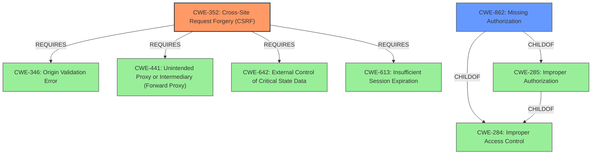

# Analysis for CVE-2022-4148

# Summary
| CWE ID | CWE Name | Confidence | CWE Abstraction Level | CWE Vulnerability Mapping Label | CWE-Vulnerability Mapping Notes |
|---|---|---|---|---|---|
| CWE-352 | Cross-Site Request Forgery (CSRF) | 1.0 | Compound | Allowed | Primary CWE |
| CWE-862 | Missing Authorization | 0.9 | Class | Allowed-with-Review | Secondary Candidate |

## Evidence and Confidence

*   **Confidence Score:** 0.95
*   **Evidence Strength:** HIGH

## Relationship Analysis
The primary weakness is CWE-352 [Cross-Site Request Forgery (CSRF)], a compound weakness. The secondary weakness is CWE-862 [Missing Authorization], which is a child of CWE-285 [Improper Authorization]. CWE-352 requires CWE-346 [Origin Validation Error], CWE-441 [Unintended Proxy or Intermediary (Forward Proxy)], CWE-642 [External Control of Critical State Data], and CWE-613 [Insufficient Session Expiration].

## Vulnerability Chain
The vulnerability chain begins with a **flawed CSRF and authorization check**, leading to **missing authorization** and ultimately allowing any authenticated user to **delete arbitrary clients**.

## Summary of Analysis
The vulnerability in the WP OAuth Server plugin is due to a **flawed CSRF and authorization check**. The key phrase "flawed CSRF and authorisation check" from the vulnerability description directly points to these weaknesses. The "CVE Reference Links Content Summary" confirms the presence of **missing authorization** and a **CSRF vulnerability**.

Based on the evidence, the primary CWE is CWE-352 [Cross-Site Request Forgery (CSRF)]. The plugin **does not sufficiently verify** if the request was intentionally provided by the user. This aligns directly with the description of CWE-352.

The secondary CWE is CWE-862 [Missing Authorization], because the plugin does not properly verify if the user is authorized to delete the client. The vulnerability description mentions that "any authenticated users, such as subscriber" can delete clients, which implies that the authorization check is **missing** or insufficient. While CWE-863 [Incorrect Authorization] was also considered, CWE-862 is more appropriate as the authorization check is essentially bypassed.

The selected CWEs are at the appropriate level of specificity, with CWE-352 being a compound weakness that accurately captures the CSRF aspect and CWE-862, a Class, representing the authorization issue.

Other CWEs Considered:

*   CWE-863 [Incorrect Authorization]: Considered but deemed less appropriate than CWE-862, as the authorization check is effectively bypassed rather than incorrectly performed.
*   CWE-285 [Improper Authorization]: Discouraged due to its high-level nature; CWE-862 provides a more specific classification.
*   CWE-425 [Direct Request ('Forced Browsing')]: Not directly applicable, as the issue is not about bypassing a navigation path but about missing CSRF protection and authorization checks.
* CWE-79 [Improper Neutralization of Input During Web Page Generation ('Cross-site Scripting')]: Not applicable as the vulnerability doesn't involve improper neutralization of input.
* CWE-434 [Unrestricted Upload of File with Dangerous Type]: Not applicable as the vulnerability doesn't involve file uploads.
* CWE-603 [Use of Client-Side Authentication]: Not applicable as the vulnerability doesn't involve client-side authentication.
* CWE-306 [Missing Authentication for Critical Function]: Not applicable as the vulnerability involves a missing authorization check, not authentication.