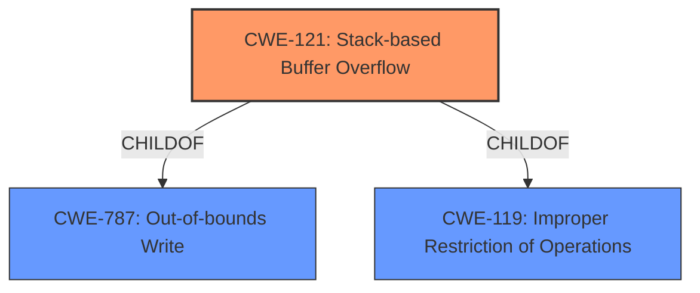

# Analysis Report for CVE-2022-41520

# Vulnerability Analysis Report: CVE-2022-41520

## Description


## Analysis (with Relationship Data)

# Summary
| CWE ID | CWE Name | Confidence | CWE Abstraction Level | CWE Vulnerability Mapping Label | CWE-Vulnerability Mapping Notes |
|---|---|---|---|---|---|
| CWE-121 | Stack-based Buffer Overflow | 1.0 | Variant | Allowed | Primary CWE |

## Evidence and Confidence

*   **Confidence Score:** 1.0
*   **Evidence Strength:** HIGH

## Relationship Analysis
The primary relationship that influenced my decision was the ChildOf relationship between CWE-121 and its parents, CWE-787 and CWE-119. While CWE-787 (Out-of-bounds Write) is more general, CWE-121 specifically identifies the **stack** as the location of the buffer overflow, aligning precisely with the vulnerability description. CWE-119 (Improper Restriction of Operations within the Bounds of a Memory Buffer) is a higher-level class that encompasses various buffer-related weaknesses, but CWE-121 provides the necessary specificity for this case.



## Vulnerability Chain
The vulnerability chain is straightforward:
1.  **Root Cause:** A **stack overflow** occurs due to an unspecified error in the `UploadCustomModule` function when handling the `File` parameter.
2.  **Impact:** The **stack overflow** can lead to arbitrary code execution, denial of service, or other security breaches.

## Summary of Analysis
The analysis is based on the vulnerability description provided. The key phrase "stack overflow" directly corresponds to CWE-121. The Retriever Results also strongly support CWE-121 as the primary candidate, with a score of 1.0.

The description explicitly states that the vulnerability is a **stack overflow** within the `UploadCustomModule` function, triggered by the `File` parameter. This aligns perfectly with the definition of CWE-121, which is a "stack-based buffer overflow condition." The CWE descriptions and relationships confirm that CWE-121 is the most specific and appropriate choice, providing adequate granularity for this vulnerability.

I am overriding the consideration of other CWEs due to the explicit mention of "stack overflow", which maps directly to CWE-121. While other CWEs like CWE-190 (Integer Overflow) or CWE-78 (OS Command Injection) could potentially be related in more complex scenarios, the available information does not suggest their involvement in this specific instance.

Relevant CWE Information:

# Enhanced Context (25 CWEs)

## CWE-121: Stack-based Buffer Overflow
**Abstraction:** Variant
**Status:** Draft

### Description
A stack-based buffer overflow condition is a condition where the buffer being overwritten is allocated on the stack (i.e., is a local variable or, rarely, a parameter to a function).

### Extended Description
Not provided

### Alternative Terms
Stack Overflow: "Stack Overflow" is often used to mean the same thing as stack-based buffer overflow, however it is also used on occasion to mean stack exhaustion, usually a result from an excessively recursive function call. Due to the ambiguity of the term, use of stack overflow to describe either circumstance is discouraged.

### Relationships
ChildOf -> CWE-788
ChildOf -> CWE-787

### Mapping Guidance
**Usage:** Allowed
**Rationale:** This CWE entry is at the Variant level of abstraction, which is a preferred level of abstraction for mapping to the root causes of vulnerabilities.
**Comments:** Carefully read both the name and description to ensure that this mapping is an appropriate fit. Do not try to 'force' a mapping to a lower-level Base/Variant simply to comply with this preferred level of abstraction.
**Reasons:**
- Acceptable-Use

### Additional Notes
**[Other]** Stack-based buffer overflows can instantiate in return address overwrites, stack pointer overwrites or frame pointer overwrites. They can also be considered function pointer overwrites, array indexer overwrites or write-what-where condition, etc.

### Observed Examples
- **CVE-2021-35395:** Stack-based buffer overflows in SFK for wifi chipset used for IoT/embedded devices, as exploited in the wild per CISA KEV.


## CWE Relationship Analysis

Current CWEs represent these abstraction levels: .


### Vulnerability Chain Analysis

**Chain starting from CWE-190:**
- 190 (Integer Overflow or Wraparound) - ROOT


**Chain starting from CWE-121:**
- 121 (Stack-based Buffer Overflow) - ROOT


### CWE Relationship Diagram

```mermaid
graph TD
    classDef primary fill:#f96,stroke:#333,stroke-width:2px
    classDef secondary fill:#69f,stroke:#333
    classDef tertiary fill:#9e9,stroke:#333
```


*Report generated on 2025-03-30 19:51:48*
