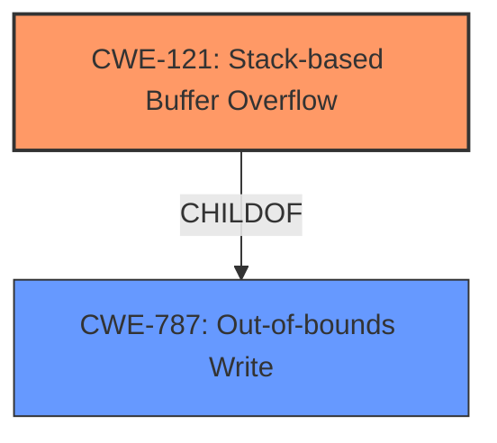

# Analysis Report for CVE-2022-41521

# Vulnerability Analysis Report: CVE-2022-41521

## Description


## Analysis (with Relationship Data)

# Summary
| CWE ID | CWE Name | Confidence | CWE Abstraction Level | CWE Vulnerability Mapping Label | CWE-Vulnerability Mapping Notes |
|---|---|---|---|---|---|
| CWE-121 | Stack-based Buffer Overflow | 1.0 | Variant | Allowed | Primary CWE |

## Evidence and Confidence

*   **Confidence Score:** 1.0
*   **Evidence Strength:** HIGH

## Relationship Analysis
The primary CWE is CWE-121, Stack-based Buffer Overflow which is a variant of CWE-787, Out-of-bounds Write. This reflects the specific nature of the buffer overflow occurring on the stack.



## Vulnerability Chain
The vulnerability chain starts with the **stack overflow** condition in the `setIpPortFilterRules` function. The `sPort/ePort` parameters cause a buffer overflow on the stack. This leads to the potential for arbitrary code execution.

## Summary of Analysis
The vulnerability description clearly states that there is an authenticated **stack overflow** in the `setIpPortFilterRules` function due to the `sPort/ePort` parameter.

The Retriever Results identify CWE-121 as the top candidate with a score of 1.0.
CWE-121 (Stack-based Buffer Overflow) is a Variant of CWE-787 (Out-of-bounds Write), which aligns with the nature of the vulnerability.

The description mentions that the stack overflow is in the `setIpPortFilterRules` function due to the `sPort/ePort` parameter. This is sufficient evidence to assign CWE-121 as the primary CWE.

Relevant CWE Information:

# Enhanced Context (25 CWEs)

## CWE-121: Stack-based Buffer Overflow
**Abstraction:** Variant
**Status:** Draft

### Description
A stack-based buffer overflow condition is a condition where the buffer being overwritten is allocated on the stack (i.e., is a local variable or, rarely, a parameter to a function).

### Mapping Guidance
**Usage:** Allowed
**Rationale:** This CWE entry is at the Variant level of abstraction, which is a preferred level of abstraction for mapping to the root causes of vulnerabilities.

### Observed Examples
- **CVE-2021-35395:** Stack-based buffer overflows in SFK for wifi chipset used for IoT/embedded devices, as exploited in the wild per CISA KEV.

CWE-190, CWE-78, CWE-674, CWE-125, CWE-790, CWE-128, CWE-120, CWE-770 and CWE-1284 were considered but are not a fit because the description specifically says stack overflow which is best represented by CWE-121.


## CWE Relationship Analysis

Current CWEs represent these abstraction levels: .


### Vulnerability Chain Analysis

**Chain starting from CWE-190:**
- 190 (Integer Overflow or Wraparound) - ROOT


**Chain starting from CWE-121:**
- 121 (Stack-based Buffer Overflow) - ROOT


### CWE Relationship Diagram

```mermaid
graph TD
    classDef primary fill:#f96,stroke:#333,stroke-width:2px
    classDef secondary fill:#69f,stroke:#333
    classDef tertiary fill:#9e9,stroke:#333
```


*Report generated on 2025-03-31 03:17:23*
