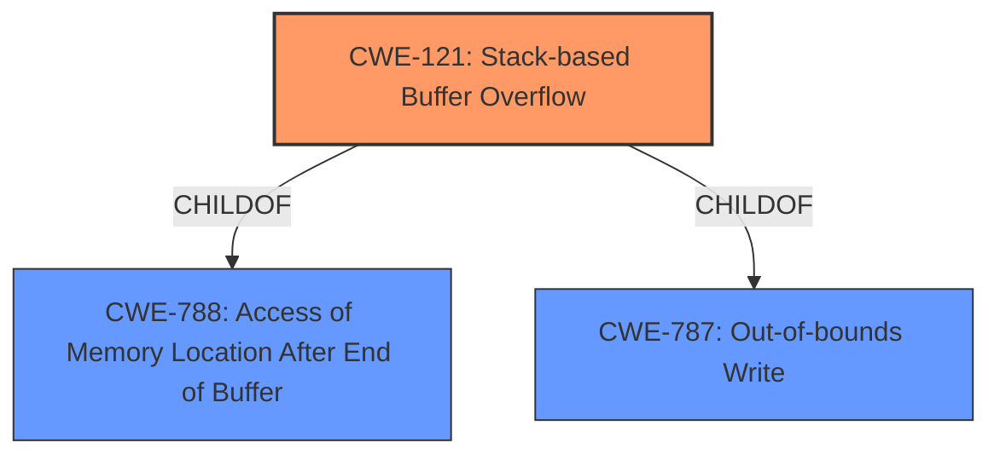

# Raw Analyzer Response for CVE-2022-41523

# Summary
| CWE ID | CWE Name | Confidence | CWE Abstraction Level | CWE Vulnerability Mapping Label | CWE-Vulnerability Mapping Notes |
|---|---|---|---|---|---|
| CWE-121 | Stack-based Buffer Overflow | 1.0 | Variant | Allowed | Primary CWE |

## Evidence and Confidence

*   **Confidence Score:** 1.0
*   **Evidence Strength:** HIGH

## Relationship Analysis
The primary CWE is CWE-121 (Stack-based Buffer Overflow), which is a variant of CWE-788 (Access of Memory Location After End of Buffer) and CWE-787 (Out-of-bounds Write). This hierarchical relationship indicates that CWE-121 is a specific type of out-of-bounds write that occurs on the stack.

## Vulnerability Chain
The vulnerability chain involves a **stack overflow** in the `setTracerouteCfg` function, which allows an attacker to overwrite memory on the stack, potentially leading to arbitrary code execution.

## Summary of Analysis
The analysis is based on the vulnerability description, which explicitly mentions a "**stack overflow**" in the `setTracerouteCfg` function. This aligns directly with CWE-121 (Stack-based Buffer Overflow), a variant-level CWE that accurately represents the weakness. The retriever results also ranked CWE-121 as the top candidate with a score of 1.0. The relationship analysis shows that CWE-121 is a specific type of out-of-bounds write, making it the most appropriate choice.

Relevant CWE Information:

# Enhanced Context (25 CWEs)

## CWE-121: Stack-based Buffer Overflow
**Abstraction:** Variant
**Status:** Draft

### Description
A stack-based buffer overflow condition is a condition where the buffer being overwritten is allocated on the stack (i.e., is a local variable or, rarely, a parameter to a function).

### Mapping Guidance
**Usage:** Allowed
**Rationale:** This CWE entry is at the Variant level of abstraction, which is a preferred level of abstraction for mapping to the root causes of vulnerabilities.

**Final Conclusion:** The vulnerability description clearly indicates a **stack overflow**, making CWE-121 the most specific and accurate classification. The high confidence score reflects the direct match between the vulnerability details and the CWE definition.

## CWE-190: Integer Overflow or Wraparound
**Abstraction:** Base
**Status:** Stable

### Description
The product performs a calculation that can
         produce an integer overflow or wraparound when the logic
         assumes that the resulting value will always be larger than
         the original value. This occurs when an integer value is
         incremented to a value that is too large to store in the
         associated representation. When this occurs, the value may
         become a very small or negative number.
### NOT USED
This CWE was considered because integer overflows can sometimes lead to buffer overflows if they are used in the calculation of buffer sizes. However, the vulnerability description does not provide any evidence of an integer overflow, so this CWE is not applicable.

## CWE-78: Improper Neutralization of Special Elements used in an OS Command ('OS Command Injection')
**Abstraction:** Base
**Status:** Stable

### Description
The product constructs all or part of an OS command using externally-influenced input from an upstream component, but it does not neutralize or incorrectly neutralizes special elements that could modify the intended OS command when it is sent to a downstream component.
### NOT USED
This CWE was considered because the `setTracerouteCfg` function might involve executing OS commands. However, the vulnerability description specifically mentions a **stack overflow**, not command injection, so this CWE is not applicable.

## CWE-674: Uncontrolled Recursion
**Abstraction:** Class
**Status:** Draft

### Description
The product does not properly control the amount of recursion that takes place,  consuming excessive resources, such as allocated memory or the program stack.
### NOT USED
This CWE was considered since recursion may lead to stack exhaustion which may be related to a **stack overflow**. However, the description is explicitly a **stack overflow**, not uncontrolled recursion.

## CWE-120: Buffer Copy without Checking Size of Input ('Classic Buffer Overflow')
**Abstraction:** Base
**Status:** Incomplete

### Description
The product copies an input buffer to an output buffer without verifying that the size of the input buffer is less than the size of the output buffer, leading to a buffer overflow.
### NOT USED
While this CWE is related to buffer overflows, CWE-121 is more specific as it explicitly identifies the overflow occurring on the stack. The lack of information about missing size checks also makes this less applicable than CWE-121.