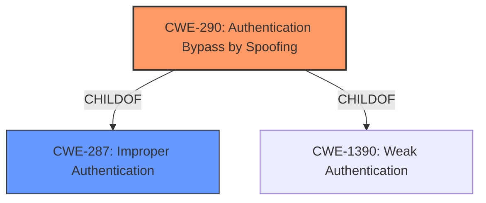

# Enhanced Analysis for CVE-2022-41579

# Summary
| CWE ID | CWE Name | Confidence | CWE Abstraction Level | CWE Vulnerability Mapping Label | CWE-Vulnerability Mapping Notes |
|---|---|---|---|---|---|
| CWE-290 | Authentication Bypass by Spoofing | 0.9 | Base | Allowed | Primary CWE |
| CWE-287 | Improper Authentication | 0.7 | Class | Discouraged | Secondary Candidate |

## Evidence and Confidence

*   **Confidence Score:** 0.9
*   **Evidence Strength:** HIGH

## Relationship Analysis
The primary relationship that influenced the selection was the ChildOf relationship between CWE-290 and CWE-287. CWE-290 is a more specific case of authentication bypass due to spoofing, making it a better fit than the broader CWE-287. The retriever results also supported CWE-290.



## Vulnerability Chain
The vulnerability chain starts with **insufficient authentication**, leading to the ability for an attacker to spoof a legitimate device and connect to the band.
  - **Root Cause:** **Insufficient Authentication**
  - **Weakness:** Ability to spoof device credentials
  - **Impact:** Attacker connects to the band

## Summary of Analysis
The initial analysis identified **insufficient authentication** as the root cause, leading to the ability to spoof a legitimate device. The retriever results suggested CWE-287 (Improper Authentication) and CWE-290 (Authentication Bypass by Spoofing). While CWE-287 is a broader classification, CWE-290 is more specific to the spoofing aspect described in the vulnerability. The vulnerability description states, "Successful exploit could allow the attacker to spoof then connect to the band." The CVE Reference Links Content Summary also mentions the attacker's ability to "fake credentials" and "spoof the device." Thus, CWE-290 is a more precise representation of the vulnerability.

The MITRE mapping guidance discourages the use of CWE-287 in favor of more specific entries. Therefore, CWE-290 was selected as the primary CWE with high confidence (0.9).

Relevant CWE Information:

# Enhanced Context (25 CWEs)
The following CWEs were identified as potentially relevant to this vulnerability:

## CWE-290: Authentication Bypass by Spoofing
**CWE-290**: Authentication Bypass by Spoofing

### Technical Explanation:
The vulnerability stems from the **insufficient authentication** mechanism, specifically allowing an attacker to spoof a legitimate device's credentials. This allows the attacker to bypass the intended authentication process and establish a connection with the Huawei band.

### Security Implications:
Successful exploitation grants the attacker unauthorized access to the band, potentially enabling them to control its functions, access sensitive data, or disrupt its operation.

### Relationship Explanation:
CWE-290 is a child of CWE-287 (Improper Authentication), representing a specific type of authentication failure related to spoofing.

### Mapping Guidance Influence:
The MITRE mapping guidance suggests using more specific CWEs when available, which influenced the choice of CWE-290 over the broader CWE-287.

### Other CWEs Considered but Not Used:
*   **CWE-287: Improper Authentication** - Considered but deemed too broad. CWE-290 provides a more accurate description of the vulnerability.
*   **CWE-305: Authentication Bypass by Primary Weakness** - Considered but not as fitting as CWE-290 since the primary weakness *is* the **insufficient authentication**, which is directly exploited via spoofing.
*   **CWE-863: Incorrect Authorization** - Authorization occurs *after* authentication. Since the authentication is bypassed, authorization is not reached.
*   **CWE-1220: Insufficient Granularity of Access Control** - Access control comes after authentication. Since authentication is bypassed, access control is never checked.


## CWE Relationship Analysis

Current CWEs represent these abstraction levels: .


### Vulnerability Chain Analysis

**Chain starting from CWE-290:**
- 290 (Authentication Bypass by Spoofing) - ROOT


**Chain starting from CWE-1390:**
- 1390 (Weak Authentication) - ROOT


### CWE Relationship Diagram

```mermaid
graph TD
    classDef primary fill:#f96,stroke:#333,stroke-width:2px
    classDef secondary fill:#69f,stroke:#333
    classDef tertiary fill:#9e9,stroke:#333
```