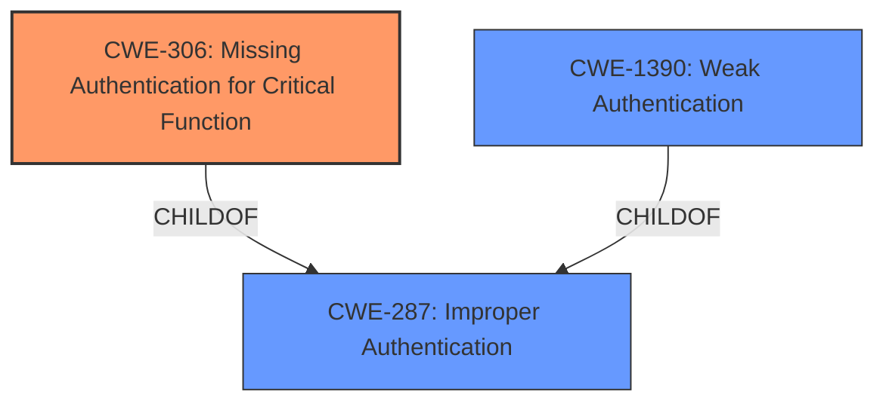

# Enhanced Analysis for CVE-2022-41590

# Summary
| CWE ID | CWE Name | Confidence | CWE Abstraction Level | CWE Vulnerability Mapping Label | CWE-Vulnerability Mapping Notes |
|---|---|---|---|---|---|
| CWE-306 | Missing Authentication for Critical Function | 0.8 | Base | Allowed | Primary CWE |
| CWE-287 | Improper Authentication | 0.6 | Class | Discouraged | Secondary Candidate |
| CWE-1390 | Weak Authentication | 0.5 | Class | Allowed-with-Review | Secondary Candidate |

## Evidence and Confidence

*   **Confidence Score:** 0.8
*   **Evidence Strength:** MEDIUM

## Relationship Analysis
The primary relationship influencing the selection was the parent-child relationship between CWE-287 (Improper Authentication) and CWE-306 (Missing Authentication for Critical Function). Because the vulnerability description suggests a complete lack of authentication during the setup wizard, CWE-306, a Base level CWE, was preferred over the more general Class-level CWE-287. CWE-1390 (Weak Authentication) was also considered but deemed less appropriate as it implies the presence of an authentication mechanism, albeit a flawed one, which isn't directly supported by the provided vulnerability description.



## Vulnerability Chain
The vulnerability chain is relatively simple:
1.  **Root Cause:** **Missing Authentication** (CWE-306) during the setup wizard.
2.  **Impact:** Bypass setup wizard, affecting smartphone availability.

## Summary of Analysis
The initial analysis strongly indicated an authentication issue. The vulnerability description explicitly mentions "**authentication-related vulnerabilities**" and a bypass of the setup wizard.

The Retriever results suggested several CWEs, including CWE-287 (Improper Authentication), CWE-119 (Improper Restriction of Operations within the Bounds of a Memory Buffer), CWE-306 (Missing Authentication for Critical Function), CWE-285 (Improper Authorization), and CWE-1390 (Weak Authentication).

CWE-306 (Missing Authentication for Critical Function) was chosen as the primary CWE because the description clearly indicates that the setup wizard can be bypassed, implying a complete absence of authentication. This aligns with CWE-306's description: "The product does not perform any authentication for functionality that requires a provable user identity or consumes a significant amount of resources." The setup wizard clearly qualifies as a critical function requiring authentication.

CWE-287 (Improper Authentication) and CWE-1390 (Weak Authentication) were considered but deemed less specific. CWE-287 is a more general class, and the mapping guidance discourages its use when lower-level CWEs are applicable. CWE-1390 implies some form of authentication exists but is weak, which isn't explicitly stated in the description.

The evidence supporting CWE-306 comes directly from the "**Vulnerability Description Key Phrases**": "**weakness:** **authentication-related vulnerabilities**", "**impact:** bypass setup wizard". This, combined with the absence of any mention of a flawed authentication mechanism, leads to the conclusion that authentication is entirely missing during the setup process.

The selection of CWE-306 as the primary CWE is at the optimal level of specificity because it directly addresses the root cause of the vulnerability: the lack of authentication for a critical function.

Relevant CWE Information:

# Enhanced Context (25 CWEs)

## CWE-1289: Improper Validation of Unsafe Equivalence in Input
**Abstraction Level**: Base
**Similarity Score**: 0.75
**Source**: dense

**Description**:
The product receives an input value that is used as a resource identifier or other type of reference, but it does not validate or incorrectly validates that the input is equivalent to a potentially-unsafe value.
*Not Selected*: Does not appear to be related to input validation.

## CWE-807: Reliance on Untrusted Inputs in a Security Decision
**Abstraction Level**: Base
**Similarity Score**: 0.74
**Source**: dense

**Description**:
The product uses a protection mechanism that relies on the existence or values of an input, but the input can be modified by an untrusted actor in a way that bypasses the protection mechanism.
*Not Selected*: Not relevant as there is no protection mechanism present.

## CWE-303: Incorrect Implementation of Authentication Algorithm
**Abstraction Level**: Base
**Similarity Score**: 0.74
**Source**: dense

**Description**:
The requirements for the product dictate the use of an established authentication algorithm, but the implementation of the algorithm is incorrect.
*Not Selected*: Not relevant as there is no authentication algorithm present.

## CWE-653: Improper Isolation or Compartmentalization
**Abstraction Level**: Class
**Similarity Score**: 0.73
**Source**: dense

**Description**:
The product does not properly compartmentalize or isolate functionality, processes, or resources that require different privilege levels, rights, or permissions.
*Not Selected*: Not relevant to authentication bypass.

## CWE-1390: Weak Authentication
**Abstraction Level**: Class
**Similarity Score**: 0.73
**Source**: dense

**Description**:
The product uses an authentication mechanism to restrict access to specific users or identities, but the mechanism does not sufficiently prove that the claimed identity is correct.
*Considered*: This was a secondary consideration, but deemed less accurate as the vulnerability description does not imply there is a weak authentication mechanism, only that it is bypassed.

## CWE-274: Improper Handling of Insufficient Privileges
**Abstraction Level**: Base
**Similarity Score**: 0.72
**Source**: dense

**Description**:
The product does not handle or incorrectly handles when it has insufficient privileges to perform an operation, leading to resultant weaknesses.
*Not Selected*: Not relevant to the authentication bypass.

## CWE-302: Authentication Bypass by Assumed-Immutable Data
**Abstraction Level**: Base
**Similarity Score**: 0.72
**Source**: dense

**Description**:
The authentication scheme or implementation uses key data elements that are assumed to be immutable, but can be controlled or modified by the attacker.
*Not Selected*: Not relevant as there is no authentication scheme.

## CWE-657: Violation of Secure Design Principles
**Abstraction Level**: Class
**Similarity Score**: 0.72
**Source**: dense

**Description**:
The product violates well-established principles for secure design.
*Not Selected*: Too broad, as a class level.

## CWE-305: Authentication Bypass by Primary Weakness
**Abstraction Level**: Base
**Similarity Score**: 0.72
**Source**: dense

**Description**:
The authentication algorithm is sound, but the implemented mechanism can be bypassed as the result of a separate weakness that is primary to the authentication error.
*Not Selected*: The description states an authentication algorithm that is bypassed, and is not missing.

## CWE-179: Incorrect Behavior Order: Early Validation
**Abstraction Level**: Base
**Similarity Score**: 0.72
**Source**: dense

**Description**:
The product validates input before applying protection mechanisms that modify the input, which could allow an attacker to bypass the validation via dangerous inputs that only arise after the modification.
*Not Selected*: Not related as there is no protection mechanism present.

## CWE-1390: Weak Authentication
**Abstraction Level**: Class
**Similarity Score**: 5871.21
**Source**: sparse

**Description**:
The product uses an authentication mechanism to restrict access to specific users or identities, but the mechanism does not sufficiently prove that the claimed identity is correct.
*Considered*: This was a secondary consideration, but deemed less accurate as the vulnerability description does not imply there is a weak authentication mechanism, only that it is bypassed.

## CWE-125: Out-of-bounds Read
**Abstraction Level**: Base
**Similarity Score**: 5841.22
**Source**: sparse

**Description**:
The product reads data past the end, or before the beginning, of the intended buffer.
*Not Selected*: Not relevant as the vulnerability description is related to Authentication.

## CWE-119: Improper Restriction of Operations within the Bounds of a Memory Buffer
**Abstraction Level**: Class
**Similarity Score**: 5837.99
**Source**: sparse

**Description**:
The product performs operations on a memory buffer, but it reads from or writes to a memory location outside the buffer's intended boundary. This may result in read or write operations on unexpected memory locations that could be linked to other variables, data structures, or internal program data.
*Not Selected*: Not relevant as


## CWE Relationship Analysis

Current CWEs represent these abstraction levels: .


### Vulnerability Chain Analysis

**Chain starting from CWE-179:**
- 179 (Incorrect Behavior Order: Early Validation) - ROOT


**Chain starting from CWE-1390:**
- 1390 (Weak Authentication) - ROOT


### CWE Relationship Diagram

```mermaid
graph TD
    classDef primary fill:#f96,stroke:#333,stroke-width:2px
    classDef secondary fill:#69f,stroke:#333
    classDef tertiary fill:#9e9,stroke:#333
```