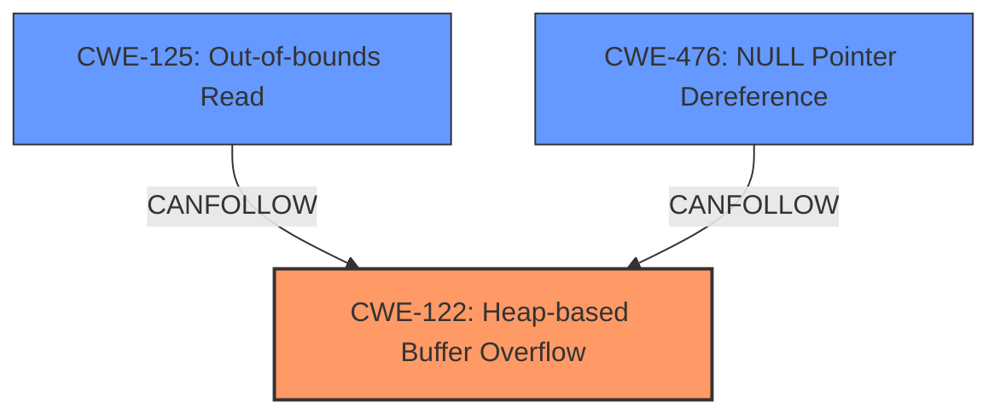

# Analysis for CVE-2022-41595

# Summary
| CWE ID | CWE Name | Confidence | CWE Abstraction Level | CWE Vulnerability Mapping Label | CWE-Vulnerability Mapping Notes |
|---|---|---|---|---|---|
| CWE-122 | Heap-based Buffer Overflow | 1.0 | Base | Allowed | Primary CWE |
| CWE-125 | Out-of-bounds Read | 1.0 | Base | Allowed | Secondary CWE |
| CWE-476 | NULL Pointer Dereference | 1.0 | Base | Allowed | Secondary CWE |

## Evidence and Confidence

*   **Confidence Score:** 1.0
*   **Evidence Strength:** HIGH

## Relationship Analysis
The primary CWE is CWE-122, which represents a heap-based buffer overflow. This can lead to CWE-125 (Out-of-bounds Read) and potentially CWE-476 (NULL Pointer Dereference) if the overflow corrupts pointer values. These CWEs are at the Base level, providing sufficient specificity.

## Vulnerability Chain
The vulnerability chain starts with a **heap overflow** (CWE-122). This **overflow** can then lead to an **out-of-bounds read** (CWE-125) and potentially a **null pointer dereference** (CWE-476) if memory corruption occurs.

## Summary of Analysis
The analysis is based on the provided vulnerability description, which explicitly mentions "**heap overflow**", "**out-of-bounds read**", and "**null pointer**" vulnerabilities.

*   The primary weakness is identified as CWE-122 (**Heap-based Buffer Overflow**), as it is the root cause that triggers the other weaknesses.
*   The secondary weaknesses are CWE-125 (**Out-of-bounds Read**) and CWE-476 (**NULL Pointer Dereference**), as they are potential consequences of the heap overflow.

The selected CWEs are at the optimal level of specificity (Base level), accurately representing the identified weaknesses based on the provided evidence.

Relevant CWE Information:

# Enhanced Context (25 CWEs)
The following CWEs were identified as potentially relevant to this vulnerability:

## CWE-131: Incorrect Calculation of Buffer Size
**Abstraction Level**: Base
**Similarity Score**: 0.73
**Source**: dense

**Description**:
The product does not correctly calculate the size to be used when allocating a buffer, which could lead to a buffer overflow.

**Mapping Guidance**:
- Usage: Allowed
- Rationale: This CWE entry is at the Base level of abstraction, which is a preferred level of abstraction for mapping to the root causes of vulnerabilities.

## CWE-824: Access of Uninitialized Pointer
**Abstraction Level**: Base
**Similarity Score**: 0.71
**Source**: dense

**Description**:
The product accesses or uses a pointer that has not been initialized.

**Mapping Guidance**:
- Usage: Allowed
- Rationale: This CWE entry is at the Base level of abstraction, which is a preferred level of abstraction for mapping to the root causes of vulnerabilities.

## CWE-754: Improper Check for Unusual or Exceptional Conditions
**Abstraction Level**: Class
**Similarity Score**: 0.71
**Source**: dense

**Description**:
The product does not check or incorrectly checks for unusual or exceptional conditions that are not expected to occur frequently during day to day operation of the product.

**Mapping Guidance**:
- Usage: Allowed-with-Review
- Rationale: This CWE entry is a Class and might have Base-level children that would be more appropriate

## CWE-703: Improper Check or Handling of Exceptional Conditions
**Abstraction Level**: Pillar
**Similarity Score**: 0.70
**Source**: dense

**Description**:
The product does not properly anticipate or handle exceptional conditions that rarely occur during normal operation of the product.

**Mapping Guidance**:
- Usage: Discouraged
- Rationale: This CWE entry is extremely high-level, a Pillar.

## CWE-129: Improper Validation of Array Index
**Abstraction Level**: Variant
**Similarity Score**: 0.69
**Source**: dense

**Description**:
The product uses untrusted input when calculating or using an array index, but the product does not validate or incorrectly validates the index to ensure the index references a valid position within the array.

**Mapping Guidance**:
- Usage: Allowed
- Rationale: This CWE entry is at the Variant level of abstraction, which is a preferred level of abstraction for mapping to the root causes of vulnerabilities.

## CWE-822: Untrusted Pointer Dereference
**Abstraction Level**: Base
**Similarity Score**: 0.69
**Source**: dense

**Description**:
The product obtains a value from an untrusted source, converts this value to a pointer, and dereferences the resulting pointer.

**Mapping Guidance**:
- Usage: Allowed
- Rationale: This CWE entry is at the Base level of abstraction, which is a preferred level of abstraction for mapping to the root causes of vulnerabilities.

## CWE-252: Unchecked Return Value
**Abstraction Level**: Base
**Similarity Score**: 0.69
**Source**: dense

**Description**:
The product does not check the return value from a method or function, which can prevent it from detecting unexpected states and conditions.

**Mapping Guidance**:
- Usage: Allowed
- Rationale: This CWE entry is at the Base level of abstraction, which is a preferred level of abstraction for mapping to the root causes of vulnerabilities.

## CWE-1391: Use of Weak Credentials
**Abstraction Level**: Class
**Similarity Score**: 0.69
**Source**: dense

**Description**:
The product uses weak credentials (such as a default key or hard-coded password) that can be calculated, derived, reused, or guessed by an attacker.

**Mapping Guidance**:
- Usage: Allowed-with-Review
- Rationale: This CWE entry is a Class and might have Base-level children that would be more appropriate

## CWE-345: Insufficient Verification of Data Authenticity
**Abstraction Level**: Class
**Similarity Score**: 0.69
**Source**: dense

**Description**:
The product does not sufficiently verify the origin or authenticity of data, in a way that causes it to accept invalid data.

**Mapping Guidance**:
- Usage: Discouraged
- Rationale: This CWE entry is a level-1 Class (i.e., a child of a Pillar). It might have lower-level children that would be more appropriate

## CWE-682: Incorrect Calculation
**Abstraction Level**: Pillar
**Similarity Score**: 0.69
**Source**: dense

**Description**:
The product performs a calculation that generates incorrect or unintended results that are later used in security-critical decisions or resource management.

**Mapping Guidance**:
- Usage: Discouraged
- Rationale: This CWE entry is extremely high-level, a Pillar. In many cases, lower-level children or descendants are more appropriate. However, sometimes this weakness is forced to be used due to the lack of in-depth weakness research. See Research Gaps.

## CWE-190: Integer Overflow or Wraparound
**Abstraction Level**: Base
**Similarity Score**: 2412.90
**Source**: sparse

**Description**:
The product performs a calculation that can
         produce an integer overflow or wraparound when the logic
         assumes that the resulting value will always be larger than
         the original value. This occurs when an integer value is
         incremented to a value that is too large to store in the
         associated representation. When this occurs, the value may
         become a very small or negative number.

**Mapping Guidance**:
- Usage: Allowed
- Rationale: This CWE entry is at the Base level of abstraction, which is a preferred level of abstraction for mapping to the root causes of vulnerabilities.

## CWE-131: Incorrect Calculation of Buffer Size
**Abstraction Level**: Base
**Similarity Score**: 2305.17
**Source**: sparse

**Description**:
The product does not correctly calculate the size to be used when allocating a buffer, which could lead to a buffer overflow.

**Mapping Guidance**:
- Usage: Allowed
- Rationale: This CWE entry is at the Base level of abstraction, which is a preferred level of abstraction for mapping to the root causes of vulnerabilities.

## CWE-125: Out-of-bounds Read
**Abstraction Level**: Base
**Similarity Score**: 2278.21
**Source**: sparse

**Description**:
The product reads data past the end, or before the beginning, of the intended buffer.

**Mapping Guidance**:
- Usage:

# Enhanced Query for CVE-2022-41595

# Vulnerability Description

    The phones have the **heap overflow**, **out-of-bounds read**, and **null pointer** vulnerabilities in the fingerprint trusted application (TA).Successful exploitation of this vulnerability may affect the fingerprint service.

    # Keyphrase-Specific CWE Analysis
    This vulnerability contains multiple keyphrases that may map to different CWEs. 
    Please analyze each keyphrase separately and determine the most appropriate CWE(s) for each.

    ## WEAKNESS: 'heap overflow'

Relevant CWEs for this WEAKNESS:

### 1. CWE-122: Heap-based Buffer Overflow (Score: 265.68)

A heap overflow condition is a buffer overflow, where the buffer that can be overwritten is allocated in the heap portion of memory, generally meaning that the buffer was allocated using a routine such as malloc()....

### 2. CWE-131: Incorrect Calculation of Buffer Size (Score: 256.29)

The product does not correctly calculate the size to be used when allocating a buffer, which could lead to a buffer overflow....

### 3. CWE-190: Integer Overflow or Wraparound (Score: 249.30)

The product performs a calculation that can
         produce an integer overflow or wraparound when the logic
         assumes that the resulting value will always be larger than
         the original value. This occurs when an integer value is
         incremented to a value that is too large to st...

### 4. CWE-193: Off-by-one Error (Score: 241.10)

A product calculates or uses an incorrect maximum or minimum value that is 1 more, or 1 less, than the correct value....

### 5. CWE-125: Out-of-bounds Read (Score: 235.78)

The product reads data past the end, or before the beginning, of the intended buffer....

## WEAKNESS: 'out-of-bounds read'

Relevant CWEs for this WEAKNESS:

### 1. CWE-122: Heap-based Buffer Overflow (Score: 265.68)

A heap overflow condition is a buffer overflow, where the buffer that can be overwritten is allocated in the heap portion of memory, generally meaning that the buffer was allocated using a routine such as malloc()....

### 2. CWE-129: Improper Validation of Array Index (Score: 265.56)

The product uses untrusted input when calculating or using an array index, but the product does not validate or incorrectly validates the index to ensure the index references a valid position within the array....

### 3. CWE-119: Improper Restriction of Operations within the Bounds of a Memory Buffer (Score: 261.39)

The product performs operations on a memory buffer, but it reads from or writes to a memory location outside the buffer's intended boundary. This may result in read or write operations on unexpected memory locations that could be linked to other variables, data structures, or internal program data....

### 4. CWE-131: Incorrect Calculation of Buffer Size (Score: 256.29)

The product does not correctly calculate the size to be used when allocating a buffer, which could lead to a buffer overflow....

### 5. CWE-125: Out-of-bounds Read (Score: 235.78)

The product reads data past the end, or before the beginning, of the intended buffer....

## PRODUCT: 'phones'

Relevant CWEs for this PRODUCT:

### 1. CWE-122: Heap-based Buffer Overflow (Score: 265.68)

A heap overflow condition is a buffer overflow, where the buffer that can be overwritten is allocated in the heap portion of memory, generally meaning that the buffer was allocated using a routine such as malloc()....

### 2. CWE-119: Improper Restriction of Operations within the Bounds of a Memory Buffer (Score: 261.39)

The product performs operations on a memory buffer, but it reads from or writes to a memory location outside the buffer's intended boundary. This may result in read or write operations on unexpected memory locations that could be linked to other variables, data structures, or internal program data....

### 3. CWE-131: Incorrect Calculation of Buffer Size (Score: 256.29)

The product does not correctly calculate the size to be used when allocating a buffer, which could lead to a buffer overflow....

### 4. CWE-190: Integer Overflow or Wraparound (Score: 249.30)

The product performs a calculation that can
         produce an integer overflow or wraparound when the logic
         assumes that the resulting value will always be larger than
         the original value. This occurs when an integer value is
         incremented to a value that is too large to st...

### 5. CWE-125: Out-of-bounds Read (Score: 235.78)

The product reads data past the end, or before the beginning, of the intended buffer....

## COMPONENT: 'fingerprint trusted application (TA)'

Relevant CWEs for this COMPONENT:

### 1. CWE-122: Heap-based Buffer Overflow (Score: 265.68)

A heap overflow condition is a buffer overflow, where the buffer that can be overwritten is allocated in the heap portion of memory, generally meaning that the buffer was allocated using a routine such as malloc()....

### 2. CWE-119: Improper Restriction of Operations within the Bounds of a Memory Buffer (Score: 261.39)

The product performs operations on a memory buffer, but it reads from or writes to a memory location outside the buffer's intended boundary. This may result in read or write operations on unexpected memory locations that could be linked to other variables, data structures, or internal program data....

### 3. CWE-131: Incorrect Calculation of Buffer Size (Score: 256.29)

The product does not correctly calculate the size to be used when allocating a buffer, which could lead to a buffer overflow....

### 4. CWE-125: Out-of-bounds Read (Score: 235.78)

The product reads data past the end, or before the beginning, of the intended buffer....

### 5. CWE-1284: Improper Validation of Specified Quantity in Input (Score: 68.82)

The product receives input that is expected to specify a quantity (such as size or length), but it does not validate or incorrectly validates that the quantity has the required properties....

## WEAKNESS: 'null pointer'

Relevant CWEs for this WEAKNESS:

### 1. CWE-131: Incorrect Calculation of Buffer Size (Score: 256.29)

The product does not correctly calculate the size to be used when allocating a buffer, which could lead to a buffer overflow....

### 2. CWE-476: NULL Pointer Dereference (Score: 249.35)

The product dereferences a pointer that it expects to be valid but is NULL....

### 3. CWE-824: Access of Uninitialized Pointer (Score: 230.62)

The product accesses or uses a pointer that has not been initialized....

### 4. CWE-456: Missing Initialization of a Variable (Score: 213.94)

The product does not initialize critical variables, which causes the execution environment to use unexpected values....

### 5. CWE-252: Unchecked Return Value (Score: 212.12)

The product does not check the return value from a method or function, which can prevent it from detecting unexpected states and conditions....

    # Analysis Instructions
    1. For each keyphrase, identify the most appropriate CWE(s) that represent the weakness.
    2. Consider how the different keyphrases might relate to each other in the vulnerability chain.
    3. Provide a final determination of primary CWE(s) and any secondary CWEs.
    4. Format your response using the standard analysis template.

    Please analyze how these different weaknesses interact and provide a comprehensive CWE classification.
    