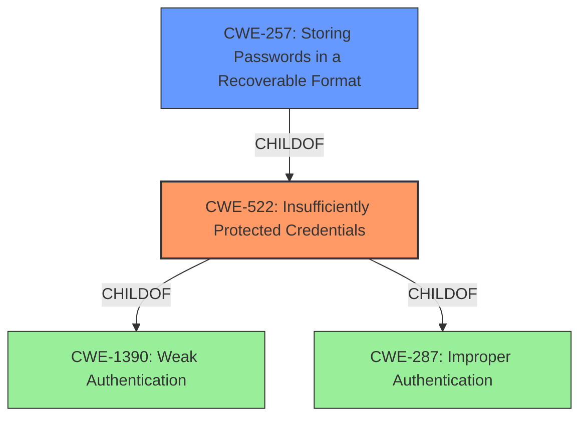

# Enhanced Analysis for CVE-2022-41614

# Summary
| CWE ID | CWE Name | Confidence | CWE Abstraction Level | CWE Vulnerability Mapping Label | CWE-Vulnerability Mapping Notes |
|---|---|---|---|---|---|
| CWE-522 | Insufficiently Protected Credentials | 0.9 | Class | Allowed-with-Review | Primary CWE |
| CWE-257 | Storing Passwords in a Recoverable Format | 0.7 | Base | Allowed | Secondary Candidate |

## Evidence and Confidence

*   **Confidence Score:** 0.8
*   **Evidence Strength:** HIGH

## Relationship Analysis
The primary CWE, CWE-522 [CWE-522: Insufficiently Protected Credentials], is a Class-level CWE. A more specific Base or Variant CWE would be ideal. CWE-522 [CWE-522: Insufficiently Protected Credentials] has a parent-child relationship with CWE-1390 [CWE-1390: Weak Authentication] and CWE-287 [CWE-287: Improper Authentication]. CWE-257 [CWE-257: Storing Passwords in a Recoverable Format] is a child of CWE-522 [CWE-522: Insufficiently Protected Credentials] which makes it more specific.



## Vulnerability Chain
The application has **insufficiently protected credentials**. This leads to potential information disclosure due to local access by an authenticated user.

## Summary of Analysis
The vulnerability involves **insufficiently protected credentials**, leading to potential information disclosure.

The vulnerability description explicitly states "**Insufficiently protected credentials**" as the root cause, which strongly aligns with CWE-522 [CWE-522: Insufficiently Protected Credentials]. The CVE Reference Links Content Summary further confirms this by highlighting that the application stored credentials in a way that they could be accessed by a local user.

CWE-522 [CWE-522: Insufficiently Protected Credentials] is a Class-level CWE. The mapping guidance suggests examining children of this entry for a better fit. CWE-257 [CWE-257: Storing Passwords in a Recoverable Format] is a child of CWE-522 [CWE-522: Insufficiently Protected Credentials] and describes storing passwords in a format that makes them subject to reuse. The description for CWE-257 [CWE-257: Storing Passwords in a Recoverable Format] requires more investigation. However, since the description does not explicitly state the format the credentials are in, it's safer to go with the parent.

Based on the evidence and relationship analysis, CWE-522 [CWE-522: Insufficiently Protected Credentials] is the most appropriate primary CWE.

Other CWEs Considered:
*   CWE-277 [CWE-277: Insecure Inherited Permissions]: While permissions are related to security, the root cause is not about insecurely inherited permissions but about the credentials themselves.
*   CWE-284 [CWE-284: Improper Access Control]: This is a high-level Pillar CWE and not specific enough.
*   CWE-248 [CWE-248: Uncaught Exception]: This CWE is not related to the described vulnerability.
*   CWE-287 [CWE-287: Improper Authentication]: This is related to authentication, but the core issue is how the credentials are stored/protected, not the authentication process itself.
*   CWE-927 [CWE-927: Use of Implicit Intent for Sensitive Communication]: This is specific to Android applications using implicit intents, which is not mentioned or implied in the vulnerability description.
*   CWE-613 [CWE-613: Insufficient Session Expiration]: This is related to session management, not credential protection.
*   CWE-693 [CWE-693: Protection Mechanism Failure]: This is a high-level Pillar CWE and not specific enough.
*   CWE-691 [CWE-691: Insufficient Control Flow Management]: This is a high-level Pillar CWE and not related to the described vulnerability.

Relevant CWE Information:


## CWE Relationship Analysis

Current CWEs represent these abstraction levels: .


### Vulnerability Chain Analysis

**Chain starting from CWE-613:**
- 613 (Insufficient Session Expiration) - ROOT


**Chain starting from CWE-693:**
- 693 (Protection Mechanism Failure) - ROOT


### CWE Relationship Diagram

```mermaid
graph TD
    classDef primary fill:#f96,stroke:#333,stroke-width:2px
    classDef secondary fill:#69f,stroke:#333
    classDef tertiary fill:#9e9,stroke:#333
```