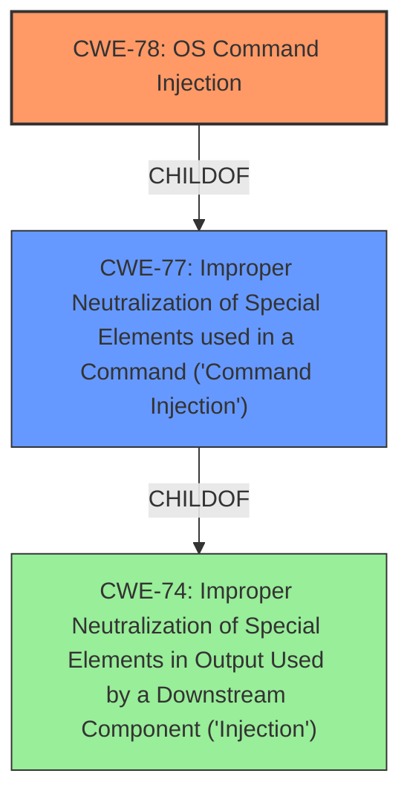

# Analysis for CVE-2022-41617

# Summary
| CWE ID | CWE Name | Confidence | CWE Abstraction Level | CWE Vulnerability Mapping Label | CWE-Vulnerability Mapping Notes |
|---|---|---|---|---|---|
| CWE-78 | Improper Neutralization of Special Elements used in an OS Command ('OS Command Injection') | 0.8 | Base | Primary | Allowed |
| CWE-77 | Improper Neutralization of Special Elements used in a Command ('Command Injection') | 0.6 | Class | Secondary | Allowed-with-Review |

## Evidence and Confidence

*   **Confidence Score:** 0.7
*   **Evidence Strength:** MEDIUM

## Relationship Analysis
The primary CWE is CWE-78, which is a base-level CWE and a child of the class-level CWE-77. CWE-77 is a more general form of command injection, while CWE-78 specifically refers to OS command injection. The vulnerability description does not provide enough information to definitively say that it is OS command injection, but it is a strong possibility given the context of the BIG-IP iControl REST interface.

## Vulnerability Chain
The vulnerability chain involves **improper neutralization** of special elements, leading to command injection and ultimately remote code execution.

## Summary of Analysis
Initially, CWE-77 and CWE-78 were considered. The vulnerability description mentions "remote code execution" and "iControl REST interface," which suggests a command injection vulnerability. The description states that the vulnerability exists when the Advanced WAF / ASM module is provisioned in the BIG-IP iControl REST interface. However, there is not enough information to determine that the injection is specifically in the OS, therefore I marked CWE-77 as a secondary candidate.

The selection of CWE-78 is based on the following evidence:

*   The vulnerability involves the iControl REST interface, which likely allows for command execution.
*   The vulnerability results in remote code execution.
*   CWE-78 is a base-level CWE, which is preferred.

The selection of CWE-77 as a secondary candidate is based on the following:

*   CWE-77 is a more general form of command injection.
*   The vulnerability description does not explicitly state that the injection is in the OS.
*   CWE-77 is a class-level CWE, but is still relevant.

Other CWEs Considered and Rejected:

*   CWE-1176: Inefficient CPU Computation - This CWE is about inefficient algorithms, which is not relevant to the vulnerability description.
*   CWE-400: Uncontrolled Resource Consumption - This CWE is about resource exhaustion, which is not relevant to the vulnerability description.
*   CWE-269: Improper Privilege Management - This CWE is about privilege management, which is not the root cause based on the description.
*   CWE-918: Server-Side Request Forgery (SSRF) - This CWE is about SSRF, which is not relevant to the vulnerability description.
*   CWE-284: Improper Access Control - Too high level of an abstraction.
*   CWE-184: Incomplete List of Disallowed Inputs - The vulnerability isn't about an incomplete list of disallowed inputs.
*   CWE-1286: Improper Validation of Syntactic Correctness of Input - Not about improper validation of syntatic correctness.
*   CWE-74: Improper Neutralization of Special Elements in Output Used by a Downstream Component ('Injection') - This is a parent of CWE-77 and CWE-78.
*   CWE-863: Incorrect Authorization - This is about incorrect authorization, which is not relevant to the vulnerability description.