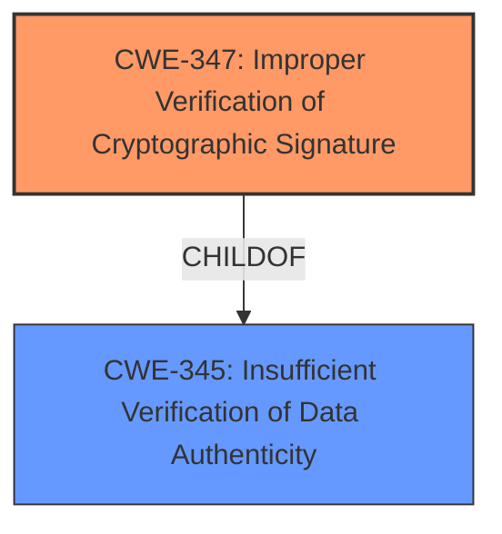

# Enhanced Analysis for CVE-2022-41669

# Summary
| CWE ID | CWE Name | Confidence | CWE Abstraction Level | CWE Vulnerability Mapping Label | CWE-Vulnerability Mapping Notes |
|---|---|---|---|---|---|
| CWE-347 | Improper Verification of Cryptographic Signature | 1 | Base | Allowed | Primary CWE |

## Evidence and Confidence

*   **Confidence Score:** 1
*   **Evidence Strength:** HIGH

## Relationship Analysis
The vulnerability description directly mentions "**Improper Verification of Cryptographic Signature**", aligning perfectly with CWE-347. CWE-347 is a Base level CWE, which is the preferred level of abstraction. CWE-347 is a child of CWE-345: Insufficient Verification of Data Authenticity. However, CWE-347 is the more specific and appropriate choice as it directly addresses the cryptographic aspect of the signature verification.



## Vulnerability Chain
The vulnerability chain starts with the **Improper Verification of Cryptographic Signature** (CWE-347), which allows an adversary with local user privileges to load a malicious DLL, leading to the execution of malicious code.

## Summary of Analysis
The initial analysis correctly identifies the **Improper Verification of Cryptographic Signature** as the root cause of the vulnerability. The vulnerability description explicitly states that there is an **Improper Verification of Cryptographic Signature**, which aligns directly with CWE-347. The provided evidence is strong and directly supports the selection of CWE-347. The CWE is at the base level of abstraction, making it the most specific and appropriate choice.

The selection is based on the following evidence:
- **Vulnerability Description Key Phrases:** "**rootcause:** **Improper Verification of Cryptographic Signature**"

The graph relationships show that CWE-347 is more specific than its parent, CWE-345, and is therefore the better choice.

Relevant CWE Information:

# Enhanced Context (25 CWEs)

## CWE-807: Reliance on Untrusted Inputs in a Security Decision
**Abstraction Level**: Base
**Similarity Score**: 0.78
**Source**: dense

**Description**:
The product uses a protection mechanism that relies on the existence or values of an input, but the input can be modified by an untrusted actor in a way that bypasses the protection mechanism.
*This CWE was considered but does not directly match the root cause. The vulnerability is not about the protection mechanism relying on untrusted input, but rather the **improper verification of a cryptographic signature**.*

## CWE-1289: Improper Validation of Unsafe Equivalence in Input
**Abstraction Level**: Base
**Similarity Score**: 0.77
**Source**: dense

**Description**:
The product receives an input value that is used as a resource identifier or other type of reference, but it does not validate or incorrectly validates that the input is equivalent to a potentially-unsafe value.
*This CWE was considered but does not directly match the root cause. The vulnerability is not about improper validation of unsafe equivalence in input, but rather the **improper verification of a cryptographic signature**.*

## CWE-345: Insufficient Verification of Data Authenticity
**Abstraction Level**: Class
**Similarity Score**: 0.77
**Source**: dense

**Description**:
The product does not sufficiently verify the origin or authenticity of data, in a way that causes it to accept invalid data.
*This CWE was considered as a parent, but the more specific CWE-347 **Improper Verification of Cryptographic Signature** is a better fit.*

## CWE-1391: Use of Weak Credentials
**Abstraction Level**: Class
**Similarity Score**: 0.76
**Source**: dense

**Description**:
The product uses weak credentials (such as a default key or hard-coded password) that can be calculated, derived, reused, or guessed by an attacker.
*This CWE was considered but does not directly match the root cause. The vulnerability is not about the use of weak credentials, but rather the **improper verification of a cryptographic signature**.*

## CWE-1390: Weak Authentication
**Abstraction Level**: Class
**Similarity Score**: 0.75
**Source**: dense

**Description**:
The product uses an authentication mechanism to restrict access to specific users or identities, but the mechanism does not sufficiently prove that the claimed identity is correct.
*This CWE was considered but does not directly match the root cause. The vulnerability is not about weak authentication, but rather the **improper verification of a cryptographic signature**.*

## CWE-319: Cleartext Transmission of Sensitive Information
**Abstraction Level**: Base
**Similarity Score**: 0.75
**Source**: dense

**Description**:
The product transmits sensitive or security-critical data in cleartext in a communication channel that can be sniffed by unauthorized actors.
*This CWE was considered but does not directly match the root cause. The vulnerability is not about cleartext transmission of sensitive information, but rather the **improper verification of a cryptographic signature**.*

## CWE-657: Violation of Secure Design Principles
**Abstraction Level**: Class
**Similarity Score**: 0.75
**Source**: dense

**Description**:
The product violates well-established principles for secure design.
*This CWE was considered, but is too generic. The root cause is more specifically the **improper verification of a cryptographic signature**.*

## CWE-204: Observable Response Discrepancy
**Abstraction Level**: Base
**Similarity Score**: 0.75
**Source**: dense

**Description**:
The product provides different responses to incoming requests in a way that reveals internal state information to an unauthorized actor outside of the intended control sphere.
*This CWE was considered but does not directly match the root cause. The vulnerability is not about observable response discrepancy, but rather the **improper verification of a cryptographic signature**.*

## CWE-312: Cleartext Storage of Sensitive Information
**Abstraction Level**: Base
**Similarity Score**: 0.75
**Source**: dense

**Description**:
The product stores sensitive information in cleartext within a resource that might be accessible to another control sphere.
*This CWE was considered but does not directly match the root cause. The vulnerability is not about cleartext storage of sensitive information, but rather the **improper verification of a cryptographic signature**.*

## CWE-303: Incorrect Implementation of Authentication Algorithm
**Abstraction Level**: Base
**Similarity Score**: 0.75
**Source**: dense

**Description**:
The requirements for the product dictate the use of an established authentication algorithm, but the implementation of the algorithm is incorrect.
*This CWE was considered but does not directly match the root cause. The vulnerability is not about incorrect implementation of an authentication algorithm, but rather the **improper verification of a cryptographic signature**.*

## CWE-427: Uncontrolled Search Path Element
**Abstraction Level**: Base
**Similarity Score**: 7548.88
**Source**: sparse

**Description**:
The product uses a fixed or controlled search path to find resources, but one or more locations in that path can be under the control of unintended actors.
*This CWE was considered as it could be related to loading a malicious DLL. However, the **improper verification of the cryptographic signature** is the root cause that allows the loading of the DLL in the first place.*

## CWE-190: Integer Overflow or Wraparound
**Abstraction Level**: Base
**Similarity Score**: 7044.77
**Source**: sparse

**Description**:
The product performs a calculation that can
         produce an integer overflow or wraparound when the logic
         assumes that the resulting value will always be larger than
         the original value. This occurs when an integer value is
         incremented to a value that is too large to store in the
         associated representation. When this occurs, the value may
         become a very small or negative number.
*This CWE was considered but does not directly match the root cause. The vulnerability is not related to integer overflow or wraparound, but rather the **improper verification of a cryptographic signature**.*

## CWE-125: Out-of-bounds Read
**Abstraction Level**: Base
**Similarity Score**: 6798.26
**Source**: sparse

**Description**:
The product reads data past the end, or before the beginning, of the intended buffer.
*This CWE was considered but does not directly match the root cause. The vulnerability is not related to out-of-bounds read, but rather the **improper verification of a cryptographic signature**.*

## CWE-119: Improper Restriction of Operations within the Bounds of a Memory Buffer
**Abstraction Level**: Class
**Similarity Score**: 6738.98
**Source**: sparse

**Description**:
The product performs operations on a memory buffer, but it reads from or writes to a memory location outside the buffer's intended boundary. This may result in read or write operations


## CWE Relationship Analysis

Current CWEs represent these abstraction levels: .


### Vulnerability Chain Analysis

**Chain starting from CWE-190:**
- 190 (Integer Overflow or Wraparound) - ROOT


**Chain starting from CWE-319:**
- 319 (Cleartext Transmission of Sensitive Information) - ROOT


### CWE Relationship Diagram

```mermaid
graph TD
    classDef primary fill:#f96,stroke:#333,stroke-width:2px
    classDef secondary fill:#69f,stroke:#333
    classDef tertiary fill:#9e9,stroke:#333
```