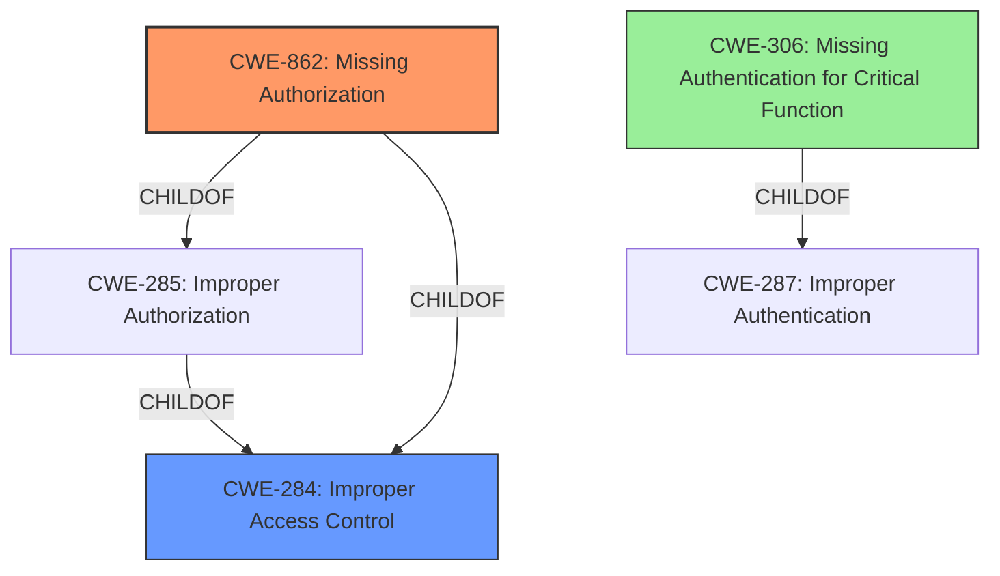

# Enhanced Analysis for CVE-2022-41692

# Summary
| CWE ID | CWE Name | Confidence | CWE Abstraction Level | CWE Vulnerability Mapping Label | CWE-Vulnerability Mapping Notes |
|---|---|---|---|---|---|
| CWE-862 | Missing Authorization | 1.0 | Class | Allowed-with-Review | Primary CWE |
| CWE-284 | Improper Access Control | 0.7 | Pillar | Discouraged | Secondary Candidate |
| CWE-306 | Missing Authentication for Critical Function | 0.6 | Base | Allowed | Secondary Candidate |

## Evidence and Confidence

*   **Confidence Score:** 1.0
*   **Evidence Strength:** HIGH

## Relationship Analysis
The primary CWE is CWE-862, which is a child of CWE-284. CWE-284 is a high-level pillar, and CWE-862 is a more specific Class. CWE-306 is a base level CWE and sibling to CWE-862, and also a child of CWE-287 (Improper Authentication). Selecting CWE-862 acknowledges the **missing authorization** aspect of the vulnerability.



## Vulnerability Chain
The vulnerability chain starts with the **missing authorization** check. This allows an attacker to perform actions they should not be able to, leading to a Broken Access Control vulnerability.

## Summary of Analysis
The vulnerability description clearly states "**missing authorization**", which directly aligns with CWE-862. The "CVE Reference Links Content Summary" section also confirms this by stating "Missing authorization, authentication or nonce token check in a function" and "Broken Access Control vulnerability." The fact that "An unprivileged user could execute higher privileged actions" is also strong evidence that the **missing authorization** is the root cause of the vulnerability.

The primary mapping is CWE-862 (Missing Authorization). This is more specific than CWE-284 (Improper Access Control), which is a high-level pillar. CWE-862 is a Class, and the retriever suggests reviewing children of this entry to see if there is a better fit; however, no child entries of CWE-862 are provided in the enhanced context information.

I considered CWE-306 (Missing Authentication for Critical Function), but authentication confirms the user's identity, whereas authorization determines if the user has permission to access a specific resource or perform an action. Since the vulnerability description explicitly points to **missing authorization**, I believe CWE-862 is a more accurate fit than CWE-306.
I also considered CWE-639 (Authorization Bypass Through User-Controlled Key), however that CWE is for when an attacker can modify the key value identifying the data. The evidence does not point to this.
CWE-425 (Direct Request ('Forced Browsing')) was also considered, but the description involves "not adequately enforce[ing] appropriate authorization", which is broader than the explicit **missing authorization** detailed in the vulnerability.

The selection of CWE-862 is at the optimal level of specificity because it precisely captures the **missing authorization** check, based on the provided evidence.


## CWE Relationship Analysis

Current CWEs represent these abstraction levels: .


### Vulnerability Chain Analysis

**Chain starting from CWE-862:**
- 862 (Missing Authorization) - ROOT


**Chain starting from CWE-425:**
- 425 (Direct Request ('Forced Browsing')) - ROOT


### CWE Relationship Diagram

```mermaid
graph TD
    classDef primary fill:#f96,stroke:#333,stroke-width:2px
    classDef secondary fill:#69f,stroke:#333
    classDef tertiary fill:#9e9,stroke:#333
```