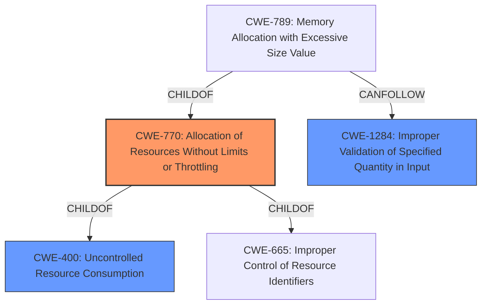

# Analysis for CVE-2022-41694

# Summary
| CWE ID | CWE Name | Confidence | CWE Abstraction Level | CWE Vulnerability Mapping Label | CWE-Vulnerability Mapping Notes |
|---|---|---|---|---|---|
| CWE-770 | Allocation of Resources Without Limits or Throttling | 0.8 | Base | Allowed | Primary CWE |
| CWE-400 | Uncontrolled Resource Consumption | 0.6 | Class | Discouraged | Secondary Candidate |
| CWE-1284 | Improper Validation of Specified Quantity in Input | 0.5 | Base | Allowed | Secondary Candidate |

## Evidence and Confidence

*   **Confidence Score:** 0.8
*   **Evidence Strength:** MEDIUM

## Relationship Analysis
The primary relationship influencing the choice of CWE-770 is its parent relationship to CWE-400. While CWE-400 is a broader class describing uncontrolled resource consumption, CWE-770 is a more specific base weakness focusing on the allocation of resources without limits. The vulnerability description implies an issue with how resources are allocated, making CWE-770 a more precise fit. Another possible parent for CWE-770 is CWE-665. CWE-1284 is also related to the vulnerability by the fact that it is a parent of CWE-789 and there are many examples of CWE-1284 leading to CWE-789.

## Vulnerability Chain
The chain of events leading to the vulnerability involves:
1.  An undisclosed input during SSL key import.
2.  A **lack of limits or throttling** when allocating resources for the SSL key processing (CWE-770).
3.  The consumption of resources leading to a denial-of-service condition (CWE-400) where MCPD terminates.

## Summary of Analysis
Initially, the retriever results pointed towards CWE-400, Uncontrolled Resource Consumption, but after closer examination, CWE-770, Allocation of Resources Without Limits or Throttling, is a more accurate representation of the **root cause**. The vulnerability occurs when "undisclosed input can cause MCPD to terminate," meaning there is an issue with how resources are allocated during the SSL key import process.

The choice of CWE-770 is further supported by the CWE specifications, which state, "The product allocates a reusable resource or group of resources on behalf of an actor without imposing any restrictions on the size or number of resources that can be allocated." This aligns perfectly with the vulnerability description, suggesting the BIG-IP/BIG-IQ system does not properly restrict resource allocation when processing SSL keys.

CWE-400 is a more general class describing the impact of uncontrolled resource consumption, but CWE-770 is the specific weakness that allows the vulnerability to occur. CWE-770 is at the Base level of abstraction, which is a preferred level of abstraction for mapping to the root causes of vulnerabilities.

The evidence supporting this decision comes directly from the vulnerability description: "when an SSL key is imported on a BIG-IP or BIG-IQ system, undisclosed input can cause MCPD to terminate." This indicates a resource allocation issue triggered by the SSL key import process.

Other CWEs considered:
*   CWE-400: Uncontrolled Resource Consumption - This was the initial candidate, but it describes the impact, not the root cause.
*   CWE-1284: Improper Validation of Specified Quantity in Input - There is no direct evidence that the input is not validated in the description, so this is unlikely to be a good fit.

Relevant CWE Information:

## CWE-807: Reliance on Untrusted Inputs in a Security Decision
**Abstraction Level**: Base
**Similarity Score**: 0.77
**Source**: dense

**Description**:
The product uses a protection mechanism that relies on the existence or values of an input, but the input can be modified by an untrusted actor in a way that bypasses the protection mechanism.

**Mapping Guidance**:
- Usage: Allowed
- Rationale: This CWE entry is at the Base level of abstraction, which is a preferred level of abstraction for mapping to the root causes of vulnerabilities.

## CWE-319: Cleartext Transmission of Sensitive Information
**Abstraction Level**: Base
**Similarity Score**: 0.77
**Source**: dense

**Description**:
The product transmits sensitive or security-critical data in cleartext in a communication channel that can be sniffed by unauthorized actors.

**Mapping Guidance**:
- Usage: Allowed
- Rationale: This CWE entry is at the Base level of abstraction, which is a preferred level of abstraction for mapping to the root causes of vulnerabilities.

## CWE-668: Exposure of Resource to Wrong Sphere
**Abstraction Level**: Class
**Similarity Score**: 0.77
**Source**: dense

**Description**:
The product exposes a resource to the wrong control sphere, providing unintended actors with inappropriate access to the resource.

**Mapping Guidance**:
- Usage: Discouraged
- Rationale: CWE-668 is high-level and is often misused as a catch-all when lower-level CWE IDs might be applicable. It is sometimes used for low-information vulnerability reports [REF-1287]. It is a level-1 Class (i.e., a child of a Pillar). It is not useful for trend analysis.

## CWE-226: Sensitive Information in Resource Not Removed Before Reuse
**Abstraction Level**: Base
**Similarity Score**: 0.76
**Source**: dense

**Description**:
The product releases a resource such as memory or a file so that it can be made available for reuse, but it does not clear or "zeroize" the information contained in the resource before the product performs a critical state transition or makes the resource available for reuse by other entities.

**Mapping Guidance**:
- Usage: Allowed
- Rationale: This CWE entry is at the Base level of abstraction, which is a preferred level of abstraction for mapping to the root causes of vulnerabilities.

## CWE-312: Cleartext Storage of Sensitive Information
**Abstraction Level**: Base
**Similarity Score**: 0.76
**Source**: dense

**Description**:
The product stores sensitive information in cleartext within a resource that might be accessible to another control sphere.

**Mapping Guidance**:
- Usage: Allowed
- Rationale: This CWE entry is at the Base level of abstraction, which is a preferred level of abstraction for mapping to the root causes of vulnerabilities.

## CWE-799: Improper Control of Interaction Frequency
**Abstraction Level**: Class
**Similarity Score**: 0.76
**Source**: dense

**Description**:
The product does not properly limit the number or frequency of interactions that it has with an actor, such as the number of incoming requests.

**Mapping Guidance**:
- Usage: Allowed-with-Review
- Rationale: This CWE entry is a Class and might have Base-level children that would be more appropriate

## CWE-345: Insufficient Verification of Data Authenticity
**Abstraction Level**: Class
**Similarity Score**: 0.75
**Source**: dense

**Description**:
The product does not sufficiently verify the origin or authenticity of data, in a way that causes it to accept invalid data.

**Mapping Guidance**:
- Usage: Discouraged
- Rationale: This CWE entry is a level-1 Class (i.e., a child of a Pillar). It might have lower-level children that would be more appropriate

## CWE-294: Authentication Bypass by Capture-replay
**Abstraction Level**: Base
**Similarity Score**: 0.75
**Source**: dense

**Description**:
A capture-replay flaw exists when the design of the product makes it possible for a malicious user to sniff network traffic and bypass authentication by replaying it to the server in question to the same effect as the original message (or with minor changes).

**Mapping Guidance**:
- Usage: Allowed
- Rationale: This CWE entry is at the Base level of abstraction, which is a preferred level of abstraction for mapping to the root causes of vulnerabilities.

## CWE-1289: Improper Validation of Unsafe Equivalence in Input
**Abstraction Level**: Base
**Similarity Score**: 0.75
**Source**: dense

**