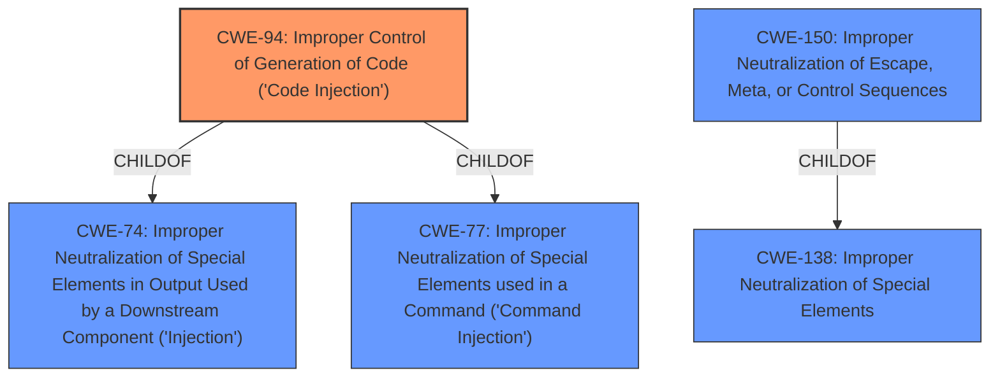

# Analysis Report for CVE-2022-4170

# Vulnerability Analysis Report: CVE-2022-4170

## Description


## Analysis (with Relationship Data)

# Summary
| CWE ID | CWE Name | Confidence | CWE Abstraction Level | CWE Vulnerability Mapping Label | CWE-Vulnerability Mapping Notes |
|---|---|---|---|---|---|
| CWE-94 | Improper Control of Generation of Code ('Code Injection') | 0.8 | Base | Allowed-with-Review | Primary CWE: The product constructs a code segment using externally-influenced input, but it does not neutralize special elements that could modify the syntax or behavior of the intended code segment. |
| CWE-150 | Improper Neutralization of Escape, Meta, or Control Sequences | 0.7 | Variant | Allowed | Secondary CWE: The product does not neutralize or incorrectly neutralizes special elements that could be interpreted as escape, meta, or control character sequences when they are sent to a downstream component. |

## Evidence and Confidence

*   **Confidence Score:** 0.75
*   **Evidence Strength:** HIGH

## Relationship Analysis
The primary relationship that influenced the decision was the hierarchical relationship between CWE-94 and its parent CWEs, specifically CWE-74 and CWE-77, and its usage recommendation of Allowed-with-Review. While the vulnerability involves injection, the fact that it directly results in code execution due to the use of `eval()` suggests CWE-94 is a more accurate fit than the more general CWE-74 or CWE-77.



## Vulnerability Chain
The chain of vulnerabilities is as follows:

1.  **Root Cause:** **Improper Input Sanitization** in the Perl background extension (`src/perl/background`). The `q0` subroutine failed to prevent characters from breaking out of the string context of a perl `eval` statement.
2.  **Weakness:** CWE-150 - **Improper Neutralization of Escape, Meta, or Control Sequences**: The application **does not neutralize** terminal escape sequences.
3.  **Weakness:** CWE-94 - **Improper Control of Generation of Code ('Code Injection')**: The user-controlled data is passed to the Perl `eval` function, leading to arbitrary code execution.
4.  **Impact:** Remote Code Execution (RCE).

## Summary of Analysis
Initially, the description pointed towards a generic injection issue, potentially covered by CWE-74 or CWE-77. However, the explicit mention of the `eval()` function and the ability to execute arbitrary code directly shifted the focus to CWE-94. The **failure to sanitize input** is the root cause, but the direct consequence is code injection.

The description states: "The `q0` subroutine in `src/perl/background` was not properly sanitizing input. Specifically, it removed null bytes, but did not prevent other characters from breaking out of the string context of a perl eval statement, and allowing arbitrary perl commands to be injected through terminal escape sequences." This directly supports the selection of CWE-94, as it involves the construction of a code segment using externally influenced input without proper neutralization.

The retriever results also point to CWE-94 as a relevant candidate, along with CWE-150. Both CWEs are considered, but CWE-94 is selected as the primary weakness because it more directly reflects the code injection aspect of the vulnerability, while CWE-150 is selected as a secondary weakness as it captures the **improper neutralization** of terminal escape sequences.

The choice of CWE-94 and CWE-150 is at the base level of specificity, providing a clear and actionable classification of the vulnerability.


## CWE Relationship Analysis

Current CWEs represent these abstraction levels: .


### Vulnerability Chain Analysis

**Chain starting from CWE-150:**
- 150 (Improper Neutralization of Escape, Meta, or Control Sequences) - ROOT


**Chain starting from CWE-94:**
- 94 (Improper Control of Generation of Code ('Code Injection')) - ROOT


### CWE Relationship Diagram

```mermaid
graph TD
    classDef primary fill:#f96,stroke:#333,stroke-width:2px
    classDef secondary fill:#69f,stroke:#333
    classDef tertiary fill:#9e9,stroke:#333
```


*Report generated on 2025-03-30 22:08:03*
