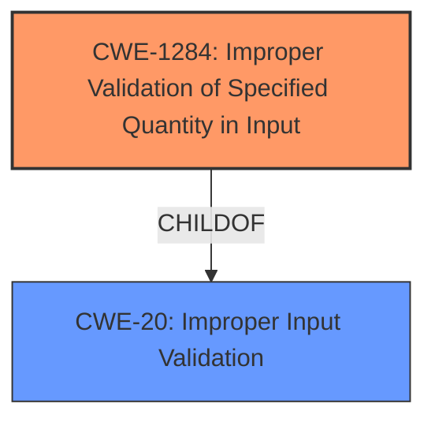

# Analysis for CVE-2022-4171

# Summary
| CWE ID    | CWE Name                                                    | Confidence | CWE Abstraction Level | CWE Vulnerability Mapping Label | CWE-Vulnerability Mapping Notes |
| :-------- | :---------------------------------------------------------- | :--------- | :-------------------- | :------------------------------ | :------------------------------ |
| CWE-1284  | Improper Validation of Specified Quantity in Input         | 0.95       | Base                  | Primary                         | Allowed                         |
| CWE-20    | Improper Input Validation                                   | 0.70       | Class                 | Secondary                       | Discouraged                     |

## Evidence and Confidence

*   **Confidence Score:** 0.90
*   **Evidence Strength:** HIGH

## Relationship Analysis
The primary CWE selected is CWE-1284 (Base), which is a child of CWE-20 (Class). While CWE-20 is a general Improper Input Validation, CWE-1284 is more specific, dealing with the validation of quantities, which in this case is the length of the input. The relationship influenced the decision to choose the more specific CWE-1284 as the primary weakness.

## Vulnerability Chain
The vulnerability chain is as follows:
1.  **Improper Input Validation** (CWE-20): The plugin does not validate user input.
2.  **Improper Validation of Specified Quantity in Input** (CWE-1284): Specifically, the plugin fails to validate the length of the input against the maximum allowed length.
3.  **Bypass of Length Restriction:** This leads to the ability to bypass the intended character limit.
4.  **Potential Data Injection/DoS:** Excessive data can be inputted, potentially leading to data injection or denial of service.

## Summary of Analysis
The initial analysis identified **improper input validation** as the root cause, which aligns with the vulnerability description. The retriever results suggested CWE-1284 as the top candidate, with a base abstraction level, which is the preferred abstraction level. The "CVE Reference Links Content Summary" section provides evidence that the plugin fails to properly enforce the maximum character limit, which confirms **Improper Validation of Specified Quantity in Input** (CWE-1284).

The relationship graph shows that CWE-1284 is a child of CWE-20. While CWE-20 is a general **improper input validation** issue, CWE-1284 is more specific to the validation of quantities, making it a better fit.

The selection of CWE-1284 is based on the evidence that the plugin does not properly validate the length of user-provided annotation text, which is a specified quantity. This aligns with the CWE description, which states: "The product receives input that is expected to specify a quantity (such as size or length), but it does not validate or incorrectly validates that the quantity has the required properties."

The rationale for choosing CWE-1284 is that it is at the Base level of abstraction and accurately represents the weakness, as the **improper validation** specifically relates to the quantity (length) of the input.

Relevant CWE Information:

# Enhanced Context (25 CWEs)

## CWE-807: Reliance on Untrusted Inputs in a Security Decision
**Abstraction Level**: Base
**Similarity Score**: 0.78
**Source**: dense

**Description**:
The product uses a protection mechanism that relies on the existence or values of an input, but the input can be modified by an untrusted actor in a way that bypasses the protection mechanism.
*Not Selected*: This CWE focuses on protection mechanisms that rely on untrusted inputs, which is not the primary issue here. The vulnerability lies in **improper validation** rather than a reliance on untrusted input for a security decision.

## CWE-1289: Improper Validation of Unsafe Equivalence in Input
**Abstraction Level**: Base
**Similarity Score**: 0.78
**Source**: dense

**Description**:
The product receives an input value that is used as a resource identifier or other type of reference, but it does not validate or incorrectly validates that the input is equivalent to a potentially-unsafe value.
*Not Selected*: This CWE is about validating that an input is equivalent to a potentially unsafe value, which is not the case here. The issue is with validating the length of the input, not its equivalence to another value.

## CWE-184: Incomplete List of Disallowed Inputs
**Abstraction Level**: Base
**Similarity Score**: 0.76
**Source**: dense

**Description**:
The product implements a protection mechanism that relies on a list of inputs (or properties of inputs) that are not allowed by policy or otherwise require other action to neutralize before additional processing takes place, but the list is incomplete.
*Not Selected*: This CWE relates to an incomplete list of disallowed inputs. The vulnerability isn't due to an incomplete list, but a failure to properly validate the input length.

## CWE-799: Improper Control of Interaction Frequency
**Abstraction Level**: Class
**Similarity Score**: 0.75
**Source**: dense

**Description**:
The product does not properly limit the number or frequency of interactions that it has with an actor, such as the number of incoming requests.
*Not Selected*: This vulnerability is not about controlling interaction frequency, but validating the input itself.

## CWE-472: External Control of Assumed-Immutable Web Parameter
**Abstraction Level**: Base
**Similarity Score**: 0.75
**Source**: dense

**Description**:
The web application does not sufficiently verify inputs that are assumed to be immutable but are actually externally controllable, such as hidden form fields.
*Not Selected*: This vulnerability is not about assuming immutability of parameters.

## CWE-74: Improper Neutralization of Special Elements in Output Used by a Downstream Component ('Injection')
**Abstraction Level**: Class
**Similarity Score**: 0.75
**Source**: dense

**Description**:
The product constructs all or part of a command, data structure, or record using externally-influenced input from an upstream component, but it does not neutralize or incorrectly neutralizes special elements that could modify how it is parsed or interpreted when it is sent to a downstream component.
*Not Selected*: This CWE is related to injection vulnerabilities. While the impact could potentially lead to data injection, the root cause is not the **improper neutralization** of special elements, but rather the **improper validation** of the input length.

## CWE-183: Permissive List of Allowed Inputs
**Abstraction Level**: Base
**Similarity Score**: 0.75
**Source**: dense

**Description**:
The product implements a protection mechanism that relies on a list of inputs (or properties of inputs) that are explicitly allowed by policy because the inputs are assumed to be safe, but the list is too permissive - that is, it allows an input that is unsafe, leading to resultant weaknesses.
*Not Selected*: This CWE is related to a permissive list of allowed inputs. The vulnerability isn't due to an overly permissive list, but a failure to properly validate the input length.

## CWE-41: Improper Resolution of Path Equivalence
**Abstraction Level**: Base
**Similarity Score**: 0.75
**Source**: dense

**Description**:
The product is vulnerable to file system contents disclosure through path equivalence. Path equivalence involves the use of special characters in file and directory names. The associated manipulations are intended to generate multiple names for the same object.
*Not Selected*: This vulnerability is unrelated to file system path equivalence.

## CWE-138: Improper Neutralization of Special Elements
**Abstraction Level**: Class
**Similarity Score**: 0.75
**Source**: dense

**Description**:
The product receives input from an upstream component, but it does not neutralize or incorrectly neutralizes special elements that could be interpreted as control elements or syntactic markers when they are sent to a downstream component.
*Not Selected*: The primary issue is not the **improper neutralization** of special elements, but the **improper validation** of input length.

## CWE-639: Authorization Bypass Through User-Controlled Key
**Abstraction Level**: Base
**Similarity Score**: 0.75
**Source**: dense

**Description**:
The system's authorization functionality does not prevent one user from gaining access to another user's data or record by modifying the key value identifying the data.
*Not Selected*: This vulnerability is not about authorization bypass.

## CWE-116: Improper Encoding or Escaping of Output
**Abstraction Level**: Class
**Similarity Score**: 8243.23
**Source**: sparse

**Description**:
The product prepares a structured message for communication with another component, but encoding or escaping of the data is either missing or done incorrectly. As a result, the intended structure of the message is not preserved.
*Not Selected*: The primary issue is not related to encoding or escaping output. The problem is with **improper validation** of the input