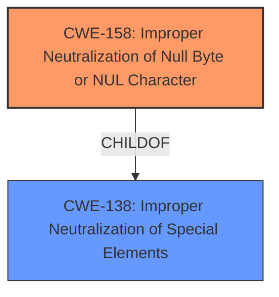

# Analysis for CVE-2022-41716

# Summary
| CWE ID | CWE Name | Confidence | CWE Abstraction Level | CWE Vulnerability Mapping Label | CWE-Vulnerability Mapping Notes |
|---|---|---|---|---|---|
| CWE-158 | Improper Neutralization of Null Byte or NUL Character | 1.0 | Variant | Primary | Allowed |

## Evidence and Confidence

*   **Confidence Score:** 1.0
*   **Evidence Strength:** HIGH

## Relationship Analysis
The selected CWE-158 (Improper Neutralization of Null Byte or NUL Character) is a Variant of CWE-138 (Improperly Neutralized Special Elements). This hierarchical relationship indicates that CWE-158 is a specific type of neutralization failure. The vulnerability description directly mentions **unsanitized NUL values** being the root cause, making CWE-158 a precise fit. There are no chain relationships for this CWE.



## Vulnerability Chain
The vulnerability chain starts with the **unsanitized NUL values** leading to the ability to maliciously set environment variables. The root cause is the lack of proper input sanitization, and the impact is the ability to manipulate environment variables, potentially leading to privilege escalation or other malicious activities.

## Summary of Analysis
The initial analysis strongly suggests that CWE-158 (Improper Neutralization of Null Byte or NUL Character) is the most appropriate CWE for this vulnerability. The **rootcause** is the presence of **unsanitized NUL values**. The evidence in the "Vulnerability Description" and "CVE Reference Links Content Summary" clearly indicates that the vulnerability stems from the lack of proper handling of NUL characters in environment variable values on Windows. Specifically, the description states: "Due to **unsanitized NUL values**, attackers may be able to maliciously set environment variables on Windows" and "syscall.StartProcess and os/exec.Cmd did not properly check for invalid environment variable values".

The retriever results also list CWE-158 as the top candidate. The mapping guidance for CWE-158 explicitly states that it is at the Variant level of abstraction, which is preferred, and the description aligns perfectly with the vulnerability. Other CWEs were considered, but they were not as specific to the identified weakness. For example, CWE-626 (Null Byte Interaction Error) is related, but CWE-158 more directly addresses the **improper neutralization**.

Relevant CWE Information:

# Enhanced Context (25 CWEs)
The following CWEs were identified as potentially relevant to this vulnerability:

## CWE-158: Improper Neutralization of Null Byte or NUL Character
**Abstraction Level**: Variant
**Similarity Score**: 0.77
**Source**: dense

**Description**:
The product receives input from an upstream component, but it does not neutralize or incorrectly neutralizes NUL characters or null bytes when they are sent to a downstream component.

**Mapping Guidance**:
- Usage: Allowed
- Rationale: This CWE entry is at the Variant level of abstraction, which is a preferred level of abstraction for mapping to the root causes of vulnerabilities.

The decision to select CWE-158 is based on the direct evidence of **unsanitized NUL values** being the **root cause**, the high similarity score, and the clear mapping guidance that supports its use for this type of vulnerability. The selection is at the optimal level of specificity, as it precisely describes the weakness without being overly broad.

# Enhanced Query for CVE-2022-41716

## Vulnerability Description
Due to **unsanitized NUL values**, attackers may be able to maliciously set environment variables on Windows. In syscall.StartProcess and os/exec.Cmd, invalid environment variable values containing NUL values are not properly checked for. A malicious environment variable value can exploit this behavior to set a value for a different environment variable. For example, the environment variable string A=B\x00C=D sets the variables A=B and C=D.

### Vulnerability Description Key Phrases
- **rootcause:** **unsanitized NUL values**
- **impact:** maliciously set environment variables
- **vector:** invalid environment variable values containing NUL values
- **attacker:** attackers
- **component:** syscall.StartProcess and os/exec.Cmd

## CVE Reference Links Content Summary
```
{
  "CVE-2022-41716": {
    "Metadata": {
      "ID": "CVE-2022-41716",
      "Description": "On Windows, syscall.StartProcess and os/exec.Cmd did not properly check for invalid environment variable values. A malicious environment variable value could exploit this behavior to set a value for a different environment variable. For example, the environment variable string \"A=B\\x00C=D\" set the variables \"A=B\" and \"C=D\".",
      "Published": "2022-11-02",
      "Updated": "2023-07-05"
    },
    "Vulnerability Details": {
      "Root cause": "The syscall.StartProcess and os/exec.Cmd functions on Windows did not properly sanitize environment variables, specifically not checking for null characters (\\x00).",
      "Vulnerabilities": [
        "Improper handling of NUL characters in environment variables.",
        "The syscall package erroneously did not reject environment variables containing a NUL on Windows."
      ],
      "Impact": "An attacker can manipulate environment variables to set unintended values. This could lead to privilege escalation or other malicious activity depending on how the environment variables are used by the affected application or system.",
      "Attack vectors": "The attack vector is network (AV:N), meaning it can be exploited remotely.",
      "Attacker capabilities": "The attacker needs no special privileges (PR:N) and there is no user interaction required (UI:N) to exploit this vulnerability.",
      "Affected component": "Windows operating system.",
       "Affected Products":[
         "Cloud Insights Telegraf Agent"
         ] ,
         "Unaffected Products":[
            "7-Mode Transition Tool",
            "AFF Baseboard Management Controller (BMC) - A700s",
            "ATTO FibreBridge - 7500N",
            "ATTO FibreBridge - 7600N",
            "Active IQ Unified Manager for Linux",
            "Active IQ Unified Manager for Microsoft Windows",
            "Active IQ Unified Manager for VMware vSphere",
            "Active IQ mobile app",
            "Astra Control Center",
            "Astra Control Center - NetApp Kubernetes Monitoring Operator",
            "Astra Trident",
            "Astra Trident Autosupport",
            "BeeGFS CSI Driver",
            "Brocade Fabric Operating System Firmware",
            "Brocade SAN Navigator (SANnav)",
            "Cloud Data Sense",
            "Cloud Insights Acquisition Unit",
            "Cloud Insights Storage Workload Security Agent",
            "Cloud Volumes ONTAP Mediator",
            "E-Series BIOS",
            "E-Series SANtricity OS Controller Software 11.x",
            "E-Series SANtricity Storage Manager",
            "E-Series SANtricity Unified Manager and Web Services Proxy",
            "Element .NET SDK",
            "Element HealthTools",
            "Element JAVA SDK",
            "Element Plug-in for vCenter Server",
            "Element Powershell Tools",
            "Element Python SDK",
            "FAS/AFF BIOS - 8080/8060/8040/8020",
            "FAS/AFF BIOS - 8300/8700/A400/C400",
            "FAS/AFF BIOS - A250/500f/C250",
            "FAS/AFF BIOS - A300/8200/A200/2650/2620/C190/A220/2720/2750/A150",
            "FAS/AFF BIOS - A320",
            "FAS/AFF BIOS - A700/9000",
            "FAS/AFF BIOS - A700s",
            "FAS/AFF BIOS - A800/C800",
            "FAS/AFF BIOS - A900/9500",
            "FAS/AFF Baseboard Management Controller (BMC) - 8300/8700/A400/C400",
            "FAS/AFF Baseboard Management Controller (BMC) - A250/500f/C250",
            "FAS/AFF Baseboard Management Controller (BMC) - A320/C190/A220/FAS2720/FAS2750/A800/C800/A150",
            "FAS/AFF Baseboard Management Controller (BMC) - A900/9500",
            "FAS/AFF Service Processor - 8080/8060/8040/8020",
            "FAS/AFF Service Processor - A300/8200/A200/2650/2620",
            "FAS/AFF Service Processor - A700/9000",
            "Global File Cache",
            "Host Utilities - SAN for Linux",
            "Host Utilities - SAN for Windows",
            "IOM6 SAS Disk Shelf Firmware",
            "Interoperability Matrix Tool",
            "Inventory Collect Tool",
            "Management Services for Element Software and NetApp HCI",
            "MetroCluster Tiebreaker for clustered Data ONTAP",
            "Multipath I/O (SANtricity DSM for Windows MPIO)",
            "NetApp BlueXP",
            "NetApp Cloud Backup OST Plug-in (formerly AltaVault OST Plug-in)",
            "NetApp Converged Systems Advisor Agent",
            "NetApp E-Series Host Collection",
            "NetApp E-Series SANtricity Collection",
            "NetApp HCI Baseboard Management Controller (BMC) - H300S/H500S/H700S/H410S",
            "NetApp HCI Baseboard Management Controller (BMC) - H410C",
            "NetApp HCI Baseboard Management Controller (BMC) - H610C",
            "NetApp HCI Baseboard Management Controller (BMC) - H610S",
            "NetApp HCI Baseboard Management Controller (BMC) - H615C",
            "NetApp HCI Compute Node (Bootstrap OS)",
            "NetApp HCI Compute Node BIOS",
            "NetApp HCI Storage Node BIOS",
            "NetApp Kubernetes Monitoring Operator",
            "NetApp Manageability SDK",
            "NetApp NFS Plug-in for VMware VAAI",
            "NetApp ONTAP PowerShell Toolkit (PSTK)",
            "NetApp SMI-S Provider",
            "NetApp SolidFire & HCI Management Node",
            "NetApp SolidFire & HCI Storage Node (Element Software)",
            "NetApp SolidFire Plug-in for vRealize Orchestrator (SolidFire vRO)",
            "NetApp Virtual Desktop Service (VDS)",
            "NetApp XCP NFS",
            "NetApp XCP SMB",
            "ONTAP 9 (formerly Clustered Data ONTAP)",
            "ONTAP Antivirus Connector",
            "ONTAP Mediator",
            "ONTAP Select Deploy administration utility",
            "ONTAP tools for VMware vSphere",
            "OnCommand Insight",
            "OnCommand Workflow Automation",
            "SANtricity Storage Plugin for vCenter",
            "SRA Plugin for Linux",
            "SRA Plugin for Windows",
            "Single Mailbox Recovery",
            "Snap Creator Framework",
            "SnapCenter",
            "SnapCenter Plug-in for VMware vSphere",
            "SnapManager for Hyper-V",
            "SolidFire Storage Replication Adapter",
            "Spot PC",
            "StorageGRID (formerly StorageGRID Webscale)",
            "StorageGRID BIOS SG1000/SG100",
            "StorageGRID BIOS SG5660/SG5612/SG5760/SG5712",
            "StorageGRID BIOS SG6060/SGF6024",
            "StorageGRID Baseboard Management Controller (BMC)",
            "System Manager 9.x"
          ]
    },
     "Affected Versions":{
         "go": [
          "before go1.18.8",
          "from go1.19.0-0 before go1.19.3"
         ],
        "Cloud Insights Telegraf Agent": [
          "before 20230210"
        ]
     },
    "Remediation": {
      "Fix": "The vulnerability is fixed in Go versions 1.18.8 and 1.19.3 by rejecting environment variables containing NULs.",
     "Cloud Insights Telegraf Agent Fix": "Fixed as of 20230210."
    },
  }
}
```

## Retriever Results

### Top Combined Results

| Rank | CWE ID | Name | Abstraction | Usage  | Retrievers | Individual Scores |
|------|--------|------|-------------|-------|------------|-------------------|
| 1 | 158 | Improper Neutralization of Null Byte or NUL Character | Variant | Allowed | sparse | 0.791 |
| 2 | 335 | Incorrect Usage of Seeds in Pseudo-Random Number Generator (PRNG) | Base | Allowed | sparse | 0.410 |
| 3 | 426 | Untrusted Search Path | Base | Allowed | sparse | 0.405 |
| 4 | 456 | Missing Initialization of a Variable | Variant | Allowed | sparse | 0.399 |
| 5 | 1419 | Incorrect Initialization of Resource | Class | Allowed-with-Review | sparse | 0.399 |
| 6 | 626 | Null Byte Interaction Error (Poison Null Byte) | Variant | Allowed | dense | 0.592 |
| 7 | 98 | Improper Control of Filename for Include/Require Statement in PHP Program ('PHP Remote File Inclusion') | Variant | Allowed | graph | 0.003 |
| 8 | 526 | Cleartext Storage of Sensitive Information in an Environment Variable | Variant | Allowed | sparse | 0.393 |
| 9 | 184 | Incomplete List of Disallowed Inputs | Base | Allowed | sparse | 0.393 |
| 10 | 822 | Untrusted Pointer Dereference | Base | Allowed | sparse | 0.384 |


# Complete CWE Specifications


## CWE-158: Improper Neutralization of Null Byte or NUL Character
**Abstraction:** Variant
**Status:** Incomplete

### Description
The product receives input from an upstream component, but it does not neutralize or incorrectly neutralizes NUL characters or null bytes when they are sent to a downstream component.

### Extended Description
As data is parsed, an injected NUL character or null byte may cause the product to believe the input is terminated earlier than it actually is, or otherwise cause the input to be misinterpreted. This could then be used to inject potentially dangerous input that occurs after the null byte or otherwise bypass validation routines and other protection mechanisms.

### Alternative Terms
None

### Relationships
ChildOf -> CWE-138

### Mapping Guidance
**Usage:** Allowed
**Rationale:** This CWE entry is at the Variant level of abstraction, which is a preferred level of abstraction for mapping to the root causes of vulnerabilities.
**Comments:** Carefully read both the name and description to ensure that this mapping is an appropriate fit. Do not try to 'force' a mapping to a lower-level Base/Variant simply to comply with this preferred level of abstraction.
**Reasons:**
- Acceptable-Use


### Additional Notes
**[Relationship]** This can be a factor in multiple interpretation errors, other interaction errors, filename equivalence, etc.


### Observed Examples
- **CVE-2008-1284:** NUL byte in theme name causes directory traversal impact to be worse
- **CVE-2005-2008:** Source code disclosure using trailing null.
- **CVE-2005-3293:** Source code disclosure using trailing null.


## CWE-335: Incorrect Usage of Seeds in Pseudo-Random Number Generator (PRNG)
**Abstraction:** Base
**Status:** Draft

### Description
The product uses a Pseudo-Random Number Generator (PRNG) but does not correctly manage seeds.

### Extended Description


 PRNGs are deterministic and, while their output appears random, they cannot actually create entropy. They rely on cryptographically secure and unique seeds for entropy so proper seeding is critical to the secure operation of the PRNG.


 Management of seeds could be broken down into two main areas: 


  -  (1) protecting seeds as cryptographic material (such as a cryptographic key); 

  -  (2) whenever possible, using a uniquely generated seed from a cryptographically secure source 

 PRNGs require a seed as input to generate a stream of numbers that are functionally indistinguishable from random numbers. While the output is, in many cases, sufficient for cryptographic uses, the output of any PRNG is directly determined by the seed provided as input. If the seed can be ascertained by a third party, the entire output of the PRNG can be made known to them. As such, the seed should be kept secret and should ideally not be able to be guessed. For example, the current time may be a poor seed. Knowing the approximate time the PRNG was seeded greatly reduces the possible key space. 

 Seeds do not necessarily need to be unique, but reusing seeds may open up attacks if the seed is discovered. 


### Alternative Terms
None

### Relationships
ChildOf -> CWE-330
ChildOf -> CWE-330

### Mapping Guidance
**Usage:** Allowed
**Rationale:** This CWE entry is at the Base level of abstraction, which is a preferred level of abstraction for mapping to the root causes of vulnerabilities.
**Comments:** Carefully read both the name and description to ensure that this mapping is an appropriate fit. Do not try to 'force' a mapping to a lower-level Base/Variant simply to comply with this preferred level of abstraction.
**Reasons:**
- Acceptable-Use


### Additional Notes
**[Maintenance]** As of CWE 4.5, terminology related to randomness, entropy, and predictability can vary widely. Within the developer and other communities, "randomness" is used heavily. However, within cryptography, "entropy" is distinct, typically implied as a measurement. There are no commonly-used definitions, even within standards documents and cryptography papers. Future versions of CWE will attempt to define these terms and, if necessary, distinguish between them in ways that are appropriate for different communities but do not reduce the usability of CWE for mapping, understanding, or other scenarios.


### Observed Examples
- **CVE-2020-7010:** Cloud application on Kubernetes generates passwords using a weak random number generator based on deployment time.
- **CVE-2019-11495:** server uses erlang:now() to seed the PRNG, which results in a small search space for potential random seeds
- **CVE-2018-12520:** Product's PRNG is not seeded for the generation of session IDs


## CWE-426: Untrusted Search Path
**Abstraction:** Base
**Status:** Stable

### Description
The product searches for critical resources using an externally-supplied search path that can point to resources that are not under the product's direct control.

### Extended Description


This might allow attackers to execute their own programs, access unauthorized data files, or modify configuration in unexpected ways. If the product uses a search path to locate critical resources such as programs, then an attacker could modify that search path to point to a malicious program, which the targeted product would then execute. The problem extends to any type of critical resource that the product trusts.


Some of the most common variants of untrusted search path are:


  - In various UNIX and Linux-based systems, the PATH environment variable may be consulted to locate executable programs, and LD_PRELOAD may be used to locate a separate library.

  - In various Microsoft-based systems, the PATH environment variable is consulted to locate a DLL, if the DLL is not found in other paths that appear earlier in the search order.


### Alternative Terms
Untrusted Path

### Relationships
ChildOf -> CWE-642
ChildOf -> CWE-668
ChildOf -> CWE-673
PeerOf -> CWE-427
PeerOf -> CWE-428

### Mapping Guidance
**Usage:** Allowed
**Rationale:** This CWE entry is at the Base level of abstraction, which is a preferred level of abstraction for mapping to the root causes of vulnerabilities.
**Comments:** Carefully read both the name and description to ensure that this mapping is an appropriate fit. Do not try to 'force' a mapping to a lower-level Base/Variant simply to comply with this preferred level of abstraction.
**Reasons:**
- Acceptable-Use


### Observed Examples
- **CVE-1999-1120:** Application relies on its PATH environment variable to find and execute program.
- **CVE-2008-1810:** Database application relies on its PATH environment variable to find and execute program.
- **CVE-2007-2027:** Chain: untrusted search path enabling resultant format string by loading malicious internationalization messages.


## CWE-456: Missing Initialization of a Variable
**Abstraction:** Variant
**Status:** Draft

### Description
The product does not initialize critical variables, which causes the execution environment to use unexpected values.

### Extended Description
Not provided

### Alternative Terms
None

### Relationships
ChildOf -> CWE-909
ChildOf -> CWE-665
ChildOf -> CWE-665
CanPrecede -> CWE-89
CanPrecede -> CWE-120
CanPrecede -> CWE-98
CanPrecede -> CWE-457

### Mapping Guidance
**Usage:** Allowed
**Rationale:** This CWE entry is at the Variant level of abstraction, which is a preferred level of abstraction for mapping to the root causes of vulnerabilities.
**Comments:** Carefully read both the name and description to ensure that this mapping is an appropriate fit. Do not try to 'force' a mapping to a lower-level Base/Variant simply to comply with this preferred level of abstraction.
**Reasons:**
- Acceptable-Use


### Additional Notes
**[Relationship]** This weakness is a major factor in a number of resultant weaknesses, especially in web applications that allow global variable initialization (such as PHP) with libraries that can be directly requested.

**[Research Gap]** It is highly likely that a large number of resultant weaknesses have missing initialization as a primary factor, but researcher reports generally do not provide this level of detail.


### Observed Examples
- **CVE-2020-6078:** Chain: The return value of a function returning a pointer is not checked for success (CWE-252) resulting in the later use of an uninitialized variable (CWE-456) and a null pointer dereference (CWE-476)
- **CVE-2009-2692:** Chain: Use of an unimplemented network socket operation pointing to an uninitialized handler function (CWE-456) causes a crash because of a null pointer dereference (CWE-476).
- **CVE-2020-20739:** A variable that has its value set in a conditional statement is sometimes used when the conditional fails, sometimes causing data leakage


## CWE-1419: Incorrect Initialization of Resource
**Abstraction:** Class
**Status:** Incomplete

### Description
The product attempts to initialize a resource but does not correctly do so, which might leave the resource in an unexpected, incorrect, or insecure state when it is accessed.

### Extended Description


This can have security implications when the associated resource is expected to have certain properties or values. Examples include a variable that determines whether a user has been authenticated or not, or a register or fuse value that determines the security state of the product.


For software, this weakness can frequently occur when implicit initialization is used, meaning the resource is not explicitly set to a specific value. For example, in C, memory is not necessarily cleared when it is allocated on the stack, and many scripting languages use a default empty, null value, or zero value when a variable is not explicitly initialized.


For hardware, this weakness frequently appears with reset values and fuses. After a product reset, hardware may initialize registers incorrectly. During different phases of a product lifecycle, fuses may be set to incorrect values. Even if fuses are set to correct values, the lines to the fuse could be broken or there might be hardware on the fuse line that alters the fuse value to be incorrect.


### Alternative Terms
None

### Relationships
ChildOf -> CWE-665

### Mapping Guidance
**Usage:** Allowed-with-Review
**Rationale:** This CWE entry is a Class and might have Base-level children that would be more appropriate
**Comments:** Examine children of this entry to see if there is a better fit
**Reasons:**
- Abstraction


### Observed Examples
- **CVE-2020-27211:** Chain: microcontroller system-on-chip uses a register value stored in flash to set product protection state on the memory bus and does not contain protection against fault injection (CWE-1319) which leads to an incorrect initialization of the memory bus (CWE-1419) causing the product to be in an unprotected state.
- **CVE-2023-25815:** chain: a change in an underlying package causes the gettext function to use implicit initialization with a hard-coded path (CWE-1419) under the user-writable C:\ drive, introducing an untrusted search path element (CWE-427) that enables spoofing of messages.
- **CVE-2022-43468:** WordPress module sets internal variables based on external inputs, allowing false reporting of the number of views


## CWE-626: Null Byte Interaction Error (Poison Null Byte)
**Abstraction:** Variant
**Status:** Draft

### Description
The product does not properly handle null bytes or NUL characters when passing data between different representations or components.

### Extended Description


A null byte (NUL character) can have different meanings across representations or languages. For example, it is a string terminator in standard C libraries, but Perl and PHP strings do not treat it as a terminator. When two representations are crossed - such as when Perl or PHP invokes underlying C functionality - this can produce an interaction error with unexpected results. Similar issues have been reported for ASP. Other interpreters written in C might also be affected.


The poison null byte is frequently useful in path traversal attacks by terminating hard-coded extensions that are added to a filename. It can play a role in regular expression processing in PHP.


### Alternative Terms
None

### Relationships
ChildOf -> CWE-147
ChildOf -> CWE-436

### Mapping Guidance
**Usage:** Allowed
**Rationale:** This CWE entry is at the Variant level of abstraction, which is a preferred level of abstraction for mapping to the root causes of vulnerabilities.
**Comments:** Carefully read both the name and description to ensure that this mapping is an appropriate fit. Do not try to 'force' a mapping to a lower-level Base/Variant simply to comply with this preferred level of abstraction.
**Reasons:**
- Acceptable-Use


### Additional Notes
**[Terminology]** Current usage of "poison null byte" is typically related to this C/Perl/PHP interaction error, but the original term in 1998 was applied to an off-by-one buffer overflow involving a null byte.

**[Research Gap]** There are not many CVE examples, because the poison NULL byte is a design limitation, which typically is not included in CVE by itself. It is typically used as a facilitator manipulation to widen the scope of potential attacks against other vulnerabilities.


### Observed Examples
- **CVE-2005-4155:** NUL byte bypasses PHP regular expression check
- **CVE-2005-3153:** inserting SQL after a NUL byte bypasses allowlist regexp, enabling SQL injection


## CWE-98: Improper Control of Filename for Include/Require Statement in PHP Program ('PHP Remote File Inclusion')
**Abstraction:** Variant
**Status:** Draft

### Description
The PHP application receives input from an upstream component, but it does not restrict or incorrectly restricts the input before its usage in "require," "include," or similar functions.

### Extended Description
In certain versions and configurations of PHP, this can allow an attacker to specify a URL to a remote location from which the product will obtain the code to execute. In other cases in association with path traversal, the attacker can specify a local file that may contain executable statements that can be parsed by PHP.

### Alternative Terms
Remote file include
RFI: The Remote File Inclusion (RFI) acronym is often used by vulnerability researchers.
Local file inclusion: This term is frequently used in cases in which remote download is disabled, or when the first part of the filename is not under the attacker's control, which forces use of relative path traversal (CWE-23) attack techniques to access files that may contain previously-injected PHP code, such as web access logs.

### Relationships
ChildOf -> CWE-706
ChildOf -> CWE-829
CanPrecede -> CWE-94
CanAlsoBe -> CWE-426

### Mapping Guidance
**Usage:** Allowed
**Rationale:** This CWE entry is at the Variant level of abstraction, which is a preferred level of abstraction for mapping to the root causes of vulnerabilities.
**Comments:** Carefully read both the name and description to ensure that this mapping is an appropriate fit. Do not try to 'force' a mapping to a lower-level Base/Variant simply to comply with this preferred level of abstraction.
**Reasons:**
- Acceptable-Use


### Additional Notes
**[Relationship]** 

This is frequently a functional consequence of other weaknesses. It is usually multi-factor with other factors (e.g. MAID), although not all inclusion bugs involve assumed-immutable data. Direct request weaknesses frequently play a role.


Can overlap directory traversal in local inclusion problems.


### Observed Examples
- **CVE-2004-0285:** Modification of assumed-immutable configuration variable in include file allows file inclusion via direct request.
- **CVE-2004-0030:** Modification of assumed-immutable configuration variable in include file allows file inclusion via direct request.
- **CVE-2004-0068:** Modification of assumed-immutable configuration variable in include file allows file inclusion via direct request.


## CWE-526: Cleartext Storage of Sensitive Information in an Environment Variable
**Abstraction:** Variant
**Status:** Incomplete

### Description
The product uses an environment variable to store unencrypted sensitive information.

### Extended Description
Information stored in an environment variable can be accessible by other processes with the execution context, including child processes that dependencies are executed in, or serverless functions in cloud environments. An environment variable's contents can also be inserted into messages, headers, log files, or other outputs. Often these other dependencies have no need to use the environment variable in question. A weakness that discloses environment variables could expose this information.

### Alternative Terms
None

### Relationships
ChildOf -> CWE-312
PeerOf -> CWE-214

### Mapping Guidance
**Usage:** Allowed
**Rationale:** This CWE entry is at the Variant level of abstraction, which is a preferred level of abstraction for mapping to the root causes of vulnerabilities.
**Comments:** Carefully read both the name and description to ensure that this mapping is an appropriate fit. Do not try to 'force' a mapping to a lower-level Base/Variant simply to comply with this preferred level of abstraction.
**Reasons:**
- Acceptable-Use


### Observed Examples
- **CVE-2022-43691:** CMS shows sensitive server-side information from environment variables when run in Debug mode.
- **CVE-2022-27195:** Plugin for an automation server inserts environment variable contents into build XML files.
- **CVE-2022-25264:** CI/CD tool logs environment variables related to passwords add Contribution to content history.


## CWE-184: Incomplete List of Disallowed Inputs
**Abstraction:** Base
**Status:** Draft

### Description
The product implements a protection mechanism that relies on a list of inputs (or properties of inputs) that are not allowed by policy or otherwise require other action to neutralize before additional processing takes place, but the list is incomplete.

### Extended Description
Not provided

### Alternative Terms
Denylist / Deny List: This is used by CWE and CAPEC instead of other commonly-used terms. Its counterpart is allowlist.
Blocklist / Block List: This is often used by security tools such as firewalls, email or web gateways, proxies, etc.
Blacklist / Black List: This term is frequently used, but usage has been declining as organizations have started to adopt other terms.

### Relationships
ChildOf -> CWE-693
ChildOf -> CWE-1023
CanPrecede -> CWE-79
CanPrecede -> CWE-78
CanPrecede -> CWE-434
CanPrecede -> CWE-98

### Mapping Guidance
**Usage:** Allowed
**Rationale:** This CWE entry is at the Base level of abstraction, which is a preferred level of abstraction for mapping to the root causes of vulnerabilities.
**Comments:** Carefully read both the name and description to ensure that this mapping is an appropriate fit. Do not try to 'force' a mapping to a lower-level Base/Variant simply to comply with this preferred level of abstraction.
**Reasons:**
- Acceptable-Use


### Additional Notes
**[Relationship]** 

Multiple interpretation errors can indirectly introduce inputs that should be disallowed. For example, a list of dangerous shell metacharacters might not include a metacharacter that only has meaning in one particular shell, not all of them; or a check for XSS manipulations might ignore an unusual construct that is supported by one web browser, but not others.


### Observed Examples
- **CVE-2024-4315:** Chain: API for text generation using Large Language Models (LLMs) does not include the "\" Windows folder separator in its denylist (CWE-184) when attempting to prevent Local File Inclusion via path traversal (CWE-22), allowing deletion of arbitrary files on Windows systems.
- **CVE-2008-2309:** product uses a denylist to identify potentially dangerous content, allowing attacker to bypass a warning
- **CVE-2005-2782:** PHP remote file inclusion in web application that filters "http" and "https" URLs, but not "ftp".


## CWE-822: Untrusted Pointer Dereference
**Abstraction:** Base
**Status:** Incomplete

### Description
The product obtains a value from an untrusted source, converts this value to a pointer, and dereferences the resulting pointer.

### Extended Description


An attacker can supply a pointer for memory locations that the product is not expecting. If the pointer is dereferenced for a write operation, the attack might allow modification of critical state variables, cause a crash, or execute code. If the dereferencing operation is for a read, then the attack might allow reading of sensitive data, cause a crash, or set a variable to an unexpected value (since the value will be read from an unexpected memory location).


There are several variants of this weakness, including but not necessarily limited to:


  - The untrusted value is directly invoked as a function call.

  - In OS kernels or drivers where there is a boundary between "userland" and privileged memory spaces, an untrusted pointer might enter through an API or system call (see CWE-781 for one such example).

  - Inadvertently accepting the value from an untrusted control sphere when it did not have to be accepted as input at all. This might occur when the code was originally developed to be run by a single user in a non-networked environment, and the code is then ported to or otherwise exposed to a networked environment.


### Alternative Terms
None

### Relationships
ChildOf -> CWE-119
ChildOf -> CWE-119
ChildOf -> CWE-119
CanPrecede -> CWE-125
CanPrecede -> CWE-787

### Mapping Guidance
**Usage:** Allowed
**Rationale:** This CWE entry is at the Base level of abstraction, which is a preferred level of abstraction for mapping to the root causes of vulnerabilities.
**Comments:** Carefully read both the name and description to ensure that this mapping is an appropriate fit. Do not try to 'force' a mapping to a lower-level Base/Variant simply to comply with this preferred level of abstraction.
**Reasons:**
- Acceptable-Use


### Additional Notes
**[Maintenance]** There are close relationships between incorrect pointer dereferences and other weaknesses related to buffer operations. There may not be sufficient community agreement regarding these relationships. Further study is needed to determine when these relationships are chains, composites, perspective/layering, or other types of relationships. As of September 2010, most of the relationships are being captured as chains.

**[Terminology]** Many weaknesses related to pointer dereferences fall under the general term of "memory corruption" or "memory safety." As of September 2010, there is no commonly-used terminology that covers the lower-level variants.


### Observed Examples
- **CVE-2007-5655:** message-passing framework interprets values in packets as pointers, causing a crash.
- **CVE-2010-2299:** labeled as a "type confusion" issue, also referred to as a "stale pointer." However, the bug ID says "contents are simply interpreted as a pointer... renderer ordinarily doesn't supply this pointer directly". The "handle" in the untrusted area is replaced in one function, but not another - thus also, effectively, exposure to wrong sphere (CWE-668).
- **CVE-2009-1719:** Untrusted dereference using undocumented constructor.

