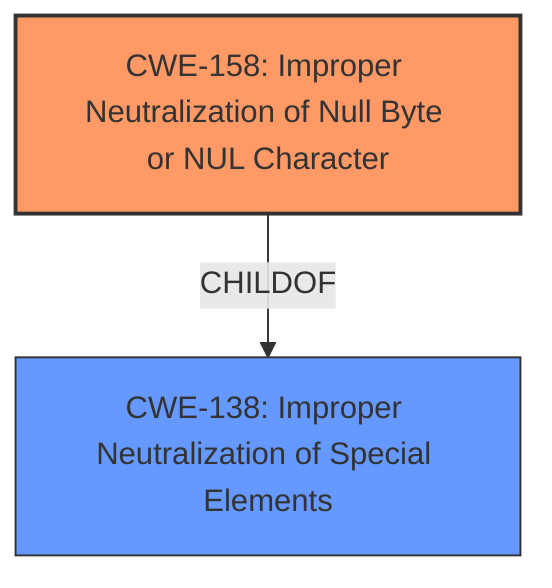

# Analysis Report for CVE-2022-41716

# Vulnerability Analysis Report: CVE-2022-41716

## Description


## Analysis (with Relationship Data)

# Summary
| CWE ID | CWE Name | Confidence | CWE Abstraction Level | CWE Vulnerability Mapping Label | CWE-Vulnerability Mapping Notes |
|---|---|---|---|---|---|
| CWE-158 | Improper Neutralization of Null Byte or NUL Character | 1.0 | Variant | Primary | Allowed |

## Evidence and Confidence

*   **Confidence Score:** 1.0
*   **Evidence Strength:** HIGH

## Relationship Analysis
The selected CWE-158 (Improper Neutralization of Null Byte or NUL Character) is a Variant of CWE-138 (Improperly Neutralized Special Elements). This hierarchical relationship indicates that CWE-158 is a specific type of neutralization failure. The vulnerability description directly mentions **unsanitized NUL values** being the root cause, making CWE-158 a precise fit. There are no chain relationships for this CWE.



## Vulnerability Chain
The vulnerability chain starts with the **unsanitized NUL values** leading to the ability to maliciously set environment variables. The root cause is the lack of proper input sanitization, and the impact is the ability to manipulate environment variables, potentially leading to privilege escalation or other malicious activities.

## Summary of Analysis
The initial analysis strongly suggests that CWE-158 (Improper Neutralization of Null Byte or NUL Character) is the most appropriate CWE for this vulnerability. The **rootcause** is the presence of **unsanitized NUL values**. The evidence in the "Vulnerability Description" and "CVE Reference Links Content Summary" clearly indicates that the vulnerability stems from the lack of proper handling of NUL characters in environment variable values on Windows. Specifically, the description states: "Due to **unsanitized NUL values**, attackers may be able to maliciously set environment variables on Windows" and "syscall.StartProcess and os/exec.Cmd did not properly check for invalid environment variable values".

The retriever results also list CWE-158 as the top candidate. The mapping guidance for CWE-158 explicitly states that it is at the Variant level of abstraction, which is preferred, and the description aligns perfectly with the vulnerability. Other CWEs were considered, but they were not as specific to the identified weakness. For example, CWE-626 (Null Byte Interaction Error) is related, but CWE-158 more directly addresses the **improper neutralization**.

Relevant CWE Information:

# Enhanced Context (25 CWEs)
The following CWEs were identified as potentially relevant to this vulnerability:

## CWE-158: Improper Neutralization of Null Byte or NUL Character
**Abstraction Level**: Variant
**Similarity Score**: 0.77
**Source**: dense

**Description**:
The product receives input from an upstream component, but it does not neutralize or incorrectly neutralizes NUL characters or null bytes when they are sent to a downstream component.

**Mapping Guidance**:
- Usage: Allowed
- Rationale: This CWE entry is at the Variant level of abstraction, which is a preferred level of abstraction for mapping to the root causes of vulnerabilities.

The decision to select CWE-158 is based on the direct evidence of **unsanitized NUL values** being the **root cause**, the high similarity score, and the clear mapping guidance that supports its use for this type of vulnerability. The selection is at the optimal level of specificity, as it precisely describes the weakness without being overly broad.


## CWE Relationship Analysis

Current CWEs represent these abstraction levels: .


### Vulnerability Chain Analysis

**Chain starting from CWE-158:**
- 158 (Improper Neutralization of Null Byte or NUL Character) - ROOT


**Chain starting from CWE-138:**
- 138 (Improper Neutralization of Special Elements) - ROOT


### CWE Relationship Diagram

```mermaid
graph TD
    classDef primary fill:#f96,stroke:#333,stroke-width:2px
    classDef secondary fill:#69f,stroke:#333
    classDef tertiary fill:#9e9,stroke:#333
```


*Report generated on 2025-03-31 04:33:14*
