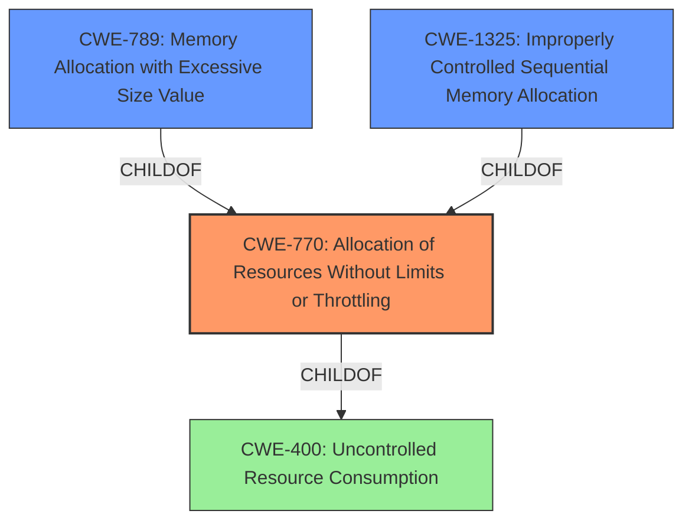

# Analysis for CVE-2022-41725

# Summary
| CWE ID | CWE Name | Confidence | CWE Abstraction Level | CWE Vulnerability Mapping Label | CWE-Vulnerability Mapping Notes |
|---|---|---|---|---|---|
| CWE-770 | Allocation of Resources Without Limits or Throttling | 0.9 | Base | Allowed | Primary CWE |
| CWE-789 | Memory Allocation with Excessive Size Value | 0.8 | Variant | Allowed | Secondary Candidate |
| CWE-1325 | Improperly Controlled Sequential Memory Allocation | 0.7 | Base | Allowed | Secondary Candidate |

## Evidence and Confidence

*   **Confidence Score:** 0.9
*   **Evidence Strength:** HIGH

## Relationship Analysis
The primary CWE is CWE-770 **Allocation of Resources Without Limits or Throttling**, which is a base class. The vulnerability involves the allocation of memory and disk resources without proper limits, leading to excessive consumption. CWE-789 **Memory Allocation with Excessive Size Value**, a variant of CWE-770, is a secondary candidate because the allocation is based on an untrusted size, but the primary issue is the lack of overall limits. CWE-1325 **Improperly Controlled Sequential Memory Allocation** is considered as a possibility as well because the vulnerability also has issues with how memory is allocated for each object, but the primary issue is the lack of overall limits.

## Vulnerability Chain
The chain of events starts with the **improper handling of multipart form data** in the `mime/multipart.Reader.ReadForm` function. This leads to **excessive memory consumption** due to the function not accounting for various overheads, and **unlimited disk file creation** because there was no restriction to the number of temporary files created. The final impact is a **denial of service**.

## Summary of Analysis
The primary weakness is the **unintended excessive resource consumption** in the net/http and mime/multipart packages, allowing an attacker to cause a denial of service.

The vulnerability description and CVE Reference Links Content Summary clearly point to a lack of limits on resource allocation, specifically memory and disk space. The `ReadForm` function in `mime/multipart` did not properly account for memory overhead, and it did not limit the number of temporary files created.

> Vulnerability Description Key Phrases:
> - **rootcause:** **unintended excessive resource consumption**

> CVE Reference Links Content Summary:
> **Weaknesses/Vulnerabilities Present:**
> 1.  **Excessive Memory Consumption:** `ReadForm` had an unconfigurable 10MB buffer reserved for non-file parts which was excessively large. In addition to this, the function didn't properly account for all memory overhead, allowing a malicious form to consume well over 10MB.
> 2.  **Unlimited Disk File Creation:** `ReadForm` did not limit the number of temporary files created on disk. Each file part was stored in a separate temporary file, leading to a potential inode exhaustion.

CWE-770 **Allocation of Resources Without Limits or Throttling** matches this description perfectly: "The product allocates a reusable resource or group of resources on behalf of an actor without imposing any restrictions on the size or number of resources that can be allocated, in violation of the intended security policy for that actor." The excessive memory consumption and unlimited file creation are direct examples of this weakness.

CWE-789 **Memory Allocation with Excessive Size Value** is a variant of CWE-770. It describes a scenario where the product allocates memory based on an untrusted, large size value, without ensuring the size is within expected limits. While this could be a contributing factor, the primary issue is the overall lack of limits, not just the size value.

CWE-1325 **Improperly Controlled Sequential Memory Allocation** also relates to the issue. The description states "The product manages a group of objects or resources and performs a separate memory allocation for each object, but it does not properly limit the total amount of memory that is consumed by all of the combined objects."

I am confident in this assessment because the evidence directly supports the selection of CWE-770 as the primary weakness, with CWE-789 and CWE-1325 as secondary contributing factors.

Relevant CWE Information:

# Enhanced Context (25 CWEs)
The following CWEs were identified as potentially relevant to this vulnerability:

## CWE-770: Allocation of Resources Without Limits or Throttling
**Abstraction Level**: Base
**Similarity Score**: 0.73
**Source**: dense

**Description**:
The product allocates a reusable resource or group of resources on behalf of an actor without imposing any restrictions on the size or number of resources that can be allocated, in violation of the intended security policy for that actor.

**Mapping Guidance**:
- Usage: Allowed
- Rationale: This CWE entry is at the Base level of abstraction, which is a preferred level of abstraction for mapping to the root causes of vulnerabilities.

## CWE-789: Memory Allocation with Excessive Size Value
**Abstraction Level**: Variant
**Similarity Score**: 0.77
**Source**: dense

**Description**:
The product allocates memory based on an untrusted, large size value, but it does not ensure that the size is within expected limits, allowing arbitrary amounts of memory to be allocated.

**Mapping Guidance**:
- Usage: Allowed
- Rationale: This CWE entry is at the Variant level of abstraction, which is a preferred level of abstraction for mapping to the root causes of vulnerabilities.

## CWE-1325: Improperly Controlled Sequential Memory Allocation
**Abstraction Level**: Base
**Similarity Score**: 0.75
**Source**: dense

**Description**:
The product manages a group of objects or resources and performs a separate memory allocation for each object, but it does not properly limit the total amount of memory that is consumed by all of the combined objects.

**Mapping Guidance**:
- Usage: Allowed
- Rationale: This CWE entry is at the Base level of abstraction, which is a preferred level of abstraction for mapping to the root causes of vulnerabilities.