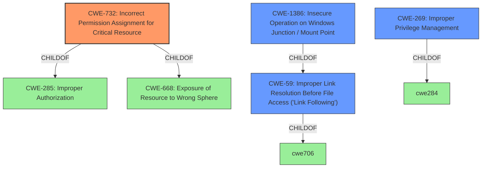

# Raw Analyzer Response for CVE-2022-4173

# Summary
| CWE ID | CWE Name | Confidence | CWE Abstraction Level | CWE Vulnerability Mapping Label | CWE-Vulnerability Mapping Notes |
|---|---|---|---|---|---|
| CWE-732 | Incorrect Permission Assignment for Critical Resource | 0.75 | Class | Allowed-with-Review | Primary CWE |
| CWE-269 | Improper Privilege Management | 0.5 | Class | Discouraged | Secondary CWE |
| CWE-59 | Improper Link Resolution Before File Access ('Link Following') | 0.3 | Base | Allowed | Secondary CWE |

## Evidence and Confidence

*   **Confidence Score:** 0.7
*   **Evidence Strength:** MEDIUM

## Relationship Analysis
The primary CWE identified is CWE-732, "Incorrect Permission Assignment for Critical Resource," which is a Class-level CWE. The analysis considered the parent-child relationships, particularly CWE-732's relationship with CWE-285 (Improper Authorization) and CWE-668 (Exposure of Resource to Wrong Sphere). The relationship with CWE-668 is important because it highlights the exposure aspect of the vulnerability. Although CWE-732 is a Class-level CWE, the details available do not point to a more specific Base-level CWE.

CWE-269 (Improper Privilege Management) was considered due to the privilege escalation impact, but it's a high-level Class CWE and is discouraged for direct mapping unless a more specific cause is absent. The provided information doesn't sufficiently pinpoint a specific privilege management error, so CWE-269 remains a secondary consideration.

CWE-59 (Improper Link Resolution Before File Access ('Link Following')) and CWE-1386 (Insecure Operation on Windows Junction / Mount Point) were also considered since the attack vector requires write access to the file system, which can be related to link following.

## Vulnerability Chain
The vulnerability chain begins with the attacker having write access to the filesystem. This write access is then leveraged, via a **vulnerability within the malware removal functionality**, to perform actions that lead to privilege escalation. The **root cause** appears to be an **improper handling of file system operations** in the malware removal functionality of Avast and AVG Antivirus.

1.  Attacker gains write access to the filesystem.
2.  The malware removal functionality contains a **vulnerability**, in which it doesn't check for proper permissions. (CWE-732)
3.  Attacker is able to manipulate file system operations.
4.  Attacker escalates privileges.

## Summary of Analysis
The initial analysis focused on the **vulnerability within the malware removal functionality** leading to privilege escalation. The key evidence comes from the "Vulnerability Description Key Phrases" and "CVE Reference Links Content Summary" sections, which highlight the **rootcause** as the **vulnerability within the malware removal functionality** and the **improper handling of file system operations**.

The selection of CWE-732 is based on the understanding that the malware removal functionality likely involves actions on critical system resources, and an incorrect permission assignment could allow an attacker to manipulate these resources. The advisory notes that the attacker needs to be able to write to the filesystem, which could mean writing to a location that the removal tool then acts upon.

CWE-269 was considered but is less specific. While privilege escalation is the impact, the root cause seems more related to incorrect permission assignments, making CWE-732 a better fit. The mapping guidance for CWE-269 discourages its use when only "privilege escalation" phrases are present.

CWE-59 and CWE-1386 could be related since the file system access can be done via symlinks.

The final decision favors CWE-732 because it best represents the **improper handling of file system operations** and the resulting exposure of critical resources to unauthorized modification, ultimately leading to privilege escalation. This is the most accurate and specific classification based on the provided evidence.