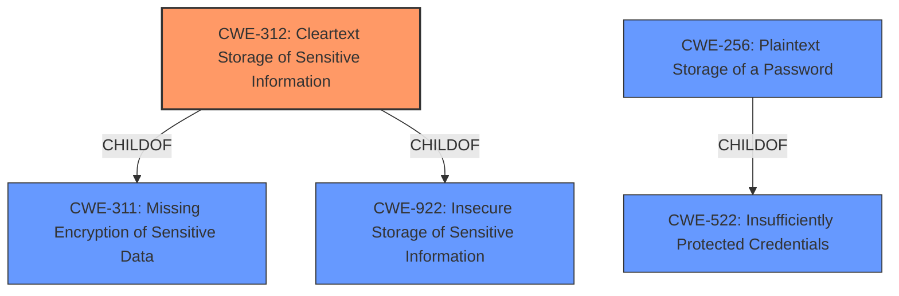

# Analysis Report for CVE-2022-41732

# Vulnerability Analysis Report: CVE-2022-41732

## Description


## Analysis (with Relationship Data)

# Summary
| CWE ID | CWE Name | Confidence | CWE Abstraction Level | CWE Vulnerability Mapping Label | CWE-Vulnerability Mapping Notes |
|---|---|---|---|---|---|
| CWE-312 | Cleartext Storage of Sensitive Information | 1.0 | Base | Allowed | Primary CWE |
| CWE-256 | Plaintext Storage of a Password | 0.7 | Base | Allowed | Secondary Candidate |
| CWE-522 | Insufficiently Protected Credentials | 0.6 | Class | Allowed-with-Review | Secondary Candidate |

## Evidence and Confidence

*   **Confidence Score:** 0.9
*   **Evidence Strength:** HIGH

## Relationship Analysis
The primary CWE is CWE-312, which is a base-level CWE describing the storage of sensitive information in cleartext. CWE-256 is a more specific type, focusing on passwords. CWE-522 is a class-level CWE that could be a parent. The relationship is that CWE-256 is a ChildOf CWE-522. CWE-312 is also a child of CWE-311 (Missing Encryption of Sensitive Data) and CWE-922 (Insecure Storage of Sensitive Information). Choosing CWE-312 represents a balance between specificity and accuracy, given the available information.



## Vulnerability Chain
The chain of events is as follows:
1.  **Root Cause:** **Improper credential storage** (CWE-312) where user credentials are stored in plain clear text.
2.  **Impact:** A local user can read the stored user credentials, potentially leading to unauthorized access.

## Summary of Analysis
The initial assessment, based on the vulnerability description and key phrases, clearly points to **improper storage** of credentials. The evidence from the CVE Reference Links Content Summary confirms that the **root cause** is the storage of user credentials in plain clear text. The Retriever Results further support this by listing CWE-256 (Plaintext Storage of a Password), CWE-522 (Insufficiently Protected Credentials), and CWE-312 (Cleartext Storage of Sensitive Information) as top candidates.

The primary choice is CWE-312 (Cleartext Storage of Sensitive Information) because it directly addresses the **root cause** described in the vulnerability: "IBM Maximo Mobile 8.7 and 8.8 stores user credentials in plain clear text which can be read by a local user." This CWE is at the Base level of abstraction, which is preferred.

CWE-256 (Plaintext Storage of a Password) was considered, but while passwords are credentials, the description refers to "user credentials" more generally, suggesting that other sensitive information might also be stored in cleartext. Therefore, CWE-312 is a more accurate fit.

CWE-522 (Insufficiently Protected Credentials) is a Class-level CWE and is less specific than CWE-312. While applicable, it is better to choose the more specific Base-level CWE. The mapping guidance for CWE-522 even suggests examining its children for a better fit.

The final decision is based on direct evidence from the vulnerability description and supporting evidence from the CVE Reference Links Content Summary. The chosen CWE is at the optimal level of specificity (Base) and aligns with the MITRE mapping guidance.


## CWE Relationship Analysis

Current CWEs represent these abstraction levels: .


### Vulnerability Chain Analysis

**Chain starting from CWE-922:**
- 922 (Insecure Storage of Sensitive Information) - ROOT


**Chain starting from CWE-522:**
- 522 (Insufficiently Protected Credentials) - ROOT


### CWE Relationship Diagram

```mermaid
graph TD
    classDef primary fill:#f96,stroke:#333,stroke-width:2px
    classDef secondary fill:#69f,stroke:#333
    classDef tertiary fill:#9e9,stroke:#333
```


*Report generated on 2025-03-30 17:50:43*
