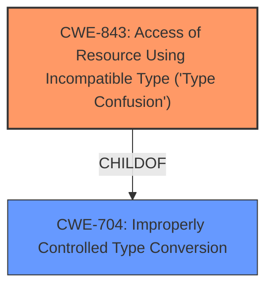

# Analysis Report for CVE-2022-4174

# Vulnerability Analysis Report: CVE-2022-4174

## Description


## Analysis (with Relationship Data)

# Summary
| CWE ID | CWE Name | Confidence | CWE Abstraction Level | CWE Vulnerability Mapping Label | CWE-Vulnerability Mapping Notes |
|---|---|---|---|---|---|
| CWE-843 | Access of Resource Using Incompatible Type ('Type Confusion') | 1.0 | Base | Allowed | Primary CWE |

## Evidence and Confidence

*   **Confidence Score:** 1.0
*   **Evidence Strength:** HIGH

## Relationship Analysis
The primary CWE, CWE-843, is a Base level CWE and a child of CWE-704 (Improperly Controlled Type Conversion). This hierarchical relationship indicates that the root cause involves an issue with type handling.



## Vulnerability Chain
The chain of events for this vulnerability is relatively straightforward:
1.  **Root Cause:** **Type Confusion** (CWE-843) occurs within the V8 JavaScript engine.
2.  **Impact:** This leads to potential heap corruption, allowing for remote code execution.

## Summary of Analysis
The analysis indicates that the primary weakness is **Type Confusion**, which occurs when a program attempts to use a resource with an incompatible type. The evidence from the "Vulnerability Description" and "CVE Reference Links Content Summary" points to the **confusion** of types in the V8 engine as the root cause. The vulnerability description explicitly mentions "**Type confusion** in V8", and the CVE summary confirms that the root cause is "a **Type Confusion** in V8". The impact is heap corruption, potentially leading to remote code execution.

The selection of CWE-843 is based on the explicit mention of "**Type Confusion**" in the vulnerability description and the CVE summary. The "CWE for similar CVE Descriptions" section also lists CWE-843 as the Primary CWE Match.

CWE-427 (Uncontrolled Search Path Element) was considered because it had a high retriever score, but the description does not align with the vulnerability, which is a type confusion issue, not a pathing issue.

The selected CWE is at the optimal level of specificity, as it directly addresses the root cause of the vulnerability: **Type Confusion**.


## CWE Relationship Analysis

Current CWEs represent these abstraction levels: .


### Vulnerability Chain Analysis

**Chain starting from CWE-843:**
- 843 (Access of Resource Using Incompatible Type ('Type Confusion')) - ROOT


**Chain starting from CWE-427:**
- 427 (Uncontrolled Search Path Element) - ROOT


### CWE Relationship Diagram

```mermaid
graph TD
    classDef primary fill:#f96,stroke:#333,stroke-width:2px
    classDef secondary fill:#69f,stroke:#333
    classDef tertiary fill:#9e9,stroke:#333
```


*Report generated on 2025-03-31 07:48:51*
