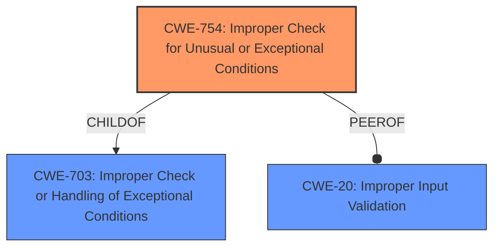

# Raw Analyzer Response for CVE-2022-41777

# Summary
| CWE ID | CWE Name | Confidence | CWE Abstraction Level | CWE Vulnerability Mapping Label | CWE-Vulnerability Mapping Notes |
|---|---|---|---|---|---|
| CWE-754 | Improper Check for Unusual or Exceptional Conditions | 0.9 | Class | Primary | Allowed-with-Review |
| CWE-703 | Improper Check or Handling of Exceptional Conditions | 0.7 | Pillar | Secondary | Discouraged |
| CWE-20 | Improper Input Validation | 0.6 | Class | Secondary | Discouraged |

## Evidence and Confidence

*   **Confidence Score:** 0.8
*   **Evidence Strength:** HIGH

## Relationship Analysis
The primary CWE selected is CWE-754 (Improper Check for Unusual or Exceptional Conditions), which is a child of CWE-703 (Improper Check or Handling of Exceptional Conditions). CWE-754 is a Class-level CWE, while CWE-703 is a Pillar. Choosing CWE-754 provides a more specific classification of the vulnerability. CWE-20 (Improper Input Validation) is a peer that could be considered, though the vulnerability description leans more towards handling unusual conditions than a general lack of input validation.

## Vulnerability Chain
The vulnerability chain starts with the **improper check or handling of exceptional conditions** when processing the input to `decodeURIComponent`. This leads to a server crash due to the unhandled exception.

## Summary of Analysis
The initial assessment, based on the vulnerability description and CVE details, points towards an **improper check or handling of exceptional conditions** within the `nako3edit` component when processing the input for `decodeURIComponent`. The vulnerability description explicitly mentions "**Improper check or handling of exceptional conditions**" as the root cause.

The CVE reference summary supports this by stating that the root cause is the improper handling of exceptional conditions, specifically when injecting an invalid value into the `decodeURIComponent` function, leading to a server crash. The attacker injects an invalid value into the `file` parameter of the URL, which triggers a crash when `decodeURIComponent` is called.

The retriever results also prioritize CWE-703 (Improper Check or Handling of Exceptional Conditions), CWE-755 (Improper Handling of Exceptional Conditions), and CWE-754 (Improper Check for Unusual or Exceptional Conditions).

CWE-703 is a Pillar, and the mapping guidance discourages its use, recommending children instead. CWE-755 is a Class, but its description "The product does not handle or incorrectly handles an exceptional condition" is less specific than CWE-754. CWE-754 (Improper Check for Unusual or Exceptional Conditions) is a Class-level CWE and provides a more precise classification. It states, "The product does not check or incorrectly checks for unusual or exceptional conditions that are not expected to occur frequently during day to day operation of the product." This aligns well with the vulnerability where an invalid value in `decodeURIComponent` leads to a server crash, which is an unusual condition.

CWE-20 (Improper Input Validation) is also considered, as the lack of input validation contributes to the vulnerability. However, the primary issue is not the lack of validation itself, but the failure to handle the exceptional condition when `decodeURIComponent` receives an invalid value. Therefore, CWE-754 is the more appropriate primary CWE.

The selection of CWE-754 is at the optimal level of specificity, as it accurately represents the vulnerability's root cause: the failure to properly check for and handle unusual or exceptional conditions during input processing, leading to a server crash.

Relevant CWE Information:

# Enhanced Context (25 CWEs)
The following CWEs were identified as potentially relevant to this vulnerability:

## CWE-1289: Improper Validation of Unsafe Equivalence in Input
**Abstraction Level**: Base
**Similarity Score**: 0.74
**Source**: dense

**Description**:
The product receives an input value that is used as a resource identifier or other type of reference, but it does not validate or incorrectly validates that the input is equivalent to a potentially-unsafe value.

**Mapping Guidance**:
- Usage: Allowed
- Rationale: This CWE entry is at the Base level of abstraction, which is a preferred level of abstraction for mapping to the root causes of vulnerabilities.

## CWE-74: Improper Neutralization of Special Elements in Output Used by a Downstream Component ('Injection')
**Abstraction Level**: Class
**Similarity Score**: 0.74
**Source**: dense

**Description**:
The product constructs all or part of a command, data structure, or record using externally-influenced input from an upstream component, but it does not neutralize or incorrectly neutralizes special elements that could modify how it is parsed or interpreted when it is sent to a downstream component.

**Mapping Guidance**:
- Usage: Discouraged
- Rationale: CWE-74 is high-level and often misused when lower-level weaknesses are more appropriate.

## CWE-915: Improperly Controlled Modification of Dynamically-Determined Object Attributes
**Abstraction Level**: Base
**Similarity Score**: 0.73
**Source**: dense

**Description**:
The product receives input from an upstream component that specifies multiple attributes, properties, or fields that are to be initialized or updated in an object, but it does not properly control which attributes can be modified.

**Mapping Guidance**:
- Usage: Allowed
- Rationale: This CWE entry is at the Base level of abstraction, which is a preferred level of abstraction for mapping to the root causes of vulnerabilities.

## CWE-184: Incomplete List of Disallowed Inputs
**Abstraction Level**: Base
**Similarity Score**: 0.73
**Source**: dense

**Description**:
The product implements a protection mechanism that relies on a list of inputs (or properties of inputs) that are not allowed by policy or otherwise require other action to neutralize before additional processing takes place, but the list is incomplete.

**Mapping Guidance**:
- Usage: Allowed
- Rationale: This CWE entry is at the Base level of abstraction, which is a preferred level of abstraction for mapping to the root causes of vulnerabilities.

## CWE-691: Insufficient Control Flow Management
**Abstraction Level**: Pillar
**Similarity Score**: 0.72
**Source**: dense

**Description**:
The code does not sufficiently manage its control flow during execution, creating conditions in which the control flow can be modified in unexpected ways.

**Mapping Guidance**:
- Usage: Discouraged
- Rationale: This CWE entry is extremely high-level, a Pillar. However, classification research is limited for weaknesses of this type, so there can be gaps or organizational difficulties within CWE that force use of this weakness, even at such a high level of abstraction.

## CWE-838: Inappropriate Encoding for Output Context
**Abstraction Level**: Base
**Similarity Score**: 0.72
**Source**: dense

**Description**:
The product uses or specifies an encoding when generating output to a downstream component, but the specified encoding is not the same as the encoding that is expected by the downstream component.

**Mapping Guidance**:
- Usage: Allowed
- Rationale: This CWE entry is at the Base level of abstraction, which is a preferred level of abstraction for mapping to the root causes of vulnerabilities.

## CWE-99: Improper Control of Resource Identifiers ('Resource Injection')
**Abstraction Level**: Class
**Similarity Score**: 0.72
**Source**: dense

**Description**:
The product receives input from an upstream component, but it does not restrict or incorrectly restricts the input before it is used as an identifier for a resource that may be outside the intended sphere of control.

**Mapping Guidance**:
- Usage: Allowed-with-Review
- Rationale: This CWE entry is a Class and might have Base-level children that would be more appropriate

## CWE-606: Unchecked Input for Loop Condition
**Abstraction Level**: Base
**Similarity Score**: 0.72
**Source**: dense

**Description**:
The product does not properly check inputs that are used for loop conditions, potentially leading to a denial of service or other consequences because of excessive looping.

**Mapping Guidance**:
- Usage: Allowed
- Rationale: This CWE entry is at the Base level of abstraction, which is a preferred level of abstraction for mapping to the root causes of vulnerabilities.

## CWE-130: Improper Handling of Length Parameter Inconsistency
**Abstraction Level**: Base
**Similarity Score**: 0.72
**Source**: dense

**Description**:
The product parses a formatted message or structure, but it does not handle or incorrectly handles a length field that is