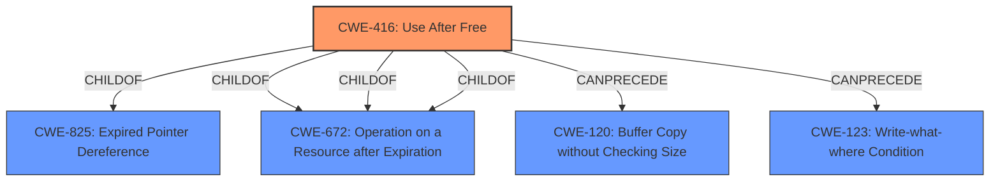

# Raw Analyzer Response for CVE-2022-4179

# Summary
| CWE ID | CWE Name | Confidence | CWE Abstraction Level | CWE Vulnerability Mapping Label | CWE-Vulnerability Mapping Notes |
|---|---|---|---|---|---|
| CWE-416 | Use After Free | 1.0 | Variant | Allowed | Primary CWE |

## Evidence and Confidence

*   **Confidence Score:** 1.0
*   **Evidence Strength:** HIGH

## Relationship Analysis
The primary relationship influencing the decision is that CWE-416 is a Variant, which is a preferred level of abstraction. There are also ChildOf relationships to CWE-825 and CWE-672. The CanPrecede relationship to CWE-120 and CWE-123 indicates potential causes that could lead to a use-after-free vulnerability.

## Vulnerability Chain
The vulnerability chain starts with a **use after free** which leads to **heap corruption**. The attacker exploits this via a crafted Chrome Extension.

## Summary of Analysis
The analysis is based on the provided evidence, specifically the vulnerability description and the CVE reference links content summary. The vulnerability description explicitly states "Use after free" as the root cause. The CVE reference links confirm this, stating "Root cause: Use after free in Audio." The description also mentions "**heap corruption**" which is a potential impact of use-after-free.

The graph relationships influenced the selection by showing that CWE-416 is a variant and preferred level.

CWE-416 is selected because it directly matches the root cause "Use after free". The evidence from the vulnerability description and CVE reference links is sufficient to support this classification. It is at the optimal level of specificity as it is a Variant.

Relevant CWE Information:

# Enhanced Context (25 CWEs)

## CWE-416: Use After Free
**Abstraction:** Variant
**Status:** Stable

### Description
The product reuses or references memory after it has been freed. At some point afterward, the memory may be allocated again and saved in another pointer, while the original pointer references a location somewhere within the new allocation. Any operations using the original pointer are no longer valid because the memory "belongs" to the code that operates on the new pointer.

### Extended Description
Not provided

### Alternative Terms
Dangling pointer: a pointer that no longer points to valid memory, often after it has been freed
UAF: commonly used acronym for Use After Free
Use-After-Free

### Relationships
ChildOf -> CWE-825
ChildOf -> CWE-672
ChildOf -> CWE-672
ChildOf -> CWE-672
CanPrecede -> CWE-120
CanPrecede -> CWE-123

### Mapping Guidance
**Usage:** Allowed
**Rationale:** This CWE entry is at the Variant level of abstraction, which is a preferred level of abstraction for mapping to the root causes of vulnerabilities.
**Comments:** Carefully read both the name and description to ensure that this mapping is an appropriate fit. Do not try to 'force' a mapping to a lower-level Base/Variant simply to comply with this preferred level of abstraction.
**Reasons:**
- Acceptable-Use