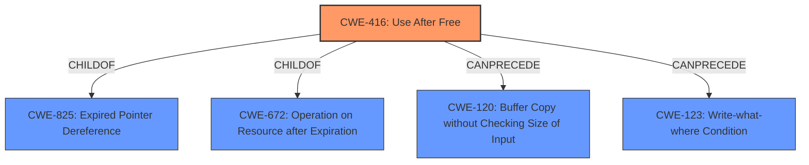

# Enhanced Analysis for CVE-2022-4181

# Summary
| CWE ID | CWE Name | Confidence | CWE Abstraction Level | CWE Vulnerability Mapping Label | CWE-Vulnerability Mapping Notes |
|---|---|---|---|---|---|
| CWE-416 | Use After Free | 1.0 | Variant | Allowed | Primary CWE |

## Evidence and Confidence

*   **Confidence Score:** 1.0
*   **Evidence Strength:** HIGH

## Relationship Analysis
The primary identified CWE is CWE-416, which is a variant-level CWE. It has child-of relationships with CWE-825 (Expired Pointer Dereference) and CWE-672 (Operation on Resource after Expiration). It also has CanPrecede relationships with CWE-120 (Buffer Copy without Checking Size of Input) and CWE-123 (Write-what-where Condition). The relationships indicate that CWE-416 is a specific type of memory safety issue that can lead to further exploitable conditions.



## Vulnerability Chain
The vulnerability chain starts with a **use after free** (CWE-416), which leads to **heap corruption**. The vulnerability can be exploited by a remote attacker via a crafted HTML page.

## Summary of Analysis
The vulnerability description clearly indicates a **use after free** condition, which leads to **heap corruption**. The CVE Reference Links Content Summary confirms this by stating the **root_cause** is "Use after free in Forms" and the **weaknesses** include "Use after free". The primary CWE match suggested is CWE-416 (Use After Free), which aligns perfectly with the description.

The retriever results also strongly suggest CWE-416 as the best match.

CWE-416 is chosen because it precisely describes the **root cause** of the vulnerability which is that the product reuses or references memory after it has been freed. This aligns with the description "Use after free in Forms"

CWE-843 (Access of Resource Using Incompatible Type ('Type Confusion')) was considered but not selected because the primary weakness is the **use after free** not accessing a resource using an incompatible type.

CWE-366 (Race Condition within a Thread) was considered but not selected because there's no explicit mention or evidence of a race condition.

CWE-122 (Heap-based Buffer Overflow) was considered but not selected because the vulnerability is a **use after free** that leads to **heap corruption**, not a buffer overflow.

CWE-911 (Improper Update of Reference Count) was considered but not selected because the description doesn't mention anything about reference counts.

CWE-451 (User Interface (UI) Misrepresentation of Critical Information) was considered but not selected because it's not related to the **root cause** of this vulnerability.

CWE-123 (Write-what-where Condition) was considered but not selected because even though **heap corruption** can lead to this, there's not enough evidence to suggest this is the primary weakness.

CWE-415 (Double Free) was considered but not selected because the provided information says that the issue is **use after free** not a double free.

CWE-362 (Concurrent Execution using Shared Resource with Improper Synchronization ('Race Condition')) was considered but not selected because there is no mention of concurrent execution in the description.

CWE-356 (Product UI does not Warn User of Unsafe Actions) was considered but not selected because it is not related to the **root cause** of this vulnerability.

Relevant CWE Information:

# Enhanced Context (25 CWEs)
The following CWEs were identified as potentially relevant to this vulnerability:

## CWE-356: Product UI does not Warn User of Unsafe Actions
**Abstraction Level**: Base
**Similarity Score**: 0.80
**Source**: dense

**Description**:
The product's user interface does not warn the user before undertaking an unsafe action on behalf of that user. This makes it easier for attackers to trick users into inflicting damage to their system.

**Mapping Guidance**:
- Usage: Allowed
- Rationale: This CWE entry is at the Base level of abstraction, which is a preferred level of abstraction for mapping to the root causes of vulnerabilities.


## CWE-366: Race Condition within a Thread
**Abstraction Level**: Base
**Similarity Score**: 0.77
**Source**: dense

**Description**:
If two threads of execution use a resource simultaneously, there exists the possibility that resources may be used while invalid, in turn making the state of execution undefined.

**Mapping Guidance**:
- Usage: Allowed
- Rationale: This CWE entry is at the Base level of abstraction, which is a preferred level of abstraction for mapping to the root causes of vulnerabilities.


## CWE-451: User Interface (UI) Misrepresentation of Critical Information
**Abstraction Level**: Class
**Similarity Score**: 0.77
**Source**: dense

**Description**:
The user interface (UI) does not properly represent critical information to the user, allowing the information - or its source - to be obscured or spoofed. This is often a component in phishing attacks.

**Mapping Guidance**:
- Usage: Allowed-with-Review
- Rationale: This CWE entry is a Class and might have Base-level children that would be more appropriate


## CWE-404: Improper Resource Shutdown or Release
**Abstraction Level**: Class
**Similarity Score**: 0.77
**Source**: dense

**Description**:
The product does not release or incorrectly releases a resource before it is made available for re-use.

**Mapping Guidance**:
- Usage: Allowed-with-Review
- Rationale: This CWE entry is a Class and might have Base-level children that would be more appropriate


## CWE-667: Improper Locking
**Abstraction Level**: Class
**Similarity Score**: 0.77
**Source**: dense

**Description**:
The product does not properly acquire or release a lock on a resource, leading to unexpected resource state changes and behaviors.

**Mapping Guidance**:
- Usage: Allowed-with-Review
- Rationale: This CWE entry is a Class and might have Base-level children that would be more appropriate


## CWE-226: Sensitive Information in Resource Not Removed Before Reuse
**Abstraction Level**: Base
**Similarity Score**: 0.77
**Source**: dense

**Description**:
The product releases a resource such as memory or a file so that it can be made available for reuse, but it does not clear or "zeroize" the information contained in the resource before the product performs a critical state transition or makes the resource available for reuse by other entities.

**Mapping Guidance**:
- Usage: Allowed
- Rationale: This CWE entry is at the Base level of abstraction, which is a preferred level of abstraction for mapping to the root causes of vulnerabilities.


## CWE-1289: Improper Validation of Unsafe Equivalence in Input
**Abstraction Level**: Base
**Similarity Score**: 0.76
**Source**: dense

**Description**:
The product receives an input value that is used as a resource identifier or other type of reference, but it does not validate or incorrectly validates that the input is equivalent to a potentially-unsafe value.

**Mapping Guidance**:
- Usage: Allowed
- Rationale: This CWE entry is at the Base level of abstraction, which is a preferred level of abstraction for mapping to the root causes of vulnerabilities.


## CWE-754: Improper Check for Unusual or Exceptional Conditions
**Abstraction Level**: Class
**Similarity Score**: 0.76
**Source**: dense

**Description**:
The product does not check or incorrectly checks for unusual or exceptional conditions that are not expected to occur frequently during day to day operation of the product.

**Mapping Guidance**:
- Usage: Allowed-with-Review
- Rationale: This CWE entry is a Class and might have Base-level children that would be more appropriate


## CWE-362: Concurrent Execution using Shared Resource with Improper Synchronization ('Race Condition')
**Abstraction Level**: Class
**Similarity Score**: 0.76
**Source**: dense

**Description**:
The product contains a concurrent code sequence that requires temporary, exclusive access to a shared resource, but a timing


## CWE Relationship Analysis

Current CWEs represent these abstraction levels: .


### Vulnerability Chain Analysis

**Chain starting from CWE-226:**
- 226 (Sensitive Information in Resource Not Removed Before Reuse) - ROOT


**Chain starting from CWE-825:**
- 825 (Expired Pointer Dereference) - ROOT


### CWE Relationship Diagram

```mermaid
graph TD
    classDef primary fill:#f96,stroke:#333,stroke-width:2px
    classDef secondary fill:#69f,stroke:#333
    classDef tertiary fill:#9e9,stroke:#333
```