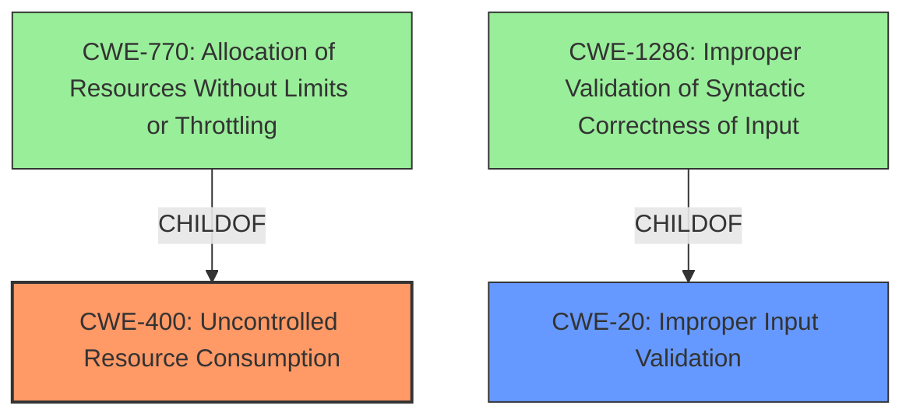

# Analysis for CVE-2022-41813

# Summary
| CWE ID | CWE Name | Confidence | CWE Abstraction Level | CWE Vulnerability Mapping Label | CWE-Vulnerability Mapping Notes |
|---|---|---|---|---|---|
| CWE-400 | Uncontrolled Resource Consumption | 0.7 | Class | Primary | Discouraged |
| CWE-20 | Improper Input Validation | 0.5 | Class | Secondary | Discouraged |

## Evidence and Confidence

*   **Confidence Score:** 0.6
*   **Evidence Strength:** LOW

## Relationship Analysis
The primary CWE considered was CWE-400 **(Uncontrolled Resource Consumption)** because the vulnerability results in the termination of the Traffic Management Microkernel (TMM). CWE-400 is a Class-level CWE, and the mapping guidance discourages its use when more specific CWEs exist. The relationship between CWE-400 and its children, such as CWE-770 **(Allocation of Resources Without Limits or Throttling)**, suggests that a more detailed analysis of the resource allocation process might lead to a more precise CWE.

CWE-20 **(Improper Input Validation)** was also considered as a secondary candidate due to the **undisclosed input** that triggers the termination. However, without more information about the specific **input** and the validation process, it's difficult to determine if this is the root cause. CWE-20 is a Class-level CWE, and the mapping guidance discourages its use when more specific CWEs are available. The children of CWE-20, such as CWE-1286 **(Improper Validation of Syntactic Correctness of Input)**, might be more appropriate if more details about the **input** format and validation are known.

## Vulnerability Chain
The vulnerability chain appears to start with an **undisclosed input** that leads to the termination of the Traffic Management Microkernel (TMM).

`Undisclosed Input -> Resource Consumption -> TMM Termination`

Without more information, it is difficult to determine the exact steps in the chain. It is possible that the **input** triggers excessive resource allocation, leading to resource exhaustion and TMM termination. Alternatively, the **input** could directly cause a critical error in TMM, leading to its termination.

## Summary of Analysis
The initial analysis identified CWE-400 **(Uncontrolled Resource Consumption)** as the primary candidate due to the TMM termination. However, the **root cause** is listed as an **undisclosed input**, so it is hard to confirm if the termination is a direct result of resource exhaustion or some other error caused by the **input**.

The graph relationships highlight the need for a more specific CWE if more information were available. For example, if the **input** causes excessive memory allocation, then CWE-789 **(Memory Allocation with Excessive Size Value)** might be a better fit. If the **input** bypasses validation checks, then CWE-181 **(Incorrect Behavior Order: Validate Before Filter)** might be more appropriate.

The selection of CWE-400 is based on the limited evidence provided. The vulnerability description indicates that an **undisclosed input** causes TMM to terminate. Without more information about the nature of the **input** and the specific mechanism that leads to termination, it is difficult to select a more specific CWE. The evidence is weak, as the **rootcause** description is very vague.

Relevant CWE Information:
- CWE-400: Uncontrolled Resource Consumption
  - The product does not properly control the allocation and maintenance of a limited resource, thereby enabling an actor to influence the amount of resources consumed, eventually leading to the exhaustion of available resources.
  - Mapping Guidance: Discouraged - CWE-400 is intended for incorrect behaviors in which the product is expected to track and restrict how many resources it consumes, but CWE-400 is often misused because it is conflated with the "technical impact" of vulnerabilities in which resource consumption occurs.
- CWE-20: Improper Input Validation
  - The product receives input or data, but it does not validate or incorrectly validates that the input has the properties that are required to process the data safely and correctly.
  - Mapping Guidance: Discouraged - CWE-20 is commonly misused in low-information vulnerability reports when lower-level CWEs could be used instead, or when more details about the vulnerability are available.

Other CWEs Considered But Not Used:
- CWE-789: Memory Allocation with Excessive Size Value - Considered but not used because there is no direct evidence of memory allocation issues.
- CWE-181: Incorrect Behavior Order: Validate Before Filter - Considered but not used because there is no direct evidence of validation bypass.
- CWE-1286: Improper Validation of Syntactic Correctness of Input - Considered but not used because the type of input is not described.