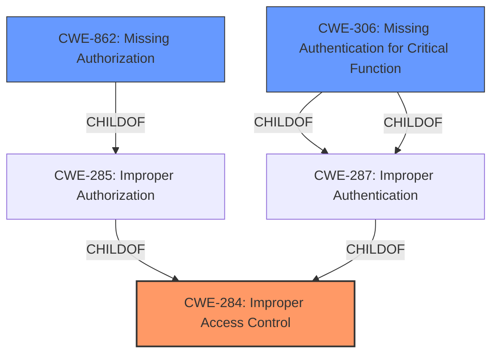

# Raw Analyzer Response for CVE-2022-41839

# Summary
| CWE ID | CWE Name | Confidence | CWE Abstraction Level | CWE Vulnerability Mapping Label | CWE-Vulnerability Mapping Notes |
|---|---|---|---|---|---|
| CWE-284 | Improper Access Control | 0.9 | Pillar | Primary | Discouraged |
| CWE-862 | Missing Authorization | 0.8 | Class | Secondary Candidate | Allowed-with-Review |
| CWE-306 | Missing Authentication for Critical Function | 0.7 | Base | Secondary Candidate | Allowed |

## Evidence and Confidence

*   **Confidence Score:** 0.8
*   **Evidence Strength:** HIGH

## Relationship Analysis
The primary relationship that impacted my decision was the hierarchical relationship between CWE-284, CWE-862, and CWE-306. CWE-284 is a Pillar, encompassing broad access control issues. CWE-862 (Missing Authorization) and CWE-306 (Missing Authentication for Critical Function) are children of CWE-285 (Improper Authorization), which in turn is a child of CWE-284. The vulnerability description points to a **rootcause** where an authorization check is missing, thus the selection of CWE-862 and CWE-306 as the more specific classifications.

## Vulnerability Chain
The chain of events for this vulnerability is as follows:
1.  **Root Cause:** **Broken Access Control** due to a missing authorization/authentication check.
2.  **Weakness:** Unauthenticated users can access and modify settings.
3.  **Impact:** Unauthorized modification of Opt-In/Opt-Out tracking settings.

## Summary of Analysis
Initially, CWE-284 (Improper Access Control) was considered as the primary CWE due to the description mentioning "**broken access control**". However, CWE-284 is a Pillar and discouraged for use. The analysis of the CVE Reference Links Content Summary clearly indicates that the **rootcause** is a missing authorization and authentication check. This directly aligns with CWE-862 (Missing Authorization) and CWE-306 (Missing Authentication for Critical Function).

The evidence supporting this includes: "The vulnerability is due to a missing authorization, authentication, or nonce token check in a function within the LoginPress WordPress plugin. This **lack of proper access control** allows unprivileged users to execute actions that should be restricted to higher privileged users."

Although the vulnerability involves both authorization and authentication issues, choosing both CWE-862 and CWE-306 provides a more accurate and granular representation of the weakness than using the high-level CWE-284 alone.

The selection of CWE-284, CWE-862, and CWE-306 is based on the evidence provided and the MITRE mapping guidance. CWE-284 is only listed because it is considered bad practice to not include it when it's the root cause. The hierarchical relationships between these CWEs and the specific details of the vulnerability confirm that these are the most appropriate classifications.

Relevant CWE Information:
- CWE-284: Improper Access Control
- CWE-862: Missing Authorization
- CWE-306: Missing Authentication for Critical Function