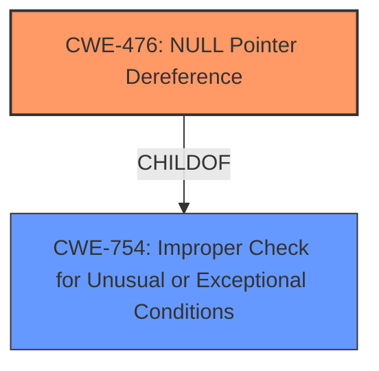

# Analysis Report for CVE-2022-41842

# Vulnerability Analysis Report: CVE-2022-41842

## Description


## Analysis (with Relationship Data)

# Summary
| CWE ID | CWE Name | Confidence | CWE Abstraction Level | CWE Vulnerability Mapping Label | CWE-Vulnerability Mapping Notes |
|---|---|---|---|---|---|
| CWE-476 | NULL Pointer Dereference | 0.7 | Base | Allowed | Primary CWE |

## Evidence and Confidence

*   **Confidence Score:** 0.7
*   **Evidence Strength:** LOW

## Relationship Analysis
The primary relationship influencing the decision is the ChildOf relationship between CWE-476 and CWE-754 (Improper Check for Unusual or Exceptional Conditions). While the description doesn't explicitly mention the lack of a check, the crash in `gfseek` due to a potential NULL pointer suggests that an improper or missing check could be the root cause.



## Vulnerability Chain
The vulnerability chain is relatively simple: A potential NULL pointer is dereferenced, leading to a crash.
  - **Root Cause:** Possible missing check leading to NULL pointer
  - **Weakness:** Dereferencing the NULL pointer
  - **Impact:** Crash

## Summary of Analysis
The analysis indicates that the most suitable CWE for this vulnerability is CWE-476 (NULL Pointer Dereference). This is based on the provided vulnerability description, which explicitly states that a crash occurs in `gfseek` within `goo/gfile.cc` in Xpdf 4.04. The crash implies a likely dereference of a NULL pointer.

The selection of CWE-476 is also supported by its Base level of abstraction, which is preferred for mapping to the root causes of vulnerabilities. The MITRE mapping guidance for CWE-476 allows its usage and emphasizes the importance of carefully reading the name and description to ensure an appropriate fit.

The evidence is not strong because the description only mentions a crash.
> Vulnerability Description: An issue was discovered in Xpdf 4.04. There is a **crash** in gfseek(_IO_FILE*, long, int) in goo/gfile.cc.

The other CWEs were considered, but deemed less suitable:

*   **CWE-125 (Out-of-bounds Read)**, **CWE-122 (Heap-based Buffer Overflow)**, and **CWE-787 (Out-of-bounds Write)**: These CWEs relate to memory access issues, but the description does not provide information about the root cause.
*   **CWE-674 (Uncontrolled Recursion)**: The description doesn't suggest any recursive behavior.
*   **CWE-681 (Incorrect Conversion between Numeric Types)**: There is no evidence of data type conversion issues.
*   **CWE-193 (Off-by-one Error)**: The description doesn't suggest an off-by-one error.
*   **CWE-1284 (Improper Validation of Specified Quantity in Input)**: There is no evidence of quantity validation issues.
*   **CWE-248 (Uncaught Exception)**: The description doesn't explicitly mention exceptions.

I am selecting CWE-476 because the crash is the most compelling evidence.


## CWE Relationship Analysis

Current CWEs represent these abstraction levels: .


### Vulnerability Chain Analysis

**Chain starting from CWE-476:**
- 476 (NULL Pointer Dereference) - ROOT


**Chain starting from CWE-193:**
- 193 (Off-by-one Error) - ROOT


### CWE Relationship Diagram

```mermaid
graph TD
    classDef primary fill:#f96,stroke:#333,stroke-width:2px
    classDef secondary fill:#69f,stroke:#333
    classDef tertiary fill:#9e9,stroke:#333
```


*Report generated on 2025-03-31 01:46:35*
