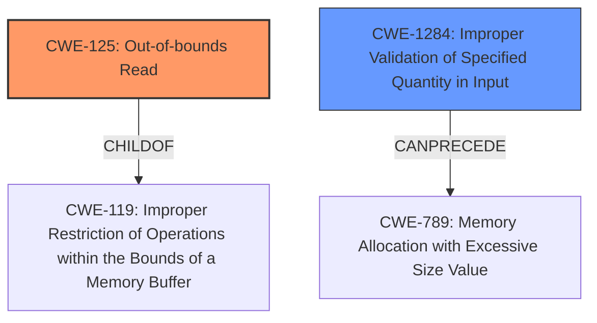

# Analysis for CVE-2022-41861

# Summary
| CWE ID | CWE Name | Confidence | CWE Abstraction Level | CWE Vulnerability Mapping Label | CWE-Vulnerability Mapping Notes |
|---|---|---|---|---|---|
| **CWE-125** | Out-of-bounds Read | 0.9 | Base | Primary | Allowed |
| CWE-1284 | Improper Validation of Specified Quantity in Input | 0.7 | Base | Secondary | Allowed |

## Evidence and Confidence

*   **Confidence Score:** 0.8
*   **Evidence Strength:** HIGH

## Relationship Analysis
The primary CWE is CWE-125, which is a base-level CWE. It is a child of CWE-119 (Improper Restriction of Operations within the Bounds of a Memory Buffer). CWE-1284 (Improper Validation of Specified Quantity in Input) can precede CWE-789 (Memory Allocation with Excessive Size Value), indicating a potential chain where input validation issues lead to memory allocation problems.

## Vulnerability Chain
The chain of root cause and weaknesses that followed for the Vulnerability Description:
1.  **Improper Input Validation (CWE-1284):** The server did not validate the size of the mask data within the `abinary` attribute.
2.  **Out-of-bounds Read (CWE-125):** The lack of validation before using it in a loop caused a potential out-of-bounds read.
3.  **Denial of Service:** The out-of-bounds read caused the server to crash.

## Summary of Analysis
Based on the provided evidence, the primary weakness is CWE-125 (Out-of-bounds Read). The vulnerability description states that a malformed `abinary` attribute can cause the server to crash, and the CVE Reference Links Content Summary indicates that the code did not properly validate the length of the mask data, leading to a potential out-of-bounds read. This aligns with the description of CWE-125, which involves reading data past the end or before the beginning of the intended buffer.

The selection of CWE-125 is based on the explicit mention of a potential out-of-bounds read in the CVE Reference Links Content Summary: "The server did not validate the size of the mask data within the `abinary` attribute before using it in a loop causing a potential out-of-bounds read." This statement directly supports the mapping to CWE-125.

The graph relationships also influenced the selection, specifically the parent-child relationship between CWE-125 and CWE-119, and the potential chain involving CWE-1284 and CWE-789. Although other CWEs like CWE-789 (Memory Allocation with Excessive Size Value) were considered, CWE-125 was deemed more specific and directly supported by the evidence. CWE-1284 is a valid secondary issue as the root cause for the out-of-bounds read is the **improper validation** of the abinary attribute size.

The selected CWEs are at the optimal level of specificity because they accurately represent the **root cause** and the immediate consequence of the vulnerability. CWE-125 describes the out-of-bounds read, while CWE-1284 captures the **lack of proper input validation** that led to it.

Relevant CWE Information:

# Enhanced Context (25 CWEs)
The following CWEs were identified as potentially relevant to this vulnerability:

## CWE-191: Integer Underflow (Wrap or Wraparound)
**Abstraction Level**: Base
**Similarity Score**: 0.80
**Source**: dense

**Description**:
The product subtracts one value from another, such that the result is less than the minimum allowable integer value, which produces a value that is not equal to the correct result.

**Mapping Guidance**:
- Usage: Allowed
- Rationale: This CWE entry is at the Base level of abstraction, which is a preferred level of abstraction for mapping to the root causes of vulnerabilities.

*Not Selected*: This CWE is not directly relevant as the vulnerability involves reading out of bounds, not an integer underflow.

## CWE-197: Numeric Truncation Error
**Abstraction Level**: Base
**Similarity Score**: 0.78
**Source**: dense

**Description**:
Truncation errors occur when a primitive is cast to a primitive of a smaller size and data is lost in the conversion.

**Mapping Guidance**:
- Usage: Allowed
- Rationale: This CWE entry is at the Base level of abstraction, which is a preferred level of abstraction for mapping to the root causes of vulnerabilities.

*Not Selected*: This CWE is not directly relevant as the vulnerability involves reading out of bounds, not numeric truncation.

## CWE-190: Integer Overflow or Wraparound
**Abstraction Level**: Base
**Similarity Score**: 0.77
**Source**: dense

**Description**:
The product performs a calculation that can
         produce an integer overflow or wraparound when the logic
         assumes that the resulting value will always be larger than
         the original value. This occurs when an integer value is
         incremented to a value that is too large to store in the
         associated representation. When this occurs, the value may
         become a very small or negative number.

**Mapping Guidance**:
- Usage: Allowed
- Rationale: This CWE entry is at the Base level of abstraction, which is a preferred level of abstraction for mapping to the root causes of vulnerabilities.

*Not Selected*: While integer overflow could potentially be related, the primary issue is the out-of-bounds read due to **insufficient input validation**.

## CWE-789: Memory Allocation with Excessive Size Value
**Abstraction Level**: Variant
**Similarity Score**: 0.77
**Source**: dense

**Description**:
The product allocates memory based on an untrusted, large size value, but it does not ensure that the size is within expected limits, allowing arbitrary amounts of memory to be allocated.

**Mapping Guidance**:
- Usage: Allowed
- Rationale: This CWE entry is at the Variant level of abstraction, which is a preferred level of abstraction for mapping to the root causes of vulnerabilities.

*Not Selected*: Although memory allocation issues can lead to denial of service, the root cause here is the out-of-bounds read, not necessarily excessive memory allocation directly.

## CWE-131: Incorrect Calculation of Buffer Size
**Abstraction Level**: Base
**Similarity Score**: 0.76
**Source**: dense

**Description**:
The product does not correctly calculate the size to be used when allocating a buffer, which could lead to a buffer overflow.

**Mapping Guidance**:
- Usage: Allowed
- Rationale: This CWE entry is at the Base level of abstraction, which is a preferred level of abstraction for mapping to the root causes of vulnerabilities.

*Not Selected*: The issue is not incorrect calculation of buffer size but **lack of input validation** that caused the out-of-bounds read.

## CWE-681: Incorrect Conversion between Numeric Types
**Abstraction Level**: Base
**Similarity Score**: 0.76
**Source**: dense

**Description**:
When converting from one data type to another, such as long to integer, data can be omitted or translated in a way that produces unexpected values. If the resulting values are used in a sensitive context, then dangerous behaviors may occur.

**Mapping Guidance**:
- Usage: Allowed
- Rationale: This CWE entry is at the Base level of abstraction, which is a preferred level of abstraction for mapping to the root causes of vulnerabilities.

*Not Selected*: The vulnerability is not directly related to incorrect conversion between numeric types.

## CWE-680: Integer Overflow to Buffer Overflow
**Abstraction Level**: Compound
**Similarity Score**: 0.75
**Source**: dense

**Description**:
The product performs a calculation to determine how much memory to allocate, but an integer overflow can occur that causes less memory to be allocated than expected, leading to a buffer overflow.

**Mapping Guidance**:
- Usage: Discouraged
- Rationale: This CWE entry is a named chain, which combines multiple weaknesses.

*Not Selected*: The described scenario doesn't explicitly involve an integer overflow leading to a buffer overflow.

## CWE-125: Out-of-bounds Read
**Abstraction Level**: Base
**Similarity Score**: 0.75
**Source**: dense

**Description**:
The product reads data past the end, or before the beginning, of the intended buffer.

**Mapping Guidance**:
- Usage: Allowed
- Rationale: This CWE entry is at the Base level of