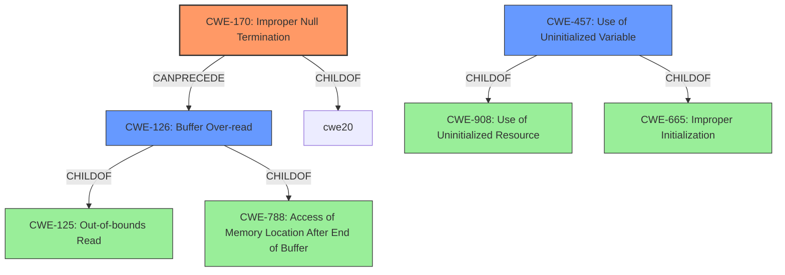

# Enhanced Analysis for CVE-2022-41862

# Summary
| CWE ID  | CWE Name                                                                                             | Confidence | CWE Abstraction Level | CWE Vulnerability Mapping Label | CWE-Vulnerability Mapping Notes |
| ------- | ---------------------------------------------------------------------------------------------------- | ---------- | --------------------- | ------------------------------- | ------------------------------- |
| CWE-170 | Improper Null Termination                                                                             | 0.9        | Base                  | Primary                         | Allowed                       |
| CWE-126 | Buffer Over-read                                                                                    | 0.7        | Variant               | Secondary                       | Allowed                       |
| CWE-457 | Use of Uninitialized Variable                                                                        | 0.6        | Variant               | Secondary                       | Allowed                       |

## Evidence and Confidence

*   **Confidence Score:** 0.8
*   **Evidence Strength:** HIGH

## Relationship Analysis
The primary CWE is CWE-170, Improper Null Termination, which is a Base level CWE. CWE-170 is related to buffer overflows and out-of-bounds reads because the **lack of null termination** can lead to these issues. CWE-126, Buffer Over-read, is a Variant of CWE-125 (Out-of-bounds Read) and a child of CWE-788. It describes reading data past the end of a buffer. CWE-457, Use of Uninitialized Variable, is a Variant of CWE-908 and CWE-665 and describes the use of a variable that has not been initialized, which can lead to unpredictable results.



## Vulnerability Chain
The vulnerability chain starts with an **unauthenticated server sending an unterminated string** (CWE-170). This **lack of null termination** leads to the client over-reading the buffer (CWE-126), potentially disclosing uninitialized bytes (CWE-457) from the client's memory.

## Summary of Analysis
The primary weakness is the **improper null termination** of the string sent by the server. The vulnerability description states, "a modified, **unauthenticated server can send an unterminated string** during the establishment of Kerberos transport encryption." This aligns directly with CWE-170 (Improper Null Termination). The impact of this weakness is that "a server can cause a libpq client to over-read and report an error message containing uninitialized bytes." The **over-read** condition aligns with CWE-126 (Buffer Over-read). The reporting of **uninitialized bytes** aligns with CWE-457 (Use of Uninitialized Variable).

The retriever results also support CWE-170 as a strong candidate, with a high similarity score. The "CVE Reference Links Content Summary" section clearly states the root cause as "A modified, **unauthenticated server can send an unterminated string** during the establishment of Kerberos transport encryption." and lists weaknesses including "Improper handling of unterminated strings" and "Client memory disclosure". This confirms that CWE-170 is an appropriate primary mapping.

The other CWEs considered include:

*   CWE-754, CWE-703, CWE-755: These relate to improper handling of exceptional conditions, but the primary issue is not the handling of an exception but the **lack of proper string termination**.
*   CWE-252: Unchecked Return Value is not relevant as the issue is not related to checking return values.
*   CWE-1289: Improper Validation of Unsafe Equivalence in Input is not relevant as the vulnerability is not related to validating equivalence of input.
*   CWE-824: Access of Uninitialized Pointer is similar to CWE-457, but CWE-457 is more specific as it describes the use of an uninitialized variable, which fits the description better than a general uninitialized pointer.
*   CWE-617: Reachable Assertion is not relevant as the description does not mention assertions.
*   CWE-668: Exposure of Resource to Wrong Sphere is too high-level.
*   CWE-404: Improper Resource Shutdown or Release is not relevant as the vulnerability is not related to resource management.
*   CWE-125: Out-of-bounds Read is related to CWE-126 (Buffer Over-read), but CWE-126 is more specific to the over-read condition described.
*   CWE-193: Off-by-one Error is not relevant as there's no mention of calculations that are off by one.
*   CWE-295: Improper Certificate Validation is not relevant, since the issue is related to a modified, unauthenticated server and a malformed string and not a certificate.
*   CWE-120: Buffer Copy without Checking Size of Input is not relevant since the weakness is about an unterminated string, not about copying without checking size.
*   CWE-190: Integer Overflow or Wraparound is not relevant as there are no integer overflows.
*   CWE-1284: Improper Validation of Specified Quantity in Input is not directly relevant, the quantity of the string is not validated, but it is the **lack of a null terminator** that causes the vulnerability.
*   CWE-789: Memory Allocation with Excessive Size Value is not relevant, as there is no mention of excessive memory allocation.
*   CWE-463: Deletion of Data Structure Sentinel is not relevant, as there is no deletion of sentinels.
*   CWE-464: Addition of Data Structure Sentinel is not relevant, as there is no addition of sentinels.
*   CWE-322: Key Exchange without Entity Authentication is not relevant, as the vulnerability is about improper string handling.
*   CWE-1339: Insufficient Precision or Accuracy of a Real Number is not relevant, as the vulnerability is about improper string handling.

The selected CWEs are at the optimal level of specificity, with CWE-170 being the root cause and CWE-126 and CWE-457 describing the immediate consequences.


## CWE Relationship Analysis

Current CWEs represent these abstraction levels: .


### Vulnerability Chain Analysis

**Chain starting from CWE-908:**
- 908 (Use of Uninitialized Resource) - ROOT


**Chain starting from CWE-668:**
- 668 (Exposure of Resource to Wrong Sphere) - ROOT


### CWE Relationship Diagram

```mermaid
graph TD
    classDef primary fill:#f96,stroke:#333,stroke-width:2px
    classDef secondary fill:#69f,stroke:#333
    classDef tertiary fill:#9e9,stroke:#333
```