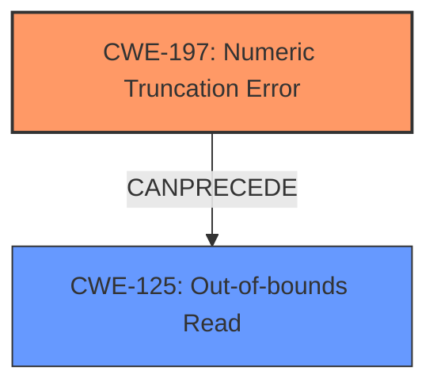

# Enhanced Analysis for CVE-2022-41873

# Summary
| CWE ID  | CWE Name                              | Confidence | CWE Abstraction Level | CWE Vulnerability Mapping Label | CWE-Vulnerability Mapping Notes |
| :------- | :------------------------------------ | :--------- | :-------------------- | :------------------------------ | :------------------------------ |
| CWE-197  | Numeric Truncation Error              | 1          | Base                  | Primary                         | Allowed                       |
| CWE-125  | Out-of-bounds Read                    | 0.9        | Base                  | Secondary                       | Allowed                       |

## Evidence and Confidence

*   **Confidence Score:** 0.95
*   **Evidence Strength:** HIGH

## Relationship Analysis
The primary weakness is **CWE-197 [Numeric Truncation Error]**, where the channel ID is truncated, leading to an incomplete bounds check. This truncation directly leads to **CWE-125 [Out-of-bounds Read]**, as the truncated value is used to access memory locations outside the intended buffer. **CWE-197 [Numeric Truncation Error]** can precede **CWE-125 [Out-of-bounds Read]**, forming a chain where the truncation error is the root cause. Both CWEs are at the Base level of abstraction, representing specific coding errors.



## Vulnerability Chain
The vulnerability chain starts with an **integer truncation issue** (CWE-197). This leads to an incomplete or incorrect bounds check, allowing a crafted channel ID to bypass the intended security measures. Subsequently, the flawed index calculation results in an **out-of-bounds memory read** (CWE-125), enabling attackers to potentially access sensitive information or cause a denial-of-service. The truncation error is the root cause, and the out-of-bounds read is the direct consequence.

## Summary of Analysis
Based on the provided evidence, the primary CWE is **CWE-197 [Numeric Truncation Error]** with high confidence. The vulnerability description explicitly mentions an "**integer truncation issue**" as the root cause. The "CVE Reference Links Content Summary" section further elaborates on how the channel ID is truncated to 8 bits for the bounds check, leading to an out-of-bounds memory access.

> **Vulnerability Description Key Phrases:**
> - **rootcause:** **integer truncation issue**
> - **weakness:** **Out-of-bounds read**

The secondary CWE is **CWE-125 [Out-of-bounds Read]**, which is a direct consequence of the truncation error. The description mentions that a crafted channel ID leads to out-of-bounds memory being read.

> **Vulnerability Description:**
> A crafted channel ID leads to out-of-bounds memory to be read and written with attacker-controlled data.

The graph relationships show that **CWE-197 [Numeric Truncation Error]** can precede **CWE-125 [Out-of-bounds Read]**, supporting the classification of **CWE-197 [Numeric Truncation Error]** as the root cause and **CWE-125 [Out-of-bounds Read]** as the resulting weakness.

The selected CWEs are at the optimal level of specificity because they accurately represent the coding errors that led to the vulnerability. **CWE-197 [Numeric Truncation Error]** describes the specific truncation issue, and **CWE-125 [Out-of-bounds Read]** describes the resulting memory access violation.

Relevant CWE Information:

# Enhanced Context (25 CWEs)

## CWE-1289: Improper Validation of Unsafe Equivalence in Input
**Abstraction Level**: Base
**Similarity Score**: 0.77
**Source**: dense

**Description**:
The product receives an input value that is used as a resource identifier or other type of reference, but it does not validate or incorrectly validates that the input is equivalent to a potentially-unsafe value.
**Rationale for not selecting**: This CWE is not selected as the core issue isn't about validating equivalence but rather about a **truncation** leading to an **out-of-bounds** access.

## CWE-606: Unchecked Input for Loop Condition
**Abstraction Level**: Base
**Similarity Score**: 0.75
**Source**: dense

**Description**:
The product does not properly check inputs that are used for loop conditions, potentially leading to a denial of service or other consequences because of excessive looping.
**Rationale for not selecting**: The vulnerability isn't directly related to loop conditions but rather memory access via a truncated index.

## CWE-754: Improper Check for Unusual or Exceptional Conditions
**Abstraction Level**: Class
**Similarity Score**: 0.75
**Source**: dense

**Description**:
The product does not check or incorrectly checks for unusual or exceptional conditions that are not expected to occur frequently during day to day operation of the product.
**Rationale for not selecting**: While a check is present, the issue is the **truncation** of the value being checked, not the absence of a check.

## CWE-703: Improper Check or Handling of Exceptional Conditions
**Abstraction Level**: Pillar
**Similarity Score**: 0.75
**Source**: dense

**Description**:
The product does not properly anticipate or handle exceptional conditions that rarely occur during normal operation of the product.
**Rationale for not selecting**: This is a Pillar level CWE, too abstract to describe the specific vulnerability.

## CWE-191: Integer Underflow (Wrap or Wraparound)
**Abstraction Level**: Base
**Similarity Score**: 0.74
**Source**: dense

**Description**:
The product subtracts one value from another, such that the result is less than the minimum allowable integer value, which produces a value that is not equal to the correct result.
**Rationale for not selecting**: The issue is not with subtraction causing an underflow, but rather truncation.

## CWE-252: Unchecked Return Value
**Abstraction Level**: Base
**Similarity Score**: 0.74
**Source**: dense

**Description**:
The product does not check the return value from a method or function, which can prevent it from detecting unexpected states and conditions.
**Rationale for not selecting**: Unrelated to the presented vulnerability.

## CWE-197: Numeric Truncation Error
**Abstraction Level**: Base
**Similarity Score**: 0.74
**Source**: dense

**Description**:
Truncation errors occur when a primitive is cast to a primitive of a smaller size and data is lost in the conversion.
**Rationale for selecting**: This is the primary root cause as described in the vulnerability.

## CWE-1288: Improper Validation of Consistency within Input
**Abstraction Level**: Base
**Similarity Score**: 0.73
**Source**: dense

**Description**:
The product receives a complex input with multiple elements or fields that must be consistent with each other, but it does not validate or incorrectly validates that the input is actually consistent.
**Rationale for not selecting**: The issue is not with the consistency of multiple inputs, but a truncation of a single input.

## CWE-404: Improper Resource Shutdown or Release
**Abstraction Level**: Class
**Similarity Score**: 0.73
**Source**: dense

**Description**:
The product does not release or incorrectly releases a resource before it is made available for re-use.
**Rationale for not selecting**: Unrelated.

## CWE-681: Incorrect Conversion between Numeric Types
**Abstraction Level**: Base
**Similarity Score**: 0.73
**Source**: dense

**Description**:
When converting from one data type to another, such as long to integer, data can be omitted or translated in a way that produces unexpected values. If the resulting values are used in a sensitive context, then dangerous behaviors may occur.
**Rationale for not selecting**: While there is a conversion, the more precise issue is the data loss that occurs during the truncation of a channel ID.

## CWE-197: Numeric Truncation Error
**Abstraction Level**: Base
**Similarity Score**: 8531.28
**Source**: sparse

**Description**:
Truncation errors occur when a primitive is cast to a primitive of a smaller size and data is lost in the conversion.
**Rationale for selecting**: This accurately describes the root cause.

## CWE-190: Integer Overflow or Wraparound
**Abstraction Level**: Base
**Similarity Score**: 8492.71
**Source**: sparse

**Description**:
The product performs a calculation that can produce an integer overflow or wraparound when the logic assumes that the resulting value will always be larger than the original value.
**Rationale for not selecting**: The issue is truncation, not overflow.

## CWE-1284: Improper Validation of Specified Quantity in Input
**Abstraction Level**: Base
**Similarity Score**: 8050.40
**Source


## CWE Relationship Analysis

Current CWEs represent these abstraction levels: .


### Vulnerability Chain Analysis

**Chain starting from CWE-190:**
- 190 (Integer Overflow or Wraparound) - ROOT


**Chain starting from CWE-703:**
- 703 (Improper Check or Handling of Exceptional Conditions) - ROOT


### CWE Relationship Diagram

```mermaid
graph TD
    classDef primary fill:#f96,stroke:#333,stroke-width:2px
    classDef secondary fill:#69f,stroke:#333
    classDef tertiary fill:#9e9,stroke:#333
```