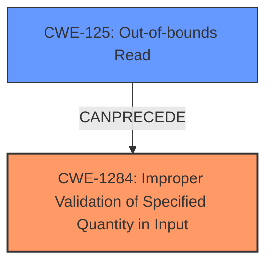

# Analysis for CVE-2022-41877

# Summary
| CWE ID | CWE Name | Confidence | CWE Abstraction Level | CWE Vulnerability Mapping Label | CWE-Vulnerability Mapping Notes |
|---|---|---|---|---|---|
| CWE-1284 | Improper Validation of Specified Quantity in Input | 0.9 | Base | Allowed | Primary CWE |
| CWE-125 | Out-of-bounds Read | 0.7 | Base | Allowed | Secondary Candidate |

## Evidence and Confidence

*   **Confidence Score:** 0.8
*   **Evidence Strength:** HIGH

## Relationship Analysis
The primary weakness identified is **CWE-1284 (Improper Validation of Specified Quantity in Input)**, which directly addresses the **missing input length validation** issue described in the vulnerability. This leads to **CWE-125 (Out-of-bounds Read)**.

## Vulnerability Chain
The vulnerability chain starts with the **missing input length validation** (**CWE-1284**). A malicious server sends a crafted path length that exceeds the allocated buffer size. When the client attempts to read the path based on the provided length, it results in an **out-of-bounds read** (**CWE-125**), potentially disclosing sensitive information.

## Summary of Analysis
The initial analysis focused on the **missing input length validation** as the root cause. The vulnerability description and the CVE Reference Links Content Summary clearly indicated that the `drive` channel in FreeRDP lacked proper validation of the input length received from the server. This **lack of validation** allowed a malicious server to send a path length exceeding the allocated buffer, leading to an **out-of-bounds read**.

The retriever results pointed to several potential CWEs, including **CWE-1284 (Improper Validation of Specified Quantity in Input)**, **CWE-789 (Memory Allocation with Excessive Size Value)**, and **CWE-125 (Out-of-bounds Read)**.

**CWE-1284** was selected as the primary CWE because it directly addresses the **root cause** of the vulnerability, which is the **missing input length validation**. The "Vulnerability Description Key Phrases" section highlights "**missing input length validation**" as the root cause. The "CVE Reference Links Content Summary" further reinforces this by stating that the vulnerability is due to a **missing input length validation** in the `drive` channel.

**CWE-125** was selected as a secondary CWE to describe the impact of the **missing input length validation**. The "Vulnerability Description Key Phrases" section highlights "**read out of bound data**" as the impact. The "CVE Reference Links Content Summary" further reinforces this by stating that this **lack of validation** allows a malicious server to send a path length that exceeds the actual buffer size allocated to receive the data, which leads to reading beyond the allocated memory.

The final decision is based on the provided evidence and the relationships between the CWEs. **CWE-1284** accurately represents the **root cause**, while **CWE-125** represents the immediate impact of the vulnerability.

**CWE-789 (Memory Allocation with Excessive Size Value)** was considered but not selected as the primary CWE because the vulnerability isn't directly related to memory allocation size, but rather to the **lack of validation** on the size/length of the *input*. The excessive size value is coming from the input and not a value used for allocating memory. The root cause is the missing validation that would have prevented the issue.

Relevant CWE Information:

# Enhanced Context (25 CWEs)
The following CWEs were identified as potentially relevant to this vulnerability:

## CWE-1284: Improper Validation of Specified Quantity in Input
**Abstraction Level**: Base
**Similarity Score**: 6919.27
**Source**: sparse

**Description**:
The product receives input that is expected to specify a quantity (such as size or length), but it does not validate or incorrectly validates that the quantity has the required properties.

**Mapping Guidance**:
- Usage: Allowed
- Rationale: This CWE entry is at the Base level of abstraction, which is a preferred level of abstraction for mapping to the root causes of vulnerabilities.

## CWE-125: Out-of-bounds Read
**Abstraction Level**: Base
**Similarity Score**: 6482.22
**Source**: sparse

**Description**:
The product reads data past the end, or before the beginning, of the intended buffer.

**Mapping Guidance**:
- Usage: Allowed
- Rationale: This CWE entry is at the Base level of abstraction, which is a preferred level of abstraction for mapping to the root causes of vulnerabilities.