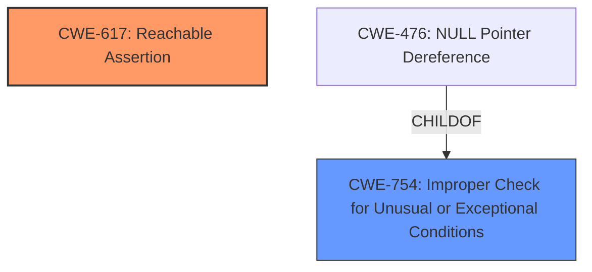

# Enhanced Analysis for CVE-2022-41899

# Summary
| CWE ID | CWE Name | Confidence | CWE Abstraction Level | CWE Vulnerability Mapping Label | CWE-Vulnerability Mapping Notes |
|---|---|---|---|---|---|
| CWE-617 | Reachable Assertion | 1.0 | Base | Allowed | Primary CWE |
| CWE-754 | Improper Check for Unusual or Exceptional Conditions | 0.7 | Class | Allowed-with-Review | Secondary CWE |

## Evidence and Confidence

*   **Confidence Score:** 0.9
*   **Evidence Strength:** HIGH

## Relationship Analysis
The primary relationship that influenced the selection was the child-parent relationship between CWE-754 and CWE-476. While a NULL pointer dereference is a possible outcome of **improper checks**, the vulnerability description specifically mentions a `CHECK` fail, making CWE-617 a more fitting primary classification.


## Vulnerability Chain
The chain starts with a **missing check** on the rank of inputs, leading to a `CHECK` fail and a crash.
  - **Root Cause:** **Missing Check** for rank 2 input
  - **Weakness:** Leads to a reachable assertion (CWE-617)
  - **Impact:** Crash, potential denial-of-service

## Summary of Analysis
The initial analysis focused on identifying the root cause and how it manifests. The "CVE Reference Links Content Summary" clearly states that the vulnerability stems from a **missing check** in the `SdcaOptimizer` implementation, which fails to validate if the inputs `dense_features` and `example_state_data` are of rank 2. This leads to a `CHECK` fail and a crash.

The selection of CWE-617 is based on the following evidence:
- "Inputs `dense_features` or `example_state_data` not of rank 2 will trigger a `CHECK` fail in `SdcaOptimizer`." (Vulnerability Description)
- "The vulnerability is present because the code does not check the rank of the `dense_features` and `example_state_data` inputs. This can lead to a `CHECK` fail and a crash." (CVE Reference Links Content Summary)
- "Exploiting this vulnerability will lead to a crash due to the `CHECK` fail." (CVE Reference Links Content Summary)

CWE-617 (Reachable Assertion) aligns perfectly with this description: "The product contains an assert() or similar statement that can be triggered by an attacker, which leads to an application exit or other behavior that is more severe than necessary." The `CHECK` fail acts as the assertion that leads to the crash.

CWE-754 (Improper Check for Unusual or Exceptional Conditions) was considered as a possible broader classification since the vulnerability stems from a **missing check**, but CWE-617 is more specific to the actual manifestation of the vulnerability.

Relevant CWE Information:

# Enhanced Context (25 CWEs)

## CWE-824: Access of Uninitialized Pointer
**Abstraction Level**: Base
**Similarity Score**: 0.76
**Source**: dense

**Description**:
The product accesses or uses a pointer that has not been initialized.
**Reasons for not selecting**: This CWE does not align with the vulnerability description, which is triggered by a missing rank check, not by accessing an uninitialized pointer.

## CWE-404: Improper Resource Shutdown or Release
**Abstraction Level**: Class
**Similarity Score**: 0.76
**Source**: dense

**Description**:
The product does not release or incorrectly releases a resource before it is made available for re-use.
**Reasons for not selecting**: The vulnerability does not involve improper resource handling.

## CWE-703: Improper Check or Handling of Exceptional Conditions
**Abstraction Level**: Pillar
**Similarity Score**: 0.76
**Source**: dense

**Description**:
The product does not properly anticipate or handle exceptional conditions that rarely occur during normal operation of the product.
**Reasons for not selecting**: This is too high-level and not specific to the vulnerability's root cause or manifestation.

## CWE-252: Unchecked Return Value
**Abstraction Level**: Base
**Similarity Score**: 0.75
**Source**: dense

**Description**:
The product does not check the return value from a method or function, which can prevent it from detecting unexpected states and conditions.
**Reasons for not selecting**: The vulnerability is triggered by a **missing check** on input rank, not an unchecked return value.

## CWE-1289: Improper Validation of Unsafe Equivalence in Input
**Abstraction Level**: Base
**Similarity Score**: 0.75
**Source**: dense

**Description**:
The product receives an input value that is used as a resource identifier or other type of reference, but it does not validate or incorrectly validates that the input is equivalent to a potentially-unsafe value.
**Reasons for not selecting**: This CWE is not related to the type of vulnerability described.

## CWE-617: Reachable Assertion
**Abstraction Level**: Base
**Similarity Score**: 0.75
**Source**: dense

**Description**:
The product contains an assert() or similar statement that can be triggered by an attacker, which leads to an application exit or other behavior that is more severe than necessary.
**Reasons for selecting**: The `CHECK` fail directly corresponds to this CWE.

## CWE-691: Insufficient Control Flow Management
**Abstraction Level**: Pillar
**Similarity Score**: 0.75
**Source**: dense

**Description**:
The code does not sufficiently manage its control flow during execution, creating conditions in which the control flow can be modified in unexpected ways.
**Reasons for not selecting**: Too high-level and does not accurately describe the specific vulnerability.

## CWE-754: Improper Check for Unusual or Exceptional Conditions
**Abstraction Level**: Class
**Similarity Score**: 0.75
**Source**: dense

**Description**:
The product does not check or incorrectly checks for unusual or exceptional conditions that are not expected to occur frequently during day to day operation of the product.
**Reasons for selecting**: Could be seen as the high level class of the **missing check** that is the **root cause**, but CWE-617 more closely models the vulnerability and is a Base class.

## CWE-667: Improper Locking
**Abstraction Level**: Class
**Similarity Score**: 0.75
**Source**: dense

**Description**:
The product does not properly acquire or release a lock on a resource, leading to unexpected resource state changes and behaviors.
**Reasons for not selecting**: This CWE is not related to the type of vulnerability described.

## CWE-664: Improper Control of a Resource Through its Lifetime
**Abstraction Level**: Pillar
**Similarity Score**: 0.75
**Source**: dense

**Description**:
The product does not maintain or incorrectly maintains control over a resource throughout its lifetime of creation, use, and release.
**Reasons for not selecting**: Too high-level and does not accurately describe the specific vulnerability.

## CWE-125: Out-of-bounds Read
**Abstraction Level**: Base
**Similarity Score**: 4729.40
**Source**: sparse

**Description**:
The product reads data past the end, or before the beginning, of the intended buffer.
**Reasons for not selecting**: There is no evidence of out-of-bounds read.

## CWE-1284: Improper Validation of Specified Quantity in Input
**Abstraction Level**: Base
**Similarity Score**: 4725.38
**Source**: sparse

**Description**:
The product receives input that is expected to specify a quantity (such as size or length), but it does not validate or incorrectly validates that the quantity has the required properties.
**Reasons for not selecting**: While related to input validation, the vulnerability is specifically about rank (dimensionality), not a quantity like size or length.

## CWE-190: Integer Overflow or Wraparound
**Abstraction Level**: Base
**Similarity Score**: 4721.82
**Source**: sparse

**Description**:
The product performs a calculation that can
produce an integer overflow or wraparound when the logic
assumes that the resulting value will always be larger than
the original value.
**Reasons for not selecting**: This CWE is not relevant to the vulnerability.

## CWE-681: Incorrect Conversion between Numeric Types
**Abstraction Level**: Base
**Similarity Score**: 4640.63
**Source**: sparse

**Description**:
When converting from one data type to another, such as long to integer, data can be omitted or translated in a way that produces unexpected values.


## CWE Relationship Analysis

Current CWEs represent these abstraction levels: .


### Vulnerability Chain Analysis

**Chain starting from CWE-190:**
- 190 (Integer Overflow or Wraparound) - ROOT


**Chain starting from CWE-476:**
- 476 (NULL Pointer Dereference) - ROOT


### CWE Relationship Diagram

```mermaid
graph TD
    classDef primary fill:#f96,stroke:#333,stroke-width:2px
    classDef secondary fill:#69f,stroke:#333
    classDef tertiary fill:#9e9,stroke:#333
```