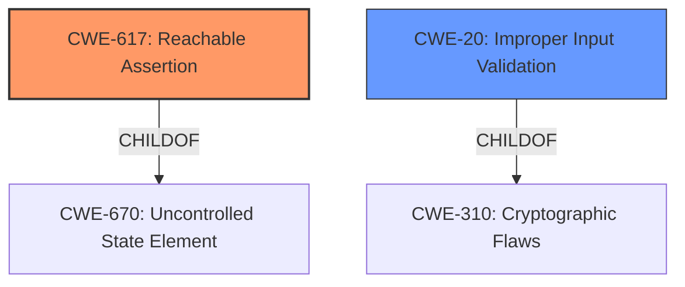

# Analysis Report for CVE-2022-41901

# Vulnerability Analysis Report: CVE-2022-41901

## Description


## Analysis (with Relationship Data)

# Summary
| CWE ID | CWE Name | Confidence | CWE Abstraction Level | CWE Vulnerability Mapping Label | CWE-Vulnerability Mapping Notes |
|---|---|---|---|---|---|
| CWE-617 | Reachable Assertion | 0.8 | Base | Allowed | Primary CWE |
| CWE-20 | Improper Input Validation | 0.6 | Class | Allowed | Secondary Candidate |

## Evidence and Confidence

*   **Confidence Score:** 0.7
*   **Evidence Strength:** MEDIUM

## Relationship Analysis
The primary CWE is CWE-617 (Reachable Assertion), which is a Base-level CWE and directly matches the **"CHECK fail"** condition described in the vulnerability. CWE-20 (Improper Input Validation) is a Class-level CWE and is considered because the root cause of the assertion failure is due to **lack of input validation** of the `sparse_matrix`. CWE-617 is a child of CWE-670 (Uncontrolled State Element) and CWE-20 is a child of CWE-310 (Cryptographic Flaws).



## Vulnerability Chain
The vulnerability chain starts with the **lack of input validation**, which leads to the **"CHECK fail"** and subsequent crash.

## Summary of Analysis
The primary weakness is the **"CHECK fail"** which is a **reachable assertion** (CWE-617) when the input `sparse_matrix` is not a matrix with a shape with rank 0. The root cause is the **lack of input validation** (CWE-20) for the input `sparse_matrix` in `tf.raw_ops.SparseMatrixNNZ`.

Evidence:
- Vulnerability Description Key Phrases: **weakness:** **CHECK fail**
- CVE Reference Links Content Summary: **Lack of Input Validation:** The primary weakness is the insufficient input validation in the `SparseMatrixNNZ` function. It does not check if the provided input is a valid scalar tensor representing a sparse matrix variant which leads to a crash.
- CVE Reference Links Content Summary: **`CHECK_EQ` Fail:** When a non-scalar tensor is passed, the code triggers a `CHECK_EQ` failure, resulting in a crash.

The graph relationships show that CWE-617 is a specific type of uncontrolled state element, while CWE-20 represents the broader issue of input validation. Choosing CWE-617 provides more specific details to the vulnerability, which is allowed by the mapping guidelines.

Relevant CWE Information:

# Enhanced Context (25 CWEs)
The following CWEs were identified as potentially relevant to this vulnerability:

## CWE-824: Access of Uninitialized Pointer
**Abstraction Level**: Base
**Similarity Score**: 0.79
**Source**: dense

**Description**:
The product accesses or uses a pointer that has not been initialized.

**Mapping Guidance**:
- Usage: Allowed
- Rationale: This CWE entry is at the Base level of abstraction, which is a preferred level of abstraction for mapping to the root causes of vulnerabilities.

This CWE was considered but rejected. The root cause is not an uninitialized pointer access, but a `CHECK` fail due to improper input validation.

## CWE-703: Improper Check or Handling of Exceptional Conditions
**Abstraction Level**: Pillar
**Similarity Score**: 0.77
**Source**: dense

**Description**:
The product does not properly anticipate or handle exceptional conditions that rarely occur during normal operation of the product.

**Mapping Guidance**:
- Usage: Discouraged
- Rationale: This CWE entry is extremely high-level, a Pillar.

This CWE was not selected because it is too high-level (Pillar).

## CWE-617: Reachable Assertion
**Abstraction Level**: Base
**Similarity Score**: 0.77
**Source**: dense

**Description**:
The product contains an assert() or similar statement that can be triggered by an attacker, which leads to an application exit or other behavior that is more severe than necessary.

**Mapping Guidance**:
- Usage: Allowed
- Rationale: This CWE entry is at the Base level of abstraction, which is a preferred level of abstraction for mapping to the root causes of vulnerabilities.

This CWE was selected as the primary CWE. The vulnerability is a `CHECK` fail which leads to an application exit.

## CWE-1284: Improper Validation of Specified Quantity in Input
**Abstraction Level**: Base
**Similarity Score**: 5272.34
**Source**: sparse

**Description**:
The product receives input that is expected to specify a quantity (such as size or length), but it does not validate or incorrectly validates that the quantity has the required properties.

**Mapping Guidance**:
- Usage: Allowed
- Rationale: This CWE entry is at the Base level of abstraction, which is a preferred level of abstraction for mapping to the root causes of vulnerabilities.

This CWE was considered but rejected. While there's **improper input validation**, the vulnerability is more specifically a **reachable assertion**. This is a better match.

## CWE-1287: Improper Validation of Specified Type of Input
**Abstraction Level**: Base
**Similarity Score**: 3.64
**Source**: graph

**Description**:
CWE-1287: Improper Validation of Specified Type of Input

**Mapping Guidance**:
- Usage: Allowed
- Rationale: This CWE entry is at the Base level of abstraction, which is a preferred level of abstraction for mapping to the root causes of vulnerabilities.

This CWE was considered but rejected. Similar to CWE-1284, there's **improper input validation**, but the vulnerability is more specifically a **reachable assertion**. This is a better match.


## CWE Relationship Analysis

Current CWEs represent these abstraction levels: .


### Vulnerability Chain Analysis

**Chain starting from CWE-703:**
- 703 (Improper Check or Handling of Exceptional Conditions) - ROOT


**Chain starting from CWE-617:**
- 617 (Reachable Assertion) - ROOT


### CWE Relationship Diagram

```mermaid
graph TD
    classDef primary fill:#f96,stroke:#333,stroke-width:2px
    classDef secondary fill:#69f,stroke:#333
    classDef tertiary fill:#9e9,stroke:#333
```


*Report generated on 2025-03-31 10:19:37*
