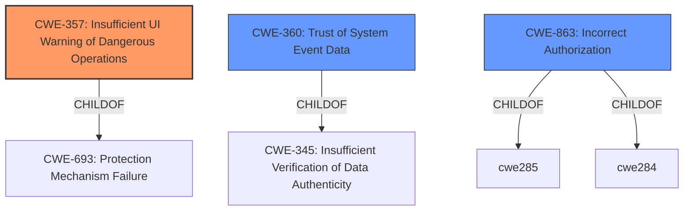

# Raw Analyzer Response for CVE-2022-41904

# Summary
| CWE ID | CWE Name | Confidence | CWE Abstraction Level | CWE Vulnerability Mapping Label | CWE-Vulnerability Mapping Notes |
|---|---|---|---|---|---|
| CWE-357 | Insufficient UI Warning of Dangerous Operations | 0.8 | Base | Allowed | Primary CWE |
| CWE-360 | Trust of System Event Data | 0.6 | Base | Allowed | Secondary Candidate |
| CWE-863 | Incorrect Authorization | 0.5 | Class | Allowed-with-Review | Secondary Candidate |

## Evidence and Confidence

*   **Confidence Score:** 0.7
*   **Evidence Strength:** HIGH

## Relationship Analysis
The primary CWE, CWE-357, is a Base level weakness related to user interface warnings. It is a child of CWE-693: Protection Mechanism Failure. CWE-360, a secondary candidate, is related to trusting system event data, and is a child of CWE-345: Insufficient Verification of Data Authenticity. CWE-863 is a class level weakness that represents an authorization bypass. These relationships help to understand the context of the vulnerability, specifically that a lack of proper UI warning (CWE-357) can lead to trusting potentially malicious data (CWE-360), and that an authorization mechanism is in place, but can be bypassed (CWE-863).

## Vulnerability Chain
The vulnerability chain starts with the **missing decoration** for untrusted Megolm sessions. This leads to the user not being warned about potentially malicious messages. The consequence is that a malicious homeserver can **inject messages** that appear to be from verified members, potentially leading to social engineering or other attacks.

## Summary of Analysis
The primary weakness is the **insufficient UI warning** (CWE-357). The vulnerability description states that "events encrypted using Megolm for which trust could not be established did not get decorated accordingly (with warning shields)." This directly aligns with the description of CWE-357, where the warning to the user is **insufficient to warrant attention**. The evidence from "CVE Reference Links Content Summary" also states that "The application failed to properly indicate when a message was decrypted using a Megolm session for which trust could not be established."

CWE-360 is a plausible secondary weakness, because the application is **trusting system event data** without proper verification, allowing malicious messages to be displayed without proper warnings.

CWE-863 is a plausible secondary weakness because the application is performing an authorization check, but it is not correctly performed because it allows a malicious homeserver to inject messages without the user being alerted.

The chosen CWEs are at the appropriate level of specificity, providing a clear representation of the vulnerability based on the provided evidence and relationship analysis.

Relevant CWE Information:

# Enhanced Context (25 CWEs)
The following CWEs were identified as potentially relevant to this vulnerability:

## CWE-668: Exposure of Resource to Wrong Sphere
**Abstraction Level**: Class
**Similarity Score**: 0.78
**Source**: dense

**Description**:
The product exposes a resource to the wrong control sphere, providing unintended actors with inappropriate access to the resource.

**Mapping Guidance**:
- Usage: Discouraged
- Rationale: CWE-668 is high-level and is often misused as a catch-all when lower-level CWE IDs might be applicable. It is sometimes used for low-information vulnerability reports [REF-1287]. It is a level-1 Class (i.e., a child of a Pillar). It is not useful for trend analysis.

*This CWE was considered but not selected because it is too high-level and other CWEs such as CWE-357 and CWE-360 better represent the vulnerability.*

## CWE-226: Sensitive Information in Resource Not Removed Before Reuse
**Abstraction Level**: Base
**Similarity Score**: 0.78
**Source**: dense

**Description**:
The product releases a resource such as memory or a file so that it can be made available for reuse, but it does not clear or "zeroize" the information contained in the resource before the product performs a critical state transition or makes the resource available for reuse by other entities.

**Mapping Guidance**:
- Usage: Allowed
- Rationale: This CWE entry is at the Base level of abstraction, which is a preferred level of abstraction for mapping to the root causes of vulnerabilities.

*This CWE was considered but not selected because it is not directly related to the vulnerability, which is focused on a **missing UI warning** rather than improper resource handling.*

## CWE-404: Improper Resource Shutdown or Release
**Abstraction Level**: Class
**Similarity Score**: 0.77
**Source**: dense

**Description**:
The product does not release or incorrectly releases a resource before it is made available for re-use.

**Mapping Guidance**:
- Usage: Allowed-with-Review
- Rationale: This CWE entry is a Class and might have Base-level children that would be more appropriate

*This CWE was considered but not selected because it is not directly related to the vulnerability, which is focused on a **missing UI warning** rather than improper resource handling.*

## CWE-639: Authorization Bypass Through User-Controlled Key
**Abstraction Level**: Base
**Similarity Score**: 0.77
**Source**: dense

**Description**:
The system's authorization functionality does not prevent one user from gaining access to another user's data or record by modifying the key value identifying the data.

**Mapping Guidance**:
- Usage: Allowed
- Rationale: This CWE entry is at the Base level of abstraction, which is a preferred level of abstraction for mapping to the root causes of vulnerabilities.

*This CWE was considered but not selected because the vulnerability is not about modifying a key to gain access to another user's data, but rather about a **missing UI warning** that allows malicious messages to appear legitimate.*

## CWE-212: Improper Removal of Sensitive Information Before Storage or Transfer
**Abstraction Level**: Base
**Similarity Score**: 0.77
**Source**: dense

**Description**:
The product stores, transfers, or shares a resource that contains sensitive information, but it does not properly remove that information before the product makes the resource available to unauthorized actors.

**Mapping Guidance**:
- Usage: Allowed
- Rationale: This CWE entry is at the Base level of abstraction, which is a preferred level of abstraction for mapping to the root causes of vulnerabilities.

*This CWE was considered but not selected because it is not directly related to the vulnerability, which is focused on a **missing UI warning** rather than improper resource handling.*

## CWE-74: Improper Neutralization of Special Elements in Output Used by a Downstream Component ('Injection')
**Abstraction Level**: Class
**Similarity Score**: 0.76
**Source**: dense

**Description**:
The product constructs all or part of a command, data structure, or record using externally-influenced input from an upstream component, but it does not neutralize or incorrectly neutralizes special elements that could modify how it is parsed or interpreted when it is sent to a downstream component.

**Mapping Guidance**:
- Usage: Discouraged
- Rationale: CWE-74 is high-level and often misused when lower-level weaknesses are more appropriate.

*This CWE was considered but not selected because it is not about injection, but rather about a **missing UI warning**.*

## CWE-41: Improper Resolution of Path Equivalence
**Abstraction Level**: Base
**Similarity Score**: 0.76
**Source**: dense

**Description**:
The product is vulnerable to file system contents disclosure through path equivalence. Path equivalence involves the use of special characters in file and directory names. The associated manipulations are intended to generate multiple names for the same object.

**Mapping Guidance**:
- Usage: Allowed
- Rationale: This CWE entry is at the Base level of abstraction, which is a preferred level of abstraction for mapping to the root causes of vulnerabilities.

*This CWE was considered but not selected because it is not about file system path equivalence, but rather about a **missing UI warning**.*

## CWE-667: Improper Locking
**Abstraction Level**: Class
**Similarity Score**: 0.76
**Source**: dense

**Description**: