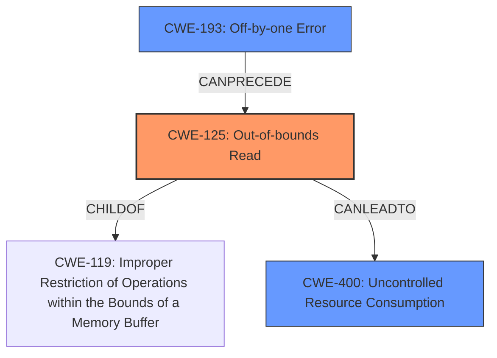

# Analysis for CVE-2022-41916

# Summary
| CWE ID | CWE Name | Confidence | CWE Abstraction Level | CWE Vulnerability Mapping Label | CWE-Vulnerability Mapping Notes |
|---|---|---|---|---|---|
| CWE-125 | Out-of-bounds Read | 0.9 | Base | Allowed | Primary CWE. The root cause is that the software reads data past the end of the buffer. |
| CWE-193 | Off-by-one Error | 0.6 | Base | Allowed | Secondary CWE. The **out-of-bounds read** may be caused by an **off-by-one error**. |
| CWE-400 | Uncontrolled Resource Consumption | 0.5 | Class | Allowed | Secondary CWE. The **out-of-bounds read** leads to a **denial of service**. |

## Evidence and Confidence

*   **Confidence Score:** 0.7
*   **Evidence Strength:** HIGH

## Relationship Analysis
The primary CWE is CWE-125, Out-of-bounds Read, which is a child of CWE-119, Improper Restriction of Operations within the Bounds of a Memory Buffer. The out-of-bounds read can be caused by CWE-193, Off-by-one Error. The impact is CWE-400, Uncontrolled Resource Consumption, which is a class level weakness.

## Vulnerability Chain
The vulnerability chain starts with a possible **off-by-one error** (CWE-193) leading to an **out-of-bounds read** (CWE-125) which results in a **denial of service** (CWE-400).

## Summary of Analysis
The vulnerability is caused by an **out-of-bounds read** in Heimdal's PKI certificate validation library when normalizing Unicode strings. This can lead to a **denial of service**.

The primary CWE is CWE-125, Out-of-bounds Read. The "CVE Reference Links Content Summary" section states: "Out-of-bounds read: The vulnerability allows reading one byte past the allocated buffer when normalizing Unicode." This clearly indicates that the software reads data past the end of the buffer.

CWE-193, Off-by-one Error, is considered as a secondary CWE because the **out-of-bounds read** may be a consequence of an **off-by-one error** during calculation of the buffer size or index.

CWE-400, Uncontrolled Resource Consumption, is considered as a secondary CWE because the **out-of-bounds read** can cause a crash of the KDC and kinit, leading to a **denial of service**. The "Vulnerability Description Key Phrases" section lists "**weakness:** **denial of service vulnerability**" and "**impact:** denial of service".

CWE-787 (Out-of-bounds Write) was considered but not selected as the evidence clearly points to an out-of-bounds read, not a write.

CWE-126 (Buffer Over-read) was considered but not selected as CWE-125 is a more general case of out-of-bounds read.

CWE-190 (Integer Overflow or Wraparound) was considered but not selected as there's no clear evidence of integer overflow causing this vulnerability, only an **out-of-bounds read**.

CWE-20 (Improper Input Validation) and CWE-345 (Insufficient Verification of Data Authenticity) were considered but not selected as the core issue is an **out-of-bounds read** during Unicode normalization, not the input validation itself, even if improper input could trigger it.

Relevant CWE Information:

# Enhanced Context (25 CWEs)
The following CWEs were identified as potentially relevant to this vulnerability:

## CWE-74: Improper Neutralization of Special Elements in Output Used by a Downstream Component ('Injection')
**Abstraction Level**: Class
**Similarity Score**: 0.78
**Source**: dense

**Description**:
The product constructs all or part of a command, data structure, or record using externally-influenced input from an upstream component, but it does not neutralize or incorrectly neutralizes special elements that could modify how it is parsed or interpreted when it is sent to a downstream component.

**Mapping Guidance**:
- Usage: Discouraged
- Rationale: CWE-74 is high-level and often misused when lower-level weaknesses are more appropriate.

## CWE-918: Server-Side Request Forgery (SSRF)
**Abstraction Level**: Base
**Similarity Score**: 0.77
**Source**: dense

**Description**:
The web server receives a URL or similar request from an upstream component and retrieves the contents of this URL, but it does not sufficiently ensure that the request is being sent to the expected destination.

**Mapping Guidance**:
- Usage: Allowed
- Rationale: This CWE entry is at the Base level of abstraction, which is a preferred level of abstraction for mapping to the root causes of vulnerabilities.

## CWE-113: Improper Neutralization of CRLF Sequences in HTTP Headers ('HTTP Request/Response Splitting')
**Abstraction Level**: Variant
**Similarity Score**: 0.77
**Source**: dense

**Description**:
The product receives data from an HTTP agent/component (e.g., web server, proxy, browser, etc.), but it does not neutralize or incorrectly neutralizes CR and LF characters before the data is included in outgoing HTTP headers.

**Mapping Guidance**:
- Usage: Allowed
- Rationale: This CWE entry is at the Variant level of abstraction, which is a preferred level of abstraction for mapping to the root causes of vulnerabilities.

## CWE-1289: Improper Validation of Unsafe Equivalence in Input
**Abstraction Level**: Base
**Similarity Score**: 0.76
**Source**: dense

**Description**:
The product receives an input value that is used as a resource identifier or other type of reference, but it does not validate or incorrectly validates that the input is equivalent to a potentially-unsafe value.

**Mapping Guidance**:
- Usage: Allowed
- Rationale: This CWE entry is at the Base level of abstraction, which is a preferred level of abstraction for mapping to the root causes of vulnerabilities.

## CWE-80: Improper Neutralization of Script-Related HTML Tags in a Web Page (Basic XSS)
**Abstraction Level**: Variant
**Similarity Score**: 0.75
**Source**: dense

**Description**:
The product receives input from an upstream component, but it does not neutralize or incorrectly neutralizes special characters such as "<", ">", and "&" that could be interpreted as web-scripting elements when they are sent to a downstream component that processes web pages.

**Mapping Guidance**:
- Usage: Allowed
- Rationale: This CWE entry is at the Variant level of abstraction, which is a preferred level of abstraction for mapping to the root causes of vulnerabilities.

## CWE-1336: Improper Neutralization of Special Elements Used in a Template Engine
**Abstraction Level**: Base
**Similarity Score**: 0.75
**Source**: dense

**Description**:
The product uses a template engine to insert or process externally-influenced input, but it does not neutralize or incorrectly neutralizes special elements or syntax that can be interpreted as template expressions or other code directives when processed by the engine.

**Mapping Guidance**:
- Usage: Allowed
- Rationale: This CWE entry is at the Base level of abstraction, which is a preferred level of abstraction for mapping to the root causes of vulnerabilities.

## CWE-345: Insufficient Verification of Data Authenticity
**Abstraction Level**: Class
**Similarity Score**: 0.75
**Source**: dense

**Description**:
The product does not sufficiently verify the origin or authenticity of data, in a way that causes it to accept invalid data.

**Mapping Guidance**:
- Usage: Discouraged
- Rationale: This CWE entry is a level-1 Class (i.e., a child of a Pillar). It might have lower-level children that would be more appropriate

## CWE-602: Client-Side Enforcement of Server-Side Security
**Abstraction Level**: Class
**Similarity Score**: 0.75
**Source**: dense

**Description**:
The product is composed of a server that relies on the client to implement a mechanism that is intended to protect the server.

**Mapping Guidance**:
- Usage: