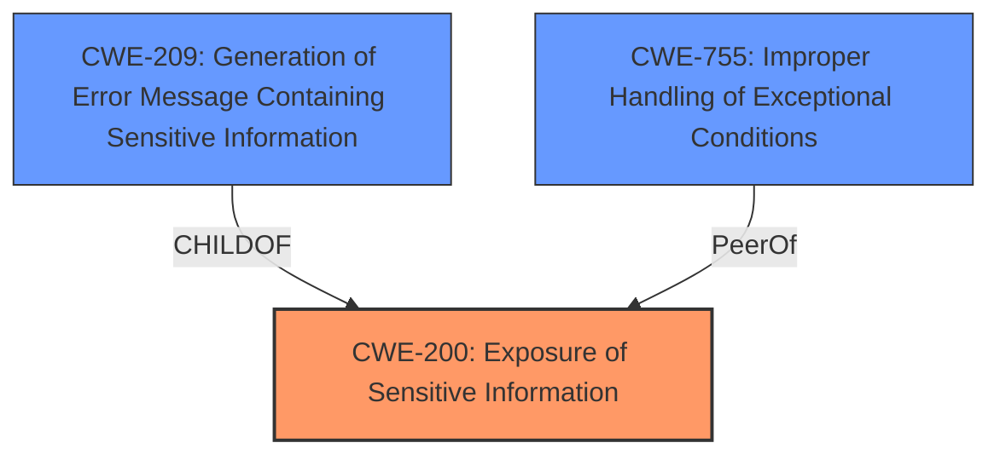

# Raw Analyzer Response for CVE-2022-41917

# Summary
| CWE ID  | CWE Name                                                                                                                | Confidence | CWE Abstraction Level | CWE Vulnerability Mapping Label | CWE-Vulnerability Mapping Notes |
| :-------- | :------------------------------------------------------------------------------------------------------------------------ | :----------- | :---------------------- | :------------------------------ | :-------------------------------- |
| CWE-200 | Exposure of Sensitive Information | 0.85       | Class                  | Allowed                      | Primary                 |
| CWE-209 | Generation of Error Message Containing Sensitive Information                                                               | 0.70       | Base                  | Allowed                      | Secondary                |
| CWE-755 | Improper Handling of Exceptional Conditions                                                                                  | 0.60       | Class                  | Discouraged                    | Secondary                 |

## Evidence and Confidence

*   **Confidence Score:** 0.80
*   **Evidence Strength:** HIGH

## Relationship Analysis
The primary CWE is CWE-200 which is a Class and has multiple children. CWE-209 is a child of CWE-200 and represents a more specific instance where sensitive information is exposed through error messages. CWE-755 is a more general class, but it could be considered because the vulnerability involves improper handling of errors during file processing, leading to the sensitive information exposure.

## Vulnerability Chain
The vulnerability chain starts with **an issue in the implementation of text analyzers**. This leads to **insufficient validation of user-provided file paths**, a **lack of proper error handling**, and ultimately the **return of the first line of text from arbitrary files**, resulting in the **exposure of sensitive information**.

## Summary of Analysis
The analysis indicates that the primary weakness is CWE-200, as the core issue is the exposure of sensitive information due to **improper error handling** and **insufficient validation** of user-provided file paths. The **rootcause** of the vulnerability is the **issue in the implementation of text analyzers** which leads to reading the first line of arbitrary text files.

The vulnerability description states, "An issue in the implementation of this feature allows certain specially crafted queries to return a response containing the first line of text from arbitrary files." The "CVE Reference Links Content Summary" section provides further details: "Improper error handling when reading analyzer mapping rules from a file. Specifically, when a user specifies a local file containing text analysis rules, certain crafted queries can cause the system to return the first line of the file, potentially exposing sensitive information."

CWE-200 is the most appropriate primary mapping, as it directly addresses the exposure of sensitive information. CWE-209 is a secondary consideration because the exposure happens through an error message, but it is not the primary mechanism. CWE-755 is a general class related to **improper handling of exceptional conditions** and is also a secondary consideration.

The selection of CWE-200 is at the optimal level of specificity because it accurately reflects the core issue of sensitive information exposure, while also accounting for the context of the vulnerability and the limitations of the available information.

Relevant CWE Information:

# Enhanced Context (25 CWEs)
The following CWEs were identified as potentially relevant to this vulnerability:

## CWE-80: Improper Neutralization of Script-Related HTML Tags in a Web Page (Basic XSS)
**Abstraction Level**: Variant
**Similarity Score**: 0.80
**Source**: dense

**Description**:
The product receives input from an upstream component, but it does not neutralize or incorrectly neutralizes special characters such as "<", ">", and "&" that could be interpreted as web-scripting elements when they are sent to a downstream component that processes web pages.

**Mapping Guidance**:
- Usage: Allowed
- Rationale: This CWE entry is at the Variant level of abstraction, which is a preferred level of abstraction for mapping to the root causes of vulnerabilities.

*This CWE is not selected because there is no evidence of cross-site scripting.*

## CWE-74: Improper Neutralization of Special Elements in Output Used by a Downstream Component ('Injection')
**Abstraction Level**: Class
**Similarity Score**: 0.78
**Source**: dense

**Description**:
The product constructs all or part of a command, data structure, or record using externally-influenced input from an upstream component, but it does not neutralize or incorrectly neutralizes special elements that could modify how it is parsed or interpreted when it is sent to a downstream component.

**Mapping Guidance**:
- Usage: Discouraged
- Rationale: CWE-74 is high-level and often misused when lower-level weaknesses are more appropriate.

*This CWE is not selected because there is no evidence of injection.*

## CWE-116: Improper Encoding or Escaping of Output
**Abstraction Level**: Class
**Similarity Score**: 0.78
**Source**: dense

**Description**:
The product prepares a structured message for communication with another component, but encoding or escaping of the data is either missing or done incorrectly. As a result, the intended structure of the message is not preserved.

**Mapping Guidance**:
- Usage: Allowed-with-Review
- Rationale: This CWE entry is a Class and might have Base-level children that would be more appropriate

*This CWE is not selected because there is no evidence of improper encoding or escaping.*

## CWE-917: Improper Neutralization of Special Elements used in an Expression Language Statement ('Expression Language Injection')
**Abstraction Level**: Base
**Similarity Score**: 0.78
**Source**: dense

**Description**:
The product constructs all or part of an expression language (EL) statement in a framework such as a Java Server Page (JSP) using externally-influenced input from an upstream component, but it does not neutralize or incorrectly neutralizes special elements that could modify the intended EL statement before it is executed.

**Mapping Guidance**:
- Usage: Allowed
- Rationale: This CWE entry is at the Base level of abstraction, which is a preferred level of abstraction for mapping to the root causes of vulnerabilities.

*This CWE is not selected because there is no evidence of expression language injection.*

## CWE-184: Incomplete List of Disallowed Inputs
**Abstraction Level**: Base
**Similarity Score**: 0.77
**Source**: dense

**Description**:
The product implements a protection mechanism that relies on a list of inputs (or properties of inputs) that are not allowed by policy or otherwise require other action to neutralize before additional processing takes place, but the list is incomplete.

**Mapping Guidance**:
- Usage: Allowed
- Rationale: This CWE entry is at the Base level of abstraction, which is a preferred level of abstraction for mapping to the root causes of vulnerabilities.

*This CWE is not selected because the core issue is not related to an incomplete list of disallowed inputs.*

## CWE-611: Improper Restriction of XML External Entity Reference
**Abstraction Level**: Base
**Similarity Score**: 0.77
**Source**: dense

**Description**:
The product processes an XML document that can contain XML entities with URIs that resolve to documents outside of the intended sphere of control, causing the product to embed incorrect documents into its output.

**Mapping Guidance**:
- Usage: Allowed
- Rationale: This CWE entry is at the Base level of abstraction, which is a preferred level of abstraction for mapping to the root causes of vulnerabilities.

*This CWE is not selected because there is no evidence of XML external entity reference issues.*

## CWE-639: Authorization Bypass Through User-Controlled Key
**Abstraction Level**: Base
**Similarity Score**: 0.77
**Source**: dense

**Description**:
The system's authorization functionality does not prevent one user from gaining access to another user's data or record by modifying the key value identifying the data.

**Mapping Guidance**:
- Usage: Allowed
- Rationale: This CWE entry is at the Base level of abstraction, which is a preferred level of abstraction for mapping to the root causes of vulnerabilities.

*This CWE is not selected because there is no authorization bypass through user-controlled key.*

## CWE-538: Insertion of Sensitive Information into Externally-Accessible File or Directory
**Abstraction Level**: Base
**Similarity Score**: 0.77
**Source**: dense

**Description**:
The product places sensitive information into files or directories that are accessible to actors who are allowed to have access to the files, but not to the sensitive information.

**Mapping Guidance**:
- Usage: Allowed
- Rationale: This CWE entry is at the Base level of abstraction, which is a preferred level of abstraction for mapping to the root causes of vulnerabilities.

*This CWE is not selected because the issue is related to exposing information from existing files, not inserting information into new files.*