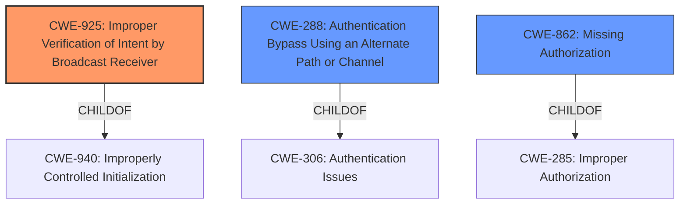

# Enhanced Analysis for CVE-2022-41926

# Summary
| CWE ID  | CWE Name                                                              | Confidence | CWE Abstraction Level | CWE Vulnerability Mapping Label | CWE-Vulnerability Mapping Notes |
| :-------- | :-------------------------------------------------------------------- | :--------- | :---------------------- | :------------------------------ | :------------------------------ |
| CWE-925 | Improper Verification of Intent by Broadcast Receiver                 | 0.9        | Variant               | Allowed                       | Primary CWE                     |
| CWE-288 | Authentication Bypass Using an Alternate Path or Channel                 | 0.6        | Base                  | Allowed                       | Secondary Candidate             |
| CWE-862 | Missing Authorization                                                     | 0.5        | Class                 | Allowed-with-Review           | Secondary Candidate             |

## Evidence and Confidence

*   **Confidence Score:** 0.9
*   **Evidence Strength:** HIGH

## Relationship Analysis
The primary CWE is CWE-925, which is a Variant of CWE-940 (Improperly Controlled Initialization). CWE-925 focuses specifically on Android applications and broadcast receivers that do not properly verify the source of an Intent. The next highest retriever result, CWE-288 is a Base CWE and a ChildOf CWE-306 (Authentication Issues). CWE-862 is a Class CWE and a ChildOf CWE-285 (Improper Authorization).



## Vulnerability Chain
The chain of weaknesses starts with the **missing broadcastPermission** which leads to **improper verification of the intent** by the broadcast receiver, potentially allowing malicious apps to monitor communication.

## Summary of Analysis
The initial analysis identified the **root cause** as a **missing broadcastPermission**, allowing malicious apps to monitor communication.

The retriever results and complete CWE specifications were then reviewed to ensure that the selected CWE accurately reflects the **root cause** and the specific context of the vulnerability.

CWE-925 (Improper Verification of Intent by Broadcast Receiver) is the most appropriate mapping because:
- It is a Variant-level CWE, which is a preferred level of abstraction.
- It specifically addresses the scenario where an Android application's Broadcast Receiver does not properly verify the source of an Intent, which aligns directly with the vulnerability description.

The supporting evidence includes:
- Vulnerability Description Key Phrases: "**rootcause:** **broadcastPermission is not protected**"
- CVE Reference Links Content Summary: "The Nextcloud Talk Android application's broadcast receiver was not protected by a custom `broadcastPermission`."
- CVE Reference Links Content Summary: "The `CallActivity` in the Nextcloud Talk Android app had an unfiltered broadcast receiver, which means it could receive broadcasts from any application on the device without requiring specific permissions."

CWE-288 (Authentication Bypass Using an Alternate Path or Channel) was considered because an unprotected broadcast receiver could potentially be exploited to bypass authentication mechanisms. However, the primary issue is the lack of intent verification, making CWE-925 a more direct fit.

CWE-862 (Missing Authorization) was considered because the broadcast receiver effectively lacks authorization controls. However, CWE-925 more precisely captures the **root cause** related to improper intent verification in the context of Android broadcast receivers.

The final selection of CWE-925 reflects the specific nature of the vulnerability in the Android context, focusing on the **improper intent verification** by the broadcast receiver as the primary weakness.


## CWE Relationship Analysis

Current CWEs represent these abstraction levels: .


### Vulnerability Chain Analysis

**Chain starting from CWE-862:**
- 862 (Missing Authorization) - ROOT


**Chain starting from CWE-925:**
- 925 (Improper Verification of Intent by Broadcast Receiver) - ROOT


### CWE Relationship Diagram

```mermaid
graph TD
    classDef primary fill:#f96,stroke:#333,stroke-width:2px
    classDef secondary fill:#69f,stroke:#333
    classDef tertiary fill:#9e9,stroke:#333
```